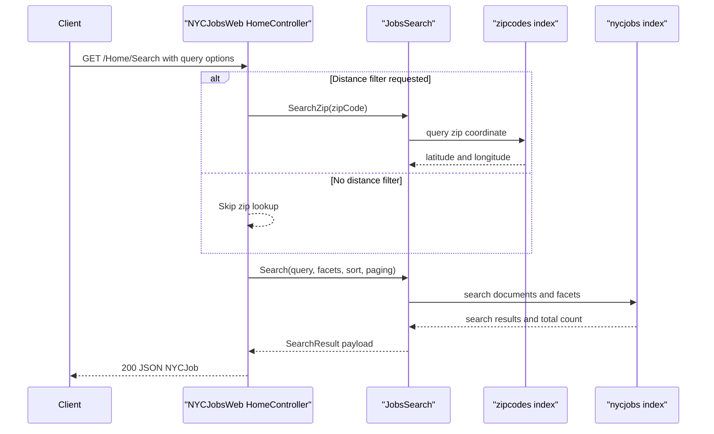

# API & Service Communication Contracts

This document inventories the API surface exposed by the MVC application and summarizes communication patterns between the web app, helper services, and external search infrastructure.

## Service Catalog

| Service | Port | Category | Purpose |
|---|---|---|---|
| NYCJobsWeb | 51269 (IIS Express dev) | API Layer | Serves MVC pages and JSON actions for searching NYC jobs data |
| DataLoader (AzureSearchBackupRestore) | N/A (console) | Infrastructure | Recreates Azure Search indexes and imports JSON seed data |

## API Endpoints Inventory

| Service | Method | Path | Request Type | Response Type |
|---|---|---|---|---|
| NYCJobsWeb | GET | /Home/Index | Query string (none required) | HTML view |
| NYCJobsWeb | GET | /Home/JobDetails | Query string (none required) | HTML view |
| NYCJobsWeb | GET | /Home/Search | Query params (`q`, facets, location paging) | JSON (`NYCJob`) |
| NYCJobsWeb | GET | /Home/Suggest | Query params (`term`, `fuzzy`) | JSON (string list) |
| NYCJobsWeb | GET | /Home/LookUp | Query param (`id`) | JSON (`NYCJobLookup`) |

## Management & Observability Endpoints

| Service | Endpoint | Custom Metrics (if any) |
|---|---|---|
| NYCJobsWeb | None explicitly configured | None detected |
| DataLoader | None (console app) | None detected |

## DTOs & Contracts

The API responses are centered on `NYCJob` (search list + facets + count) and `NYCJobLookup` (single search document payload). Request contracts are query-string based and model-bound directly to action parameters. OpenAPI/Swagger artifacts and protobuf/GraphQL schemas were not found. Serialization behavior relies on MVC JSON serialization and Azure SDK `SearchDocument` payload structures.

## Communication Patterns

Communication is synchronous request/response. Browser clients call MVC actions, controller methods delegate to `JobsSearch`, and `JobsSearch` calls Azure Cognitive Search using SDK clients. No message broker or asynchronous event flow is present. Circuit-breaker/retry policies and service discovery are not configured in code. API security posture is API-key access to Azure Search configured in `Web.config`; app endpoints do not show explicit authentication or authorization enforcement.

## Service Technology Matrix

| Service | Web | Data Access | Discovery | Gateway | Actuator | Cache | Metrics |
|---|---|---|---|---|---|---|---|
| NYCJobsWeb | ASP.NET MVC 5 | Azure.Search.Documents SDK | None | None | None | None | None |
| DataLoader | Console app | HttpClient + Azure Search REST | None | None | None | None | None |

## Service Communication Sequence

