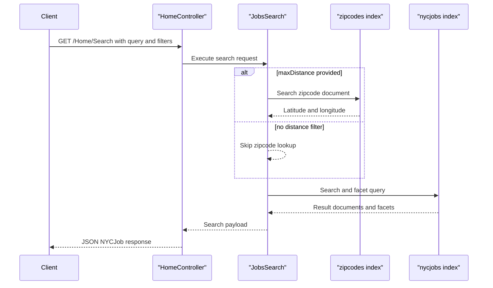

# API & Service Communication Contracts

The application exposes a small HTTP surface through a single MVC controller with synchronous request/response behavior to Azure AI Search and Bing geocoding services.

## Service Catalog

| Service | Port | Category | Purpose |
|---|---:|---|---|
| NYCJobsWeb | 51269 (IIS Express default) | API Layer | Serves MVC pages and JSON endpoints for search, suggest, and job lookup |
| DataLoader | N/A (console process) | Business | Recreates Azure Search indexes and bulk-loads JSON data |
| Azure AI Search | 443 | Infrastructure | Hosts `nycjobs` and `zipcodes` indexes queried by the web app |
| Bing Geocoding API | 443 | Infrastructure | Resolves location data for geo-search experience |

## API Endpoints Inventory

| Service | Method | Path | Request Type | Response Type |
|---|---|---|---|---|
| NYCJobsWeb/HomeController | GET | /Home/Index | None | HTML view |
| NYCJobsWeb/HomeController | GET | /Home/JobDetails | Query string `id` consumed by client script | HTML view |
| NYCJobsWeb/HomeController | GET | /Home/Search | Query params (`q`, facets, sortType, lat/lon, page, zipCode, maxDistance) | JSON `NYCJob` payload (results, facets, count) |
| NYCJobsWeb/HomeController | GET | /Home/Suggest | Query params (`term`, `fuzzy`) | JSON array of suggestion strings |
| NYCJobsWeb/HomeController | GET | /Home/LookUp | Query param (`id`) | JSON `NYCJobLookup` payload |

## Management & Observability Endpoints

| Service | Endpoint | Custom Metrics (if any) |
|---|---|---|
| NYCJobsWeb | None detected (`/health`, `/swagger`, `/actuator` absent) | None detected |
| DataLoader | None (console utility) | None detected |

## DTOs & Contracts

Gateway-level DTOs are not present because there is no API gateway tier. Service-level API contracts include `NYCJob` (search response envelope with facets/results/count) and `NYCJobLookup` (single job result wrapper) in `NYCJobsWeb/Models/Jobs.cs`. Search documents are exchanged using `SearchDocument` from the Azure SDK. No OpenAPI/Swagger specs, protobuf schemas, or GraphQL schemas were found.

## Communication Patterns

Communication is synchronous: browser calls MVC endpoints, controller delegates to `JobsSearch`, and `JobsSearch` performs direct SDK calls to Azure AI Search (`Search`, `Suggest`, `GetDocument`). The application also queries zipcode data to support distance filtering. No asynchronous messaging or eventing patterns were detected. No explicit retry, timeout, or circuit-breaker policy is configured in project configuration. Startup order impact is minimal: the web app depends on reachable Azure AI Search endpoints for functional API responses. Security posture: no explicit API authentication or authorization attributes are present on controller actions, and TLS/auth concerns are delegated to hosting and external service endpoints.

## Service Technology Matrix

| Service | Web | Data Access | Discovery | Gateway | Actuator | Cache | Metrics |
|---|---|---|---|---|---|---|---|
| NYCJobsWeb | ASP.NET MVC 5 | Azure.Search.Documents SDK | None | None | None | None | None |
| DataLoader | Console app | REST over HttpClient to Azure Search endpoints | None | None | None | None | None |

## Service Communication Sequence

