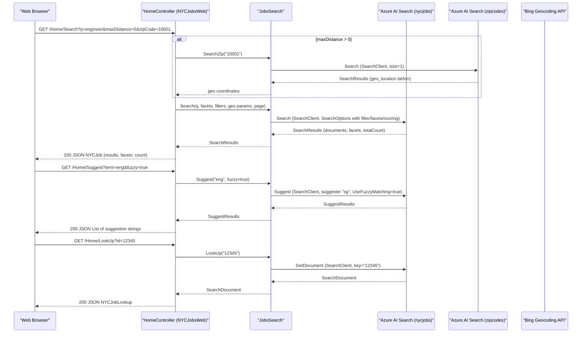

# API & Service Communication Contracts

The NYC Jobs Search solution exposes five HTTP endpoints through a single ASP.NET MVC 5 controller. All data communication is synchronous — the web application calls Azure AI Search directly via the Azure SDK, and there are no asynchronous messaging patterns or inter-service REST calls between solution components.

## Service Catalog

| Service | Port | Category | Purpose |
|---|---|---|---|
| NYCJobsWeb | 80/443 (IIS-hosted) | API Layer | ASP.NET MVC 5 web application serving the job search UI and JSON API endpoints for search, suggest, and job detail lookup |
| DataLoader | N/A (console) | Infrastructure | One-time console utility that creates and populates Azure AI Search indexes (nycjobs, zipcodes) via the Azure AI Search REST API |

## API Endpoints Inventory

| Service | Method | Path | Request Type | Response Type |
|---|---|---|---|---|
| NYCJobsWeb | GET | `/` or `/Home/Index` | None | HTML view (Index.cshtml) |
| NYCJobsWeb | GET | `/Home/JobDetails` | None | HTML view (JobDetails.cshtml) |
| NYCJobsWeb | GET | `/Home/Search` | Query params: `q`, `businessTitleFacet`, `postingTypeFacet`, `salaryRangeFacet`, `sortType`, `lat`, `lon`, `currentPage`, `zipCode`, `maxDistance` | JSON — `NYCJob` (results, facets, count) |
| NYCJobsWeb | GET | `/Home/Suggest` | Query params: `term`, `fuzzy` | JSON — `List<string>` (unique suggestion strings) |
| NYCJobsWeb | GET | `/Home/LookUp` | Query param: `id` | JSON — `NYCJobLookup` (single job document) |

> Note: No explicit `[Route]` or `[HttpGet]` attributes are used. All routes are resolved by the default ASP.NET MVC convention: `{controller}/{action}/{id}` registered in `RouteConfig.cs`.

## Management & Observability Endpoints

| Service | Endpoint | Notes |
|---|---|---|
| NYCJobsWeb | None | No health check, Swagger UI, or metrics endpoints are configured |
| DataLoader | N/A | Console application; no HTTP endpoints |

No Spring Boot Actuator, ASP.NET Core health checks, or Swagger/OpenAPI endpoints are present in either project.

## DTOs & Contracts

Two response DTOs are defined in `NYCJobsWeb.Models`:

- **`NYCJob`** — search results response. Carries paginated search results, a facet dictionary, and a total count. Used as the JSON response body for the `/Home/Search` endpoint.
- **`NYCJobLookup`** — single-document response. Wraps the `SearchDocument` returned by the Azure AI Search Get Document API. Used as the JSON response body for the `/Home/LookUp` endpoint.

Both classes are plain C# classes (not records or `readonly` structs), so they are mutable. Serialization is handled by `JsonResult` using `Newtonsoft.Json` 10.0.3. There are no OpenAPI/Swagger specifications, protobuf schemas, or GraphQL schemas in the solution.

Azure AI Search responses are typed as `SearchResult<SearchDocument>` and `SearchDocument` (schema-less dynamic documents from the `Azure.Search.Documents` SDK) — these are not owned DTOs; they are SDK types that flow through to the JSON response.

## Communication Patterns

**Synchronous only**: All communication is synchronous request/response. The `HomeController` instantiates `JobsSearch` directly (field injection by new-ing up the instance) and calls its methods inline within controller actions. There are no message queues, event buses, or background workers.

**Azure AI Search SDK calls**: `JobsSearch` uses two static `SearchClient` instances (initialized once at class-load time) to call the Azure AI Search REST API via the `Azure.Search.Documents` v11 SDK. The SDK uses `HttpClient` internally. No custom retry policy, circuit breaker (Polly), or timeout configuration is applied beyond the SDK defaults.

**No service discovery**: The Azure AI Search endpoint URL is read from `Web.config` (`Searchendpoint` key) as a hardcoded URL. There is no service registry (Eureka, Consul, Azure Service Discovery).

**No API gateway**: The application is a single-host ASP.NET MVC application. There is no API gateway, reverse proxy configuration, or gateway aggregation logic.

**Security posture**: No authentication or authorization is configured. There are no `[Authorize]` attributes, no ASP.NET Identity membership, no OAuth2/JWT middleware, and no HTTPS enforcement. The application reads a plaintext API key from `Web.config` (`SearchServiceApiKey`) and passes it as an `AzureKeyCredential` to the Azure AI Search SDK — the key is stored in source control in the repository. All five HTTP endpoints are publicly accessible with no authorization checks.

**DataLoader communication**: The `DataLoader` console app calls the Azure AI Search management and indexing REST APIs directly using a raw `HttpClient` with a hardcoded `api-key` header read from `App.config`. Index schema is read from local `.schema` files; document data is read from local `.json` files.

## Service Technology Matrix

| Service | Web Framework | Data Access | Discovery | Gateway | Health Checks | Cache | Metrics |
|---|---|---|---|---|---|---|---|
| NYCJobsWeb | ASP.NET MVC 5 (Razor) | Azure.Search.Documents SDK 11.1.1 | None | None | None | None | None |
| DataLoader | None (console) | HttpClient (raw REST) | None | None | None | None | None |

## Service Communication Sequence

