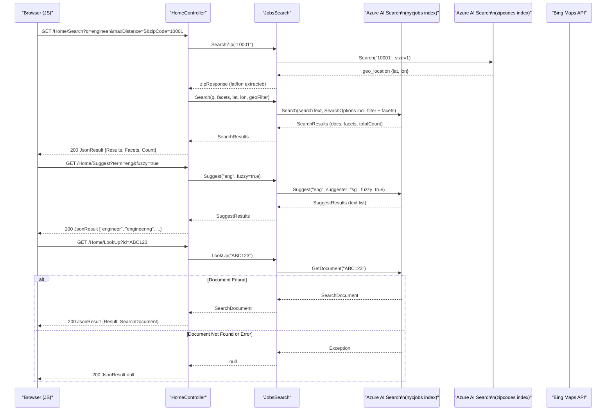

# API & Service Communication Contracts

The NYC Jobs application exposes five HTTP endpoints from a single ASP.NET MVC 5 controller, all using synchronous REST-style communication backed by Azure AI Search. There is no inter-service messaging or API gateway in this solution.

## Service Catalog

| Service | Port | Category | Purpose |
|---------|------|----------|---------|
| NYCJobsWeb | 80 / 443 (IIS-hosted) | API Layer / Business | ASP.NET MVC 5 web application serving the job search UI and JSON search API |
| DataLoader | — (CLI) | Infrastructure | Console utility that seeds Azure AI Search indexes (`nycjobs`, `zipcodes`) from local JSON/schema files |

## API Endpoints Inventory

| Service | Method | Path | Request Type | Response Type |
|---------|--------|------|--------------|---------------|
| NYCJobsWeb | GET | `/Home/Index` | — | HTML (Razor View) |
| NYCJobsWeb | GET | `/Home/JobDetails` | — | HTML (Razor View) |
| NYCJobsWeb | GET | `/Home/Search` | Query params: `q`, `businessTitleFacet`, `postingTypeFacet`, `salaryRangeFacet`, `sortType`, `lat`, `lon`, `currentPage`, `zipCode`, `maxDistance` | `JsonResult` → `NYCJob` (results, facets, count) |
| NYCJobsWeb | GET | `/Home/Suggest` | Query params: `term`, `fuzzy` | `JsonResult` → `List<string>` (distinct suggestions) |
| NYCJobsWeb | GET | `/Home/LookUp` | Query param: `id` | `JsonResult` → `NYCJobLookup` (single document) |

> Note: The default MVC route (`{controller}/{action}/{id}`) means all endpoints are also reachable as `/` for Index and `/Home/{action}`. No API versioning scheme is in use.

## Management & Observability Endpoints

| Service | Endpoint | Custom Metrics |
|---------|----------|---------------|
| NYCJobsWeb | None configured | None |
| DataLoader | None configured | None |

No health check endpoints, Swagger/OpenAPI documentation, or metrics endpoints are configured in this solution. There is no Spring Boot Actuator, ASP.NET Core health middleware, or equivalent.

## DTOs & Contracts

**Service-level response models (NYCJobsWeb):**

- **`NYCJob`** — Response DTO for the `Search` action. Contains paginated search results (`IList<SearchResult<SearchDocument>>`), facet aggregations (`IDictionary<string, IList<FacetResult>>`), and a total count (`int?`). Mutable class.
- **`NYCJobLookup`** — Response DTO for the `LookUp` action. Contains a single `SearchDocument` representing a job record. Mutable class.
- **`SearchDocument`** — Untyped property-bag from `Azure.Search.Documents`; fields are accessed dynamically at runtime. No strongly-typed job entity class is defined in the codebase.

No OpenAPI/Swagger specification, `.proto` files, or GraphQL schemas are present. Serialization is handled by ASP.NET MVC's built-in `JsonResult` (using `JavaScriptSerializer`). Response objects are annotated with `JsonRequestBehavior.AllowGet` to permit GET-based JSON responses, which is the default AJAX pattern used by the JavaScript front-end.

For field-level details of the job document schema see `data-architecture.md`.

## Communication Patterns

**Synchronous communication:**
All client-server communication is synchronous HTTP. The browser issues AJAX GET requests to `HomeController` actions; the controller calls `JobsSearch` (in-process) which synchronously calls `Azure.Search.Documents` SDK methods (`Search`, `Suggest`, `GetDocument`). The Azure SDK internally uses `HttpClient` with a default timeout (no explicit override configured).

**Asynchronous communication:** None. Neither project uses message queues, event streaming, or async/await patterns. The DataLoader's `AzureSearchHelper.SendSearchRequest` calls `client.SendAsync(...).Result`, blocking the thread synchronously.

**Resilience patterns:** None configured. There are no circuit breakers, retry policies, or timeout overrides. Exceptions are caught with bare `try/catch` blocks that write to `Console.WriteLine` and return `null` — the UI has no server-side error propagation.

**Service discovery:** None. The Azure AI Search endpoint URL and API key are read from `Web.config` `<appSettings>` as hardcoded string values. There is no service registry or dynamic endpoint resolution.

**API gateway:** None. Requests go directly from the browser to `HomeController`.

**Security posture:** No authentication, authorization, or HTTPS enforcement is configured at the application level. All five endpoints are publicly accessible with no authorization checks. The API key for Azure AI Search is a query-key (read-only), stored as plain text in `Web.config`. The `BingApiKey` value in `Web.config` is set to an empty string placeholder. No HTTPS redirect, HSTS headers, or anti-forgery tokens are present.

## Service Technology Matrix

| Service | Web Framework | Data Access | Discovery | Gateway | Health Checks | Cache | Metrics |
|---------|--------------|-------------|-----------|---------|--------------|-------|---------|
| NYCJobsWeb | ASP.NET MVC 5 | Azure.Search.Documents 11.1.1 (SDK) | None | None | None | None | None |
| DataLoader | None (Console) | Azure Search REST API (raw HttpClient) | None | None | None | None | None |

## Service Communication Sequence

