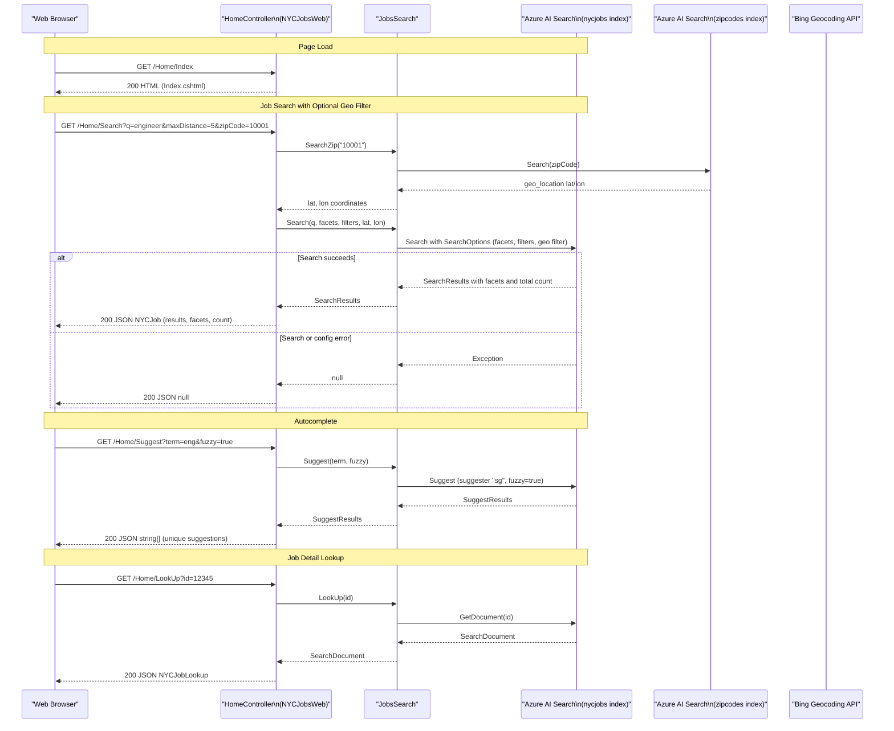

# API & Service Communication Contracts

The solution exposes five HTTP endpoints through a single ASP.NET MVC 5 controller (`HomeController`), all served over conventional MVC routing with no API versioning or gateway layer. Communication with external services is strictly synchronous REST.

## Service Catalog

| Service | Port | Category | Purpose |
|---------|------|----------|---------|
| NYCJobsWeb | 80/443 (IIS-hosted) | API Layer / UI | ASP.NET MVC 5 web app serving the job search UI and JSON search API |
| DataLoader | N/A (console) | Infrastructure | One-time console utility to create and populate Azure AI Search indexes from local JSON files |

## API Endpoints Inventory

| Service | Method | Path | Request Type | Response Type |
|---------|--------|------|-------------|---------------|
| NYCJobsWeb | GET | `/` or `/Home/Index` | — | HTML view (Index.cshtml) |
| NYCJobsWeb | GET | `/Home/JobDetails` | — | HTML view (JobDetails.cshtml) |
| NYCJobsWeb | GET | `/Home/Search` | Query params: `q`, `businessTitleFacet`, `postingTypeFacet`, `salaryRangeFacet`, `sortType`, `lat`, `lon`, `currentPage`, `zipCode`, `maxDistance` | JSON — `NYCJob` (results, facets, count) |
| NYCJobsWeb | GET | `/Home/Suggest` | Query params: `term`, `fuzzy` | JSON — `string[]` (autocomplete suggestions) |
| NYCJobsWeb | GET | `/Home/LookUp` | Query param: `id` | JSON — `NYCJobLookup` (single document) |

> Note: Routing follows ASP.NET MVC 5 conventional routing pattern `{controller}/{action}/{id}` with default controller=Home and action=Index.

## Management & Observability Endpoints

| Service | Endpoint | Custom Metrics |
|---------|----------|----------------|
| NYCJobsWeb | None configured | None |
| DataLoader | None | None |

No health check endpoints (`/health`, `/healthz`), Swagger UI, or actuator-style endpoints are configured in either project. There is no metrics instrumentation or telemetry pipeline.

## DTOs & Contracts

Two response DTO classes are defined in `NYCJobsWeb.Models`:

- **`NYCJob`** — Search results response model. Contains a list of `SearchResult<SearchDocument>` results, a facets dictionary (`IDictionary<string, IList<FacetResult>>`), and a total count. Used as the response body for the `/Home/Search` endpoint.
- **`NYCJobLookup`** — Document lookup response model. Wraps a single `SearchDocument` for the `/Home/LookUp` endpoint.

Both classes are plain mutable C# classes (not records or frozen). They are serialized to JSON by ASP.NET MVC's built-in `JsonResult` using the default `JavaScriptSerializer`. No OpenAPI/Swagger specification, `.proto` files, or GraphQL schema are present. The `SearchDocument` type is an Azure SDK dynamic property bag (`Azure.Search.Documents.Models.SearchDocument`), so the actual job field schema is defined by the Azure AI Search index schema rather than a C# type — see `data-architecture.md` for field-level details.

## Communication Patterns

**Synchronous REST only**: All calls from NYCJobsWeb to Azure AI Search are synchronous calls via the `Azure.Search.Documents` SDK (`SearchClient.Search`, `SearchClient.Suggest`, `SearchClient.GetDocument`). There is no asynchronous messaging, no message broker, and no event-driven communication.

**No resilience patterns**: There is no circuit breaker, retry policy, timeout configuration, or bulkhead pattern implemented. If the Azure AI Search service is unavailable, the `JobsSearch` class catches the exception and returns `null`, which causes the controller to return an empty/null JSON result to the client with no meaningful error response.

**No service discovery**: The Azure AI Search endpoint URL and API key are read directly from `Web.config` `<appSettings>` (`Searchendpoint`, `SearchServiceApiKey`). Services are addressed by hardcoded URL. No Eureka, Consul, or DNS-based discovery is used.

**No API gateway**: NYCJobsWeb directly serves both the HTML UI and the JSON API endpoints from the same IIS-hosted ASP.NET MVC application. There is no gateway, BFF layer, or proxy.

**Security posture**: No authentication or authorization is configured on any endpoint. All five endpoints are publicly accessible with no API key validation, JWT verification, role checks, or HTTPS enforcement at the application layer. The only secret management in place is storing the Azure AI Search API key in `Web.config`, which is not encrypted. TLS/HTTPS is not enforced at the application code level (must be configured at the IIS or load-balancer level).

**Startup dependency chain**: The `JobsSearch` service initializes its `SearchClient` instances in a static constructor at application startup. If the Azure AI Search endpoint or API key is missing or invalid, an exception is caught and stored in `errorMessage`, but the application continues to start and serve requests (returning empty results until the configuration is fixed).

## Service Technology Matrix

| Service | Web Framework | Data Access | Discovery | Gateway | Health Checks | Cache | Metrics |
|---------|--------------|-------------|-----------|---------|--------------|-------|---------|
| NYCJobsWeb | ASP.NET MVC 5 | Azure.Search.Documents SDK | None (hardcoded URL) | None | None | None | None |
| DataLoader | None (console) | System.Net.Http (raw REST) | None (hardcoded URL) | None | None | None | None |

## Service Communication Sequence

