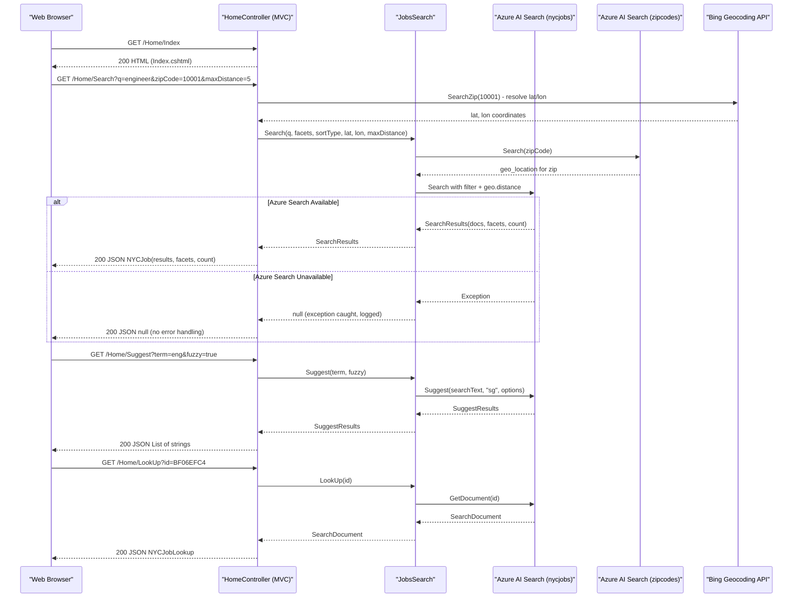

# API & Service Communication Contracts

The solution exposes five MVC action endpoints through a single ASP.NET MVC 5 controller, mixing server-rendered HTML views with JSON-returning actions; there is no formal REST API versioning, no API gateway, and no inter-service communication.

## Service Catalog

| Service | Port | Category | Purpose |
|---|---|---|---|
| NYCJobsWeb | 80 / 443 (IIS) | API Layer + UI | ASP.NET MVC 5 web app serving job-search UI and JSON data endpoints backed by Azure AI Search |
| DataLoader | N/A (console) | Infrastructure | Offline console tool for creating Azure AI Search indexes and bulk-loading job data via REST |

## API Endpoints Inventory

| Service | Method | Path | Request Type | Response Type |
|---|---|---|---|---|
| HomeController | GET | `/` or `/Home/Index` | — | HTML (Razor view `Index.cshtml`) |
| HomeController | GET | `/Home/JobDetails` | — | HTML (Razor view `JobDetails.cshtml`) |
| HomeController | GET | `/Home/Search` | Query params: `q`, `businessTitleFacet`, `postingTypeFacet`, `salaryRangeFacet`, `sortType`, `lat`, `lon`, `currentPage`, `zipCode`, `maxDistance` | JSON — `NYCJob` (results, facets, count) |
| HomeController | GET | `/Home/Suggest` | Query params: `term`, `fuzzy` | JSON — `List<string>` (unique suggestion strings) |
| HomeController | GET | `/Home/LookUp` | Query param: `id` | JSON — `NYCJobLookup` (single document) |

> Note: Route registration uses the default MVC pattern `{controller}/{action}/{id}`; no attribute routing or API versioning is configured.

## Management & Observability Endpoints

| Service | Endpoint | Custom Metrics |
|---|---|---|
| NYCJobsWeb | None configured | None |
| DataLoader | N/A (console tool) | None |

No health check endpoints (`/health`, `/healthz`), Swagger/OpenAPI UI (`/swagger`), or metrics endpoints are configured. There is no Spring Boot Actuator equivalent (e.g., ASP.NET Core health middleware) in this .NET Framework 4.7.2 MVC application.

## DTOs & Contracts

Two response DTO classes are defined in `NYCJobsWeb.Models`:

- **`NYCJob`** — Search results response: carries the Azure AI Search `SearchResults` list, the facets dictionary, and total result count. Used as the JSON payload for the `Search` action. Fields are mutable public properties (no immutability enforced).
- **`NYCJobLookup`** — Single-document lookup response: wraps a raw `SearchDocument` from the Azure Search SDK. Used as the JSON payload for the `LookUp` action.

There are no request body DTOs (all input arrives via query-string parameters). No OpenAPI/Swagger specification file, no `.proto` files, and no GraphQL schema are present. JSON serialization is handled by ASP.NET MVC 5's built-in `JsonResult`, which uses `JavaScriptSerializer` by default (not Newtonsoft.Json), though `Newtonsoft.Json` is declared as a package dependency and used in DataLoader.

## Communication Patterns

**Synchronous — inbound**: All client-to-application communication is synchronous HTTP GET (browser requests). The `Search`, `Suggest`, and `LookUp` actions return `JsonResult` consumed by jQuery AJAX calls from the browser.

**Synchronous — outbound**: `JobsSearch` calls Azure AI Search synchronously via `SearchClient` (Azure.Search.Documents SDK). Calls include:
- `SearchClient.Search<SearchDocument>()` (full-text + facet + geo-filter query)
- `SearchClient.Suggest<SearchDocument>()` (auto-suggest)
- `SearchClient.GetDocument<SearchDocument>()` (point-lookup by document key)
- `SearchIndexClient.GetSearchClient()` (zip-code lookup index)

**Resilience**: No circuit breaker, retry policy, or timeout configuration is implemented. If Azure AI Search is unavailable, the `JobsSearch` methods catch `Exception` and log to console, returning `null` — the MVC layer performs no null-checking before serializing, so callers may receive an empty JSON response or a 500 error.

**Service discovery**: None. The Azure Search endpoint URL and API key are read from `Web.config` `appSettings` (`Searchendpoint`, `SearchServiceApiKey`) at static constructor time. There is no service registry, DNS-based discovery, or environment-variable override mechanism.

**API gateway**: None configured. The application is deployed directly behind IIS; no gateway layer (Ocelot, Azure API Management, etc.) is used.

**Security posture**: No authentication or authorization is configured. All five endpoints are publicly accessible with no login requirement, no JWT/OAuth2 validation, no role checks, and no HTTPS enforcement in code. The `SearchServiceApiKey` (a query-key) is stored in plain text in `Web.config`. The Bing API key is also stored in `Web.config`. Transport security relies entirely on IIS/hosting configuration rather than application-level enforcement.

## Service Technology Matrix

| Service | Web Framework | Data Access | Discovery | Gateway | Health Checks | Cache | Metrics |
|---|---|---|---|---|---|---|---|
| NYCJobsWeb | ASP.NET MVC 5 | Azure.Search.Documents SDK | None (hardcoded URL) | None | None | None | None |
| DataLoader | N/A (console) | Raw HttpClient (REST) | None (hardcoded URL) | None | N/A | None | None |

## Service Communication Sequence

