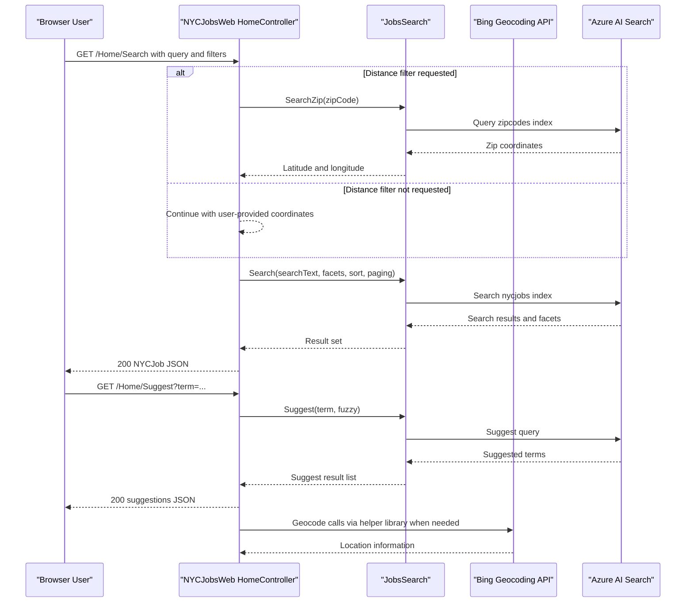

# API & Service Communication Contracts

The application exposes a small JSON API surface through ASP.NET MVC actions and relies on synchronous calls to Azure AI Search and Bing geocoding services.

## Service Catalog

| Service | Port | Category | Purpose |
|---|---:|---|---|
| NYCJobsWeb | 51269 (IIS Express default in project) | API Layer | Serves MVC pages and JSON endpoints for search, suggestions, and job lookup |
| DataLoader | N/A (console process) | Business | Seeds and refreshes Azure AI Search indexes from schema and JSON files |
| Azure AI Search (external) | 443 | Infrastructure | Hosts `nycjobs` and `zipcodes` indexes queried by the web app |
| Bing Geocoding API (external) | 443 | Infrastructure | Supports location resolution for distance-based job filtering |

## API Endpoints Inventory

| Service | Method | Path | Request Type | Response Type |
|---|---|---|---|---|
| NYCJobsWeb | GET | `/Home/Index` | None | HTML view |
| NYCJobsWeb | GET | `/Home/JobDetails` | Query: `id` (client usage) | HTML view |
| NYCJobsWeb | GET | `/Home/Search` | Query params (`q`, facets, `sortType`, `lat`, `lon`, `currentPage`, `zipCode`, `maxDistance`) | `NYCJob` JSON payload |
| NYCJobsWeb | GET | `/Home/Suggest` | Query params: `term`, `fuzzy` | `List<string>` JSON payload |
| NYCJobsWeb | GET | `/Home/LookUp` | Query param: `id` | `NYCJobLookup` JSON payload |

## Management & Observability Endpoints

| Service | Endpoint | Custom Metrics (if any) |
|---|---|---|
| NYCJobsWeb | None explicitly configured | None detected |
| DataLoader | None (console app) | None detected |

## DTOs & Contracts

The API contract is centered on two DTO classes in `NYCJobsWeb/Models/Jobs.cs`: `NYCJob` for search responses (result list, facets, count) and `NYCJobLookup` for individual document retrieval. Both are mutable C# classes serialized by ASP.NET MVC JSON handling. Request contracts are query-parameter driven rather than typed request-body models. No OpenAPI/Swagger, protobuf, or GraphQL contract files were found.

## Communication Patterns

Communication is synchronous HTTP/HTTPS throughout. `HomeController` delegates to `JobsSearch`, which uses Azure.Search.Documents clients to call Azure AI Search for query, suggest, and lookup operations. `DataLoader` uses raw REST calls via `HttpClient` to delete/create indexes and upload documents. No asynchronous messaging, circuit breaker framework, retry policy, service discovery, or API gateway is configured. Authentication to external services is API-key based in configuration; no API-level user authentication, authorization policies, or enforced TLS termination settings are defined in the application code.

## Service Technology Matrix

| Service | Web | Data Access | Discovery | Gateway | Actuator | Cache | Metrics |
|---|---|---|---|---|---|---|---|
| NYCJobsWeb | ASP.NET MVC 5 | Azure.Search.Documents SDK | None | No | No | None | None |
| DataLoader | None | HttpClient + Azure Search REST | None | No | No | None | None |

## Service Communication Sequence

