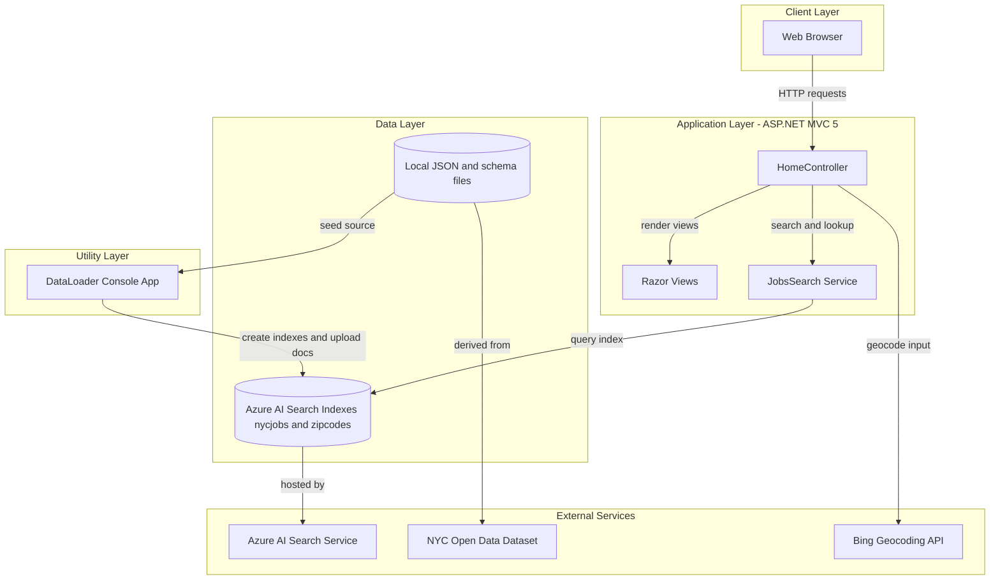
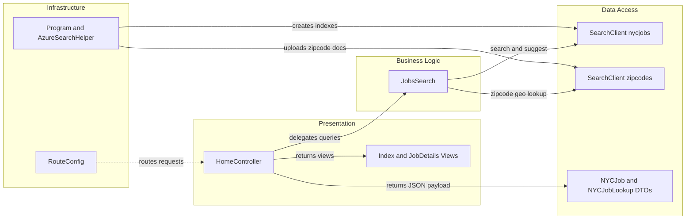

# Architecture Diagram

This .NET sample contains an ASP.NET MVC web application and a companion console data-loader utility that interact with Azure AI Search.

## Application Architecture

### Technology Stack Summary

| Layer | Technology | Version | Purpose |
|---|---|---|---|
| Presentation | ASP.NET MVC + Razor | MVC 5.2.2, WebPages 3.2.2 | Server-rendered UI and JSON endpoints |
| Application | .NET Framework | v4.7.2 (web), v4.5 (loader) | Business logic and integration orchestration |
| Search Integration | Azure.Search.Documents SDK | 11.1.1 | Query, suggest, and lookup operations |
| Utility | Console app + HttpClient | .NET Framework v4.5 | Recreate indexes and bulk upload seed data |

### Data Storage & External Services

The application does not use a relational database. It stores and retrieves job and zipcode documents from Azure AI Search indexes, and the data-loader imports source JSON files into those indexes. It also uses Bing geocoding for location-based search behavior.

### Key Architectural Decisions

- Uses a thin MVC controller layer that delegates all search operations to a dedicated `JobsSearch` service class.
- Uses Azure AI Search as the primary persistence and query platform instead of an ORM-backed relational database.
- Keeps indexing and ingestion responsibilities in a separate console utility to isolate operational data-loading from request-time web execution.

## Component Relationships

### Component Inventory

| Component | Layer | Type | Responsibility |
|---|---|---|---|
| HomeController | Presentation | MVC Controller | Handles page rendering and JSON search/suggest/lookup endpoints |
| Index and JobDetails Views | Presentation | Razor Views | Presents search UI, filters, and job detail pages |
| JobsSearch | Business Logic | Service class | Builds query options and executes Azure AI Search calls |
| SearchClient nycjobs | Data Access | Azure SDK client | Reads jobs index with filtering, facets, sorting, and suggestions |
| SearchClient zipcodes | Data Access | Azure SDK client | Resolves zipcode coordinates for distance filters |
| NYCJob / NYCJobLookup | Data Access | DTO models | Shapes API responses returned by controller actions |
| RouteConfig | Infrastructure | Routing configuration | Maps MVC routes to controller actions |
| Program / AzureSearchHelper | Infrastructure | Console utility and helper | Deletes/creates indexes and imports JSON content |
