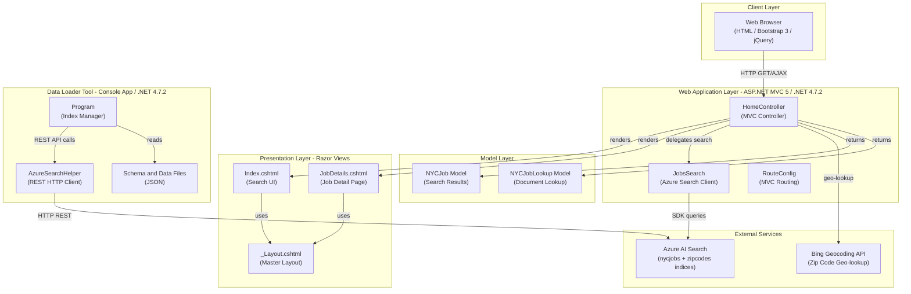
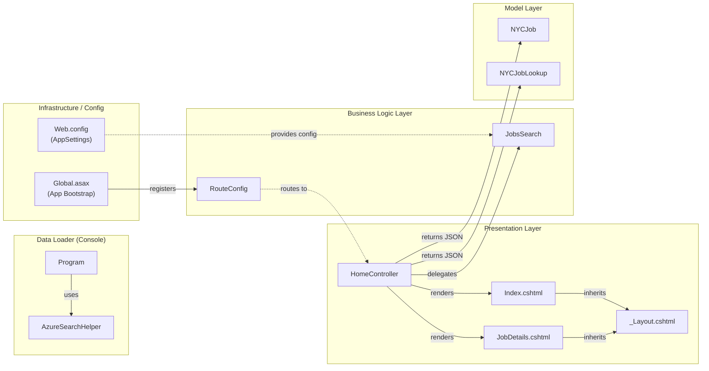

# Architecture Diagram

This document describes the architecture of the NYC Jobs Search application, a .NET Framework 4.7.2 ASP.NET MVC 5 web application that provides a job search portal backed by Azure AI Search.

## Application Architecture

### Technology Stack Summary

| Layer | Technology | Version | Purpose |
|-------|-----------|---------|---------|
| Presentation | ASP.NET MVC 5 Razor Views | 5.2.2 | Server-side HTML rendering |
| Frontend | Bootstrap | 3.4.1 | Responsive CSS framework |
| Frontend | jQuery | 3.1.1 | DOM manipulation and AJAX |
| Web Framework | ASP.NET MVC 5 | 5.2.2 | MVC routing and controllers |
| Runtime | .NET Framework | 4.7.2 | Application runtime |
| Search Client | Azure.Search.Documents | 11.1.1 | Azure AI Search SDK |
| Geo-location | BingGeocodingHelper | 1.1 | Zip-code to lat/lon resolution |
| Spatial | Microsoft.Spatial | 7.5.3 | Geography point support |
| Serialization | Newtonsoft.Json | 10.0.3 | JSON serialization |
| Data Loader | Console Application | .NET 4.7.2 | Index creation and data import |

### Data Storage & External Services

The application relies exclusively on **Azure AI Search** as its data backend. Two search indices are used: `nycjobs` (holds NYC job postings with fields such as agency, business title, salary range, geo-location, and job description) and `zipcodes` (maps US zip codes to latitude/longitude coordinates). There is no relational database or local cache — all search, filter, faceting, and auto-suggest operations are delegated to Azure AI Search via the `Azure.Search.Documents` SDK. The **Bing Geocoding API** is used indirectly through the `BingGeocodingHelper` library to resolve zip codes to geographic coordinates for distance-based filtering. The `DataLoader` console tool uses the Azure Search REST API directly to create indices and bulk-upload JSON data files at setup time.

### Key Architectural Decisions

- **Search-first architecture**: All data retrieval is performed through Azure AI Search; there is no local database, which makes the application stateless and scalable.
- **Facade pattern for search**: `JobsSearch` encapsulates all Azure AI Search SDK interactions (full-text search, suggestion, geo-filter, lookup) behind a single class consumed by the controller.
- **Static search client initialization**: The `SearchClient` instances are initialized as static fields in `JobsSearch` to reuse HTTP connections across requests, following the recommended SDK usage pattern.

## Component Relationships

### Component Inventory

| Component | Layer | Type | Responsibility |
|-----------|-------|------|---------------|
| HomeController | Presentation | MVC Controller | Handles Index, JobDetails, Search, Suggest, and LookUp HTTP actions; orchestrates the search workflow |
| Index.cshtml | Presentation | Razor View | Renders the main job search UI with search box, filters, facets, and results list |
| JobDetails.cshtml | Presentation | Razor View | Renders the detail page for a single job posting |
| _Layout.cshtml | Presentation | Razor Master Layout | Shared page shell with navigation, CSS, and JavaScript includes |
| JobsSearch | Business Logic | Service/Facade | Wraps Azure.Search.Documents SDK; exposes Search, SearchZip, Suggest, and LookUp operations |
| RouteConfig | Infrastructure | MVC Route Registration | Defines the default `{controller}/{action}/{id}` route |
| NYCJob | Model | DTO | Carries facets, search results list, and total count back to the controller |
| NYCJobLookup | Model | DTO | Carries a single SearchDocument for job detail lookup |
| Global.asax / MvcApplication | Infrastructure | HTTP Application | Application startup — registers areas and routes |
| Web.config | Infrastructure | Configuration | Holds Azure Search endpoint, API key, and Bing API key settings |
| Program (DataLoader) | Data Loader | Console Entry Point | Creates, deletes, and populates Azure Search indices using schema and JSON data files |
| AzureSearchHelper (DataLoader) | Data Loader | HTTP Helper | Sends authenticated REST requests to the Azure Search REST API with JSON payloads |
