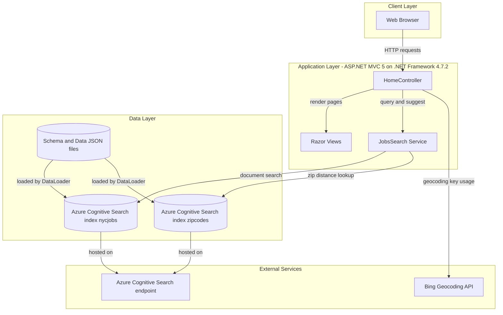
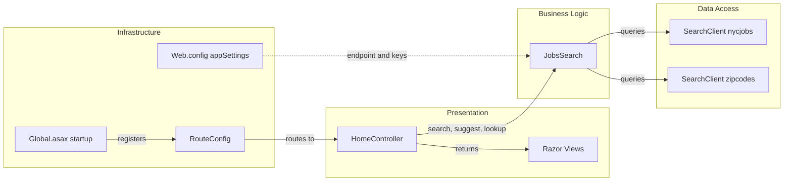

# Architecture Diagram

This document summarizes the application's high-level architecture and the main component relationships across the web app and data-loader utility.

## Application Architecture

### Technology Stack Summary

| Layer | Technology | Version | Purpose |
|---|---|---|---|
| Presentation | ASP.NET MVC + Razor | MVC 5.2.2 | Server-rendered UI and JSON endpoints |
| Business Logic | C# service class (`JobsSearch`) | .NET Framework 4.7.2 | Query orchestration and filter composition |
| Data Access | Azure.Search.Documents SDK | 11.1.1 | Access Azure Cognitive Search indexes |
| Utility Tooling | Console app (`DataLoader`) | .NET Framework 4.5 | Recreate indexes and bulk import sample data |

### Data Storage & External Services

The application does not use a relational database in-repo. It relies on Azure Cognitive Search indexes (`nycjobs`, `zipcodes`) as the primary data store and uses external search credentials from configuration. A Bing API key is also configured for geospatial lookup support.

### Key Architectural Decisions

- Uses thin MVC controllers that delegate search logic to a single `JobsSearch` service.
- Treats Azure Cognitive Search as both query engine and document store for demo data.
- Keeps index provisioning and seed upload in a separate console utility (`DataLoader`).

## Component Relationships

### Component Inventory

| Component | Layer | Type | Responsibility |
|---|---|---|---|
| HomeController | Presentation | MVC Controller | Handles page rendering and JSON actions for search/suggest/lookup |
| JobsSearch | Business Logic | Service class | Builds options/filters and calls Azure Search SDK |
| SearchClient (nycjobs) | Data Access | SDK client | Executes job search, suggest, and lookup operations |
| SearchClient (zipcodes) | Data Access | SDK client | Resolves zip code coordinates for distance filtering |
| RouteConfig | Infrastructure | Routing config | Defines default MVC route template |
| Global.asax | Infrastructure | App startup | Registers routes at application startup |
| Web.config | Infrastructure | Configuration source | Stores search endpoint and API keys |
