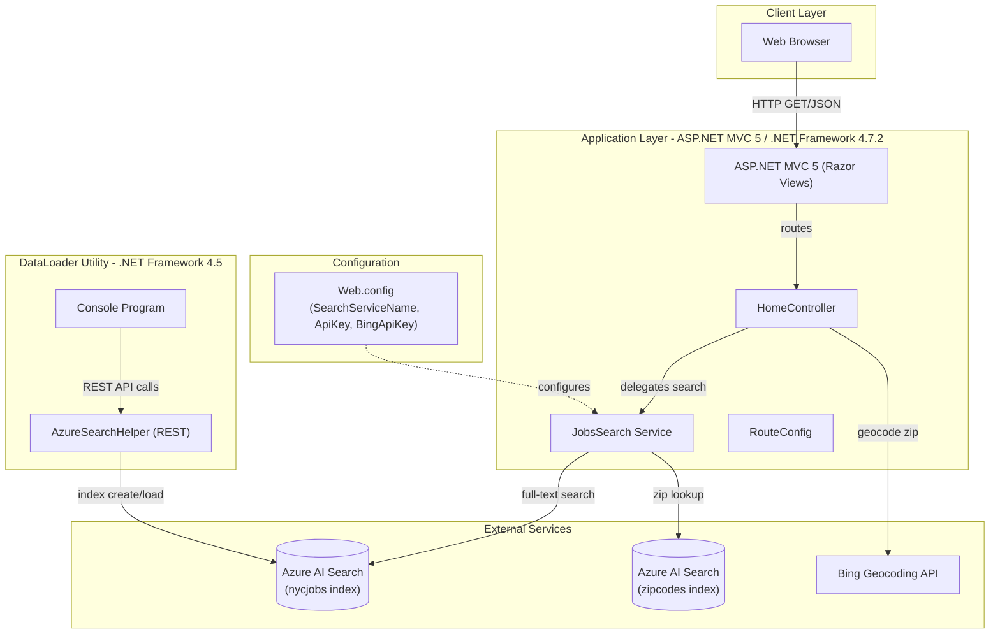
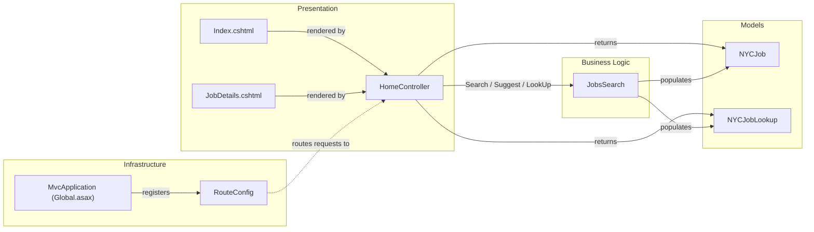

# Architecture Diagram

NYCJobsWeb is a two-component .NET Framework solution: an ASP.NET MVC 5 web application that surfaces NYC government job listings via Azure AI Search, and a companion DataLoader console utility that bulk-loads search index data.

## Application Architecture

### Technology Stack Summary

| Layer | Technology | Version | Purpose |
|---|---|---|---|
| Presentation | ASP.NET MVC 5 (Razor) | 5.2.2 | Server-rendered HTML + JSON API endpoints |
| Business Logic | Custom C# classes | .NET 4.7.2 | Search orchestration, filtering, faceting |
| Search Client | Azure.Search.Documents | 11.1.1 | Azure AI Search SDK for full-text search |
| Geocoding | BingGeocodingHelper | 1.1 | Zip code to lat/lon conversion |
| Serialization | Newtonsoft.Json | 10.0.3 | JSON serialization for API responses |
| UI Framework | Bootstrap + jQuery | 3.4.1 / 3.1.1 | Responsive front-end UI |
| DataLoader | Console app (.NET 4.5) | - | Bulk index creation and data loading |
| External Search | Azure AI Search | REST 2015-02-28 | Managed search-as-a-service backend |

### Data Storage & External Services

The application has no local database. All persistent data lives in **Azure AI Search**, which hosts two indexes: `nycjobs` (job postings with geo coordinates, salary ranges, and facet fields) and `zipcodes` (zip-to-coordinates lookup). Search queries, facet filtering, geo-distance filtering, and auto-suggest are all delegated to Azure AI Search. The **Bing Geocoding API** is used only when distance-based filtering is requested, to resolve a submitted zip code to latitude/longitude coordinates. API keys for both services are stored in `Web.config` `appSettings`.

### Key Architectural Decisions

- **Search-as-a-service pattern**: All data retrieval and filtering is offloaded to Azure AI Search; the application contains no local ORM, database connection, or caching layer.
- **JSON API + SPA hybrid**: `HomeController` serves the initial Razor page and then exposes `Search`, `Suggest`, and `LookUp` JSON endpoints consumed by jQuery front-end code, making it a thin JSON API over Azure Search.
- **Static SearchClient initialization**: `JobsSearch` uses static `SearchClient` fields initialized in a static constructor, sharing a single connection across requests.

## Component Relationships

### Component Inventory

| Component | Layer | Type | Responsibility |
|---|---|---|---|
| HomeController | Presentation | MVC Controller | Handles Index, Search (JSON), Suggest (JSON), LookUp (JSON) and JobDetails actions |
| Index.cshtml | Presentation | Razor View | Main search page with filters, facets, map, and results list |
| JobDetails.cshtml | Presentation | Razor View | Detailed view of a single job posting |
| JobsSearch | Business Logic | Service Class | Wraps Azure.Search.Documents SDK; builds search options, filters, facets, and geo queries |
| NYCJob | Models | DTO | Carries search results (list), facets dict, and total count back to the controller |
| NYCJobLookup | Models | DTO | Carries a single document result for the LookUp action |
| RouteConfig | Infrastructure | Route Registration | Registers default MVC route `{controller}/{action}/{id}` |
| MvcApplication | Infrastructure | HttpApplication | Application startup; registers areas and routes |
