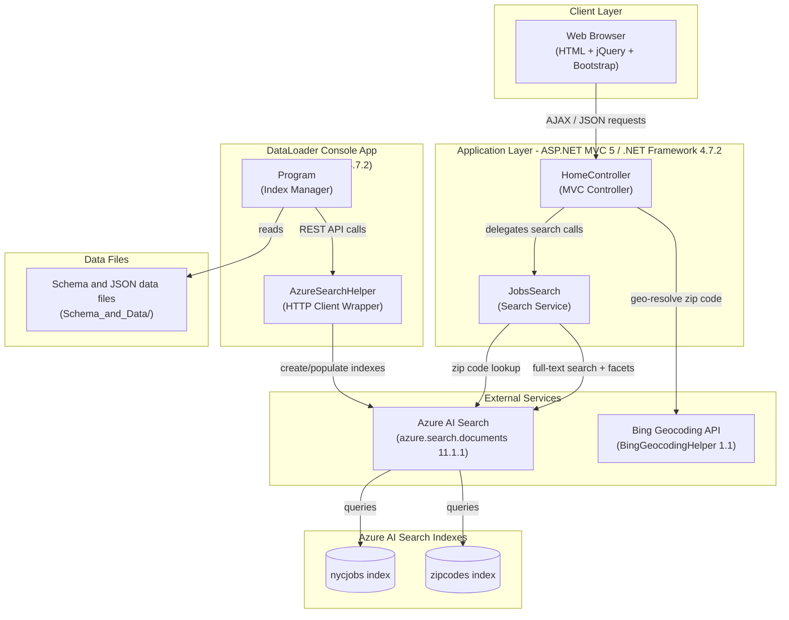
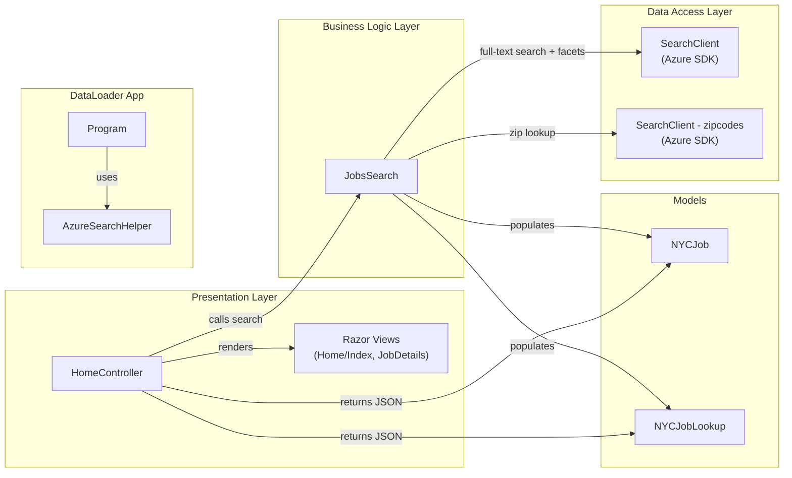

# Architecture Diagram

This document describes the architecture of the NYC Jobs Search application, a .NET Framework-based solution consisting of an ASP.NET MVC 5 web application and a DataLoader console utility, both backed by Azure AI Search.

## Application Architecture

### Technology Stack Summary

| Layer | Technology | Version | Purpose |
|-------|-----------|---------|---------|
| Presentation | ASP.NET MVC 5 | 5.2.2 | Server-side MVC web framework |
| Presentation | Razor Views | 3.2.2 | Server-side HTML templating |
| Presentation | jQuery | 3.1.1 | Client-side AJAX and DOM manipulation |
| Presentation | Bootstrap | 3.4.1 | Responsive UI layout and styling |
| Presentation | Modernizr | 2.8.3 | Browser feature detection |
| Business Logic | Azure.Search.Documents | 11.1.1 | Azure AI Search client SDK |
| Business Logic | Microsoft.Spatial | 7.5.3 | Geospatial query support |
| Business Logic | BingGeocodingHelper | 1.1 | Zip code to lat/lon resolution |
| Data Access | Azure AI Search REST API | — | Full-text search and faceted queries |
| Data Loader | .NET HttpClient | — | REST calls to Azure Search Management API |
| Runtime | .NET Framework | 4.7.2 | Application runtime |

### Data Storage & External Services

The application relies entirely on **Azure AI Search** as its data store — there is no relational database. Two indexes are used: `nycjobs` (holds NYC job postings with fields such as agency, business title, salary range, work location, geo_location, and tags) and `zipcodes` (holds zip code to geo-coordinate mappings for distance-based filtering). The **Bing Geocoding API** is called at query time when users filter by proximity (max distance from a zip code). The **DataLoader** console app uses the Azure AI Search REST Management API to recreate and populate both indexes from local JSON and schema files stored under `NYCJobsWeb/Schema_and_Data/`.

### Key Architectural Decisions

- **Azure AI Search as the sole data store**: The application uses no traditional RDBMS; all job data lives in Azure AI Search indexes, enabling full-text search, faceting, scoring profiles, and geo-spatial queries out of the box.
- **Scoring profiles for relevance tuning**: The search uses a named scoring profile (`jobsScoringFeatured`) with geo-distance boosting, allowing "featured" jobs nearest to the user's location to rank higher.
- **Thin controller, single service class**: `HomeController` delegates all search logic to the `JobsSearch` service class, which encapsulates Azure Search SDK calls for search, suggest, lookup, and zip-code resolution.

## Component Relationships

### Component Inventory

| Component | Layer | Type | Responsibility |
|-----------|-------|------|---------------|
| HomeController | Presentation | MVC Controller | Handles HTTP requests for Index, JobDetails, Search, Suggest, and LookUp actions; returns JSON or Razor views |
| Razor Views (Home/Index, JobDetails) | Presentation | MVC Views | Server-rendered HTML pages for job search UI and job detail display |
| JobsSearch | Business Logic | Service Class | Wraps Azure AI Search SDK; executes full-text search with facets/filters, autocomplete suggestions, geo-proximity filtering, and document lookup |
| NYCJob | Models | Model/DTO | Holds search results list, facets, and total count returned from a search query |
| NYCJobLookup | Models | Model/DTO | Holds a single `SearchDocument` result for job detail lookup |
| SearchClient (nycjobs) | Data Access | Azure SDK Client | Executes queries against the `nycjobs` Azure AI Search index |
| SearchClient (zipcodes) | Data Access | Azure SDK Client | Executes zip-code lookup queries against the `zipcodes` Azure AI Search index |
| Program (DataLoader) | DataLoader | Console Entry Point | Orchestrates deletion, creation, and data import of Azure AI Search indexes |
| AzureSearchHelper (DataLoader) | DataLoader | HTTP Helper | Wraps `HttpClient` to send authenticated REST requests to Azure AI Search Management API |
