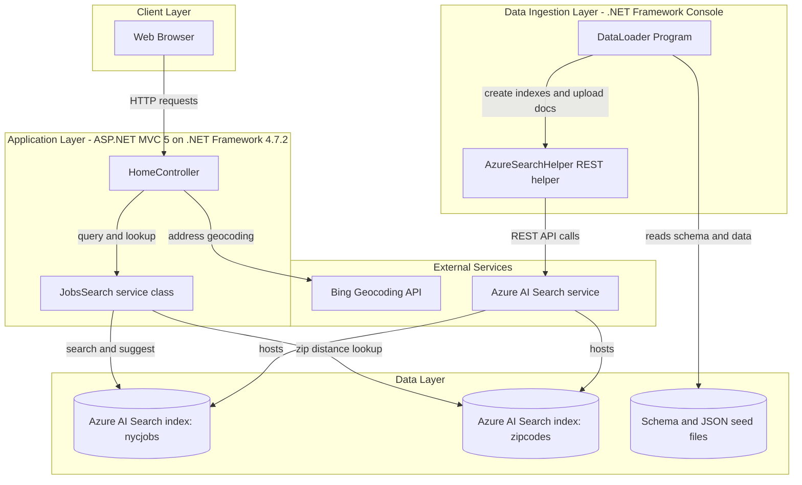
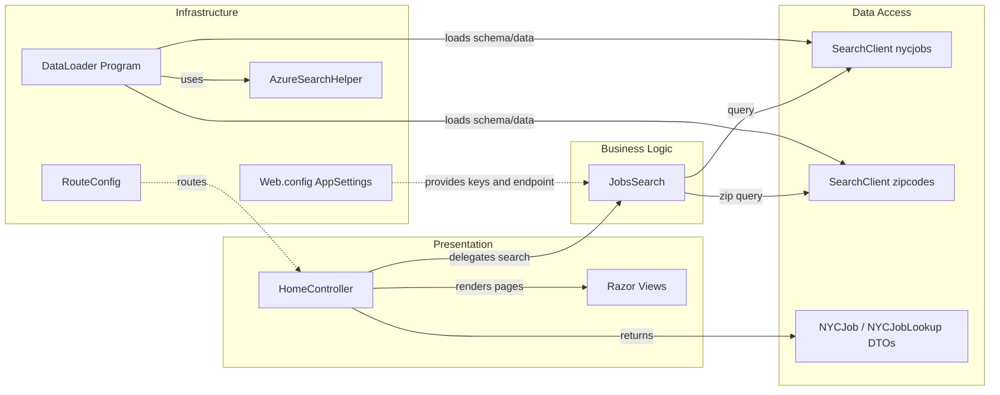

# Architecture Diagram

This repository contains a legacy ASP.NET MVC web application for searching NYC jobs and a companion console loader used to seed Azure AI Search indexes.

## Application Architecture

### Technology Stack Summary

| Layer | Technology | Version | Purpose |
|---|---|---|---|
| Presentation | ASP.NET MVC | 5.2.2 | Server-rendered UI and JSON endpoints |
| Search Integration | Azure.Search.Documents | 11.1.1 | Querying, suggestion, and document lookup |
| Geocoding | BingGeocodingHelper | 1.1 | Resolving location data for distance-based filtering |
| Data Ingestion | .NET Console App | .NET Framework 4.5 | Recreates indexes and bulk-loads seed data |
| Data Store | Azure AI Search | External service | Stores nycjobs and zipcodes search documents |

### Data Storage & External Services

The application uses Azure AI Search as its primary data store, with separate indexes for jobs and zip codes. The web app queries the indexes for search, suggestions, and detail lookups, while the DataLoader console app seeds these indexes from local schema and JSON files. Bing geocoding is used by the web layer for location-related search behavior.

### Key Architectural Decisions

- Uses a thin MVC controller with a dedicated `JobsSearch` integration class for search operations.
- Separates one-time/batch ingestion concerns into a standalone `DataLoader` executable.
- Relies on managed external search infrastructure (Azure AI Search) instead of local relational persistence.

## Component Relationships

### Component Inventory

| Component | Layer | Type | Responsibility |
|---|---|---|---|
| HomeController | Presentation | MVC Controller | Handles page rendering and JSON search endpoints |
| Razor Views | Presentation | View templates | Displays index and job detail pages |
| JobsSearch | Business Logic | Service/helper class | Builds search options and executes Azure Search operations |
| SearchClient (nycjobs) | Data Access | SDK client | Executes job search, suggest, and lookup operations |
| SearchClient (zipcodes) | Data Access | SDK client | Resolves zip code coordinates for distance filtering |
| NYCJob / NYCJobLookup | Data Access | DTOs | Shapes JSON responses returned by controller actions |
| RouteConfig | Infrastructure | MVC routing config | Defines default route pattern |
| Web.config AppSettings | Infrastructure | Config source | Stores endpoint and API keys for search/geocoding services |
| DataLoader Program | Infrastructure | Console entry point | Recreates indexes and uploads seed documents |
| AzureSearchHelper | Infrastructure | HTTP helper | Sends authenticated REST requests to Azure Search |
