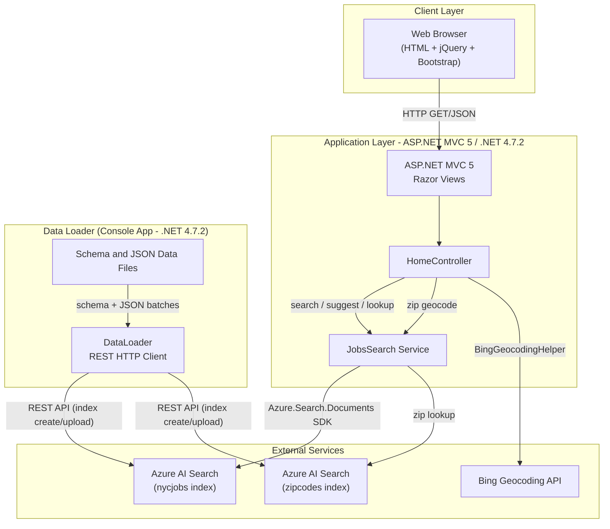
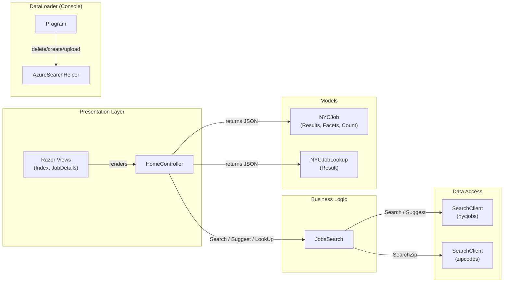

# Architecture Diagram

This document describes the architecture of the NYC Jobs Search solution, which consists of an ASP.NET MVC 5 web application and a .NET console data loader utility, both backed by Azure AI Search.

## Application Architecture

### Technology Stack Summary

| Layer | Technology | Version | Purpose |
|---|---|---|---|
| Presentation | ASP.NET MVC 5 with Razor Views | 5.2.2 | Server-side web framework for rendering job search UI |
| Presentation | jQuery | 3.1.1 | Client-side AJAX requests to MVC JSON endpoints |
| Presentation | Bootstrap | 3.4.1 | Responsive UI styling |
| Business Logic | JobsSearch Service | N/A | Encapsulates Azure AI Search queries (search, suggest, lookup, geo-filter) |
| Data Access | Azure.Search.Documents SDK | 11.1.1 | Client library for Azure AI Search REST API |
| Geospatial | BingGeocodingHelper | 1.1 | Resolves ZIP codes to latitude/longitude coordinates |
| Geospatial | Microsoft.Spatial | 7.5.3 | GeographyPoint used in geo-distance filter expressions |
| Data Loader | .NET Console App | .NET 4.7.2 | Bootstraps Azure AI Search indexes with schema and job data via REST |
| Configuration | Web.config / App.config | N/A | Stores search endpoint, API keys, and Bing API key |

### Data Storage & External Services

The application does not use a local database. All persistent data resides in **Azure AI Search** (formerly Azure Cognitive Search), hosted at an endpoint configured via `Web.config`. Two indexes are used: **nycjobs** (job postings with full-text search, faceting, geo-filtering, and scoring profiles) and **zipcodes** (a small index mapping ZIP codes to geographic coordinates for distance-based filtering). The **DataLoader** console utility pre-populates these indexes by reading JSON data files and `.schema` definition files from the `NYCJobsWeb/Schema_and_Data/` directory and uploading them via the Azure AI Search REST API. The **Bing Geocoding API** is optionally used by the web application to resolve locations.

### Key Architectural Decisions

- **Azure AI Search as the sole data store**: The application delegates all search, faceting, geo-filtering, and ranking to Azure AI Search, with no relational database, cache, or ORM layer.
- **Direct SDK usage with custom query building**: The `JobsSearch` class manually constructs `SearchOptions` (facets, filters, scoring parameters, geo-distance filters) using the `Azure.Search.Documents` v11 SDK, providing fine-grained control over query behavior.
- **Static `SearchClient` initialization**: Both `_indexClient` and `_indexZipClient` are initialized as static fields in `JobsSearch`, reusing a single HTTP connection pool across requests.

## Component Relationships

### Component Inventory

| Component | Layer | Type | Responsibility |
|---|---|---|---|
| HomeController | Presentation | MVC Controller | Handles HTTP requests for job search, suggestions, lookup, and job detail views; returns JSON responses |
| Razor Views (Index, JobDetails) | Presentation | MVC Views | Renders the job search UI and job detail page; calls controller endpoints via AJAX |
| JobsSearch | Business Logic | Service Class | Builds and executes Azure AI Search queries with filtering, faceting, geo-distance, scoring profiles, and suggestions |
| SearchClient (nycjobs) | Data Access | SDK Client | Azure AI Search client connected to the nycjobs index |
| SearchClient (zipcodes) | Data Access | SDK Client | Azure AI Search client connected to the zipcodes index for ZIP-to-coordinate lookups |
| NYCJob | Models | DTO | Carries search results, facet data, and total count back to the view |
| NYCJobLookup | Models | DTO | Carries a single job document for the detail lookup endpoint |
| Program (DataLoader) | DataLoader | Console Entry Point | Orchestrates deletion, recreation, and data upload for nycjobs and zipcodes indexes |
| AzureSearchHelper | DataLoader | HTTP Helper | Sends authenticated REST requests to the Azure AI Search management/indexing APIs |
