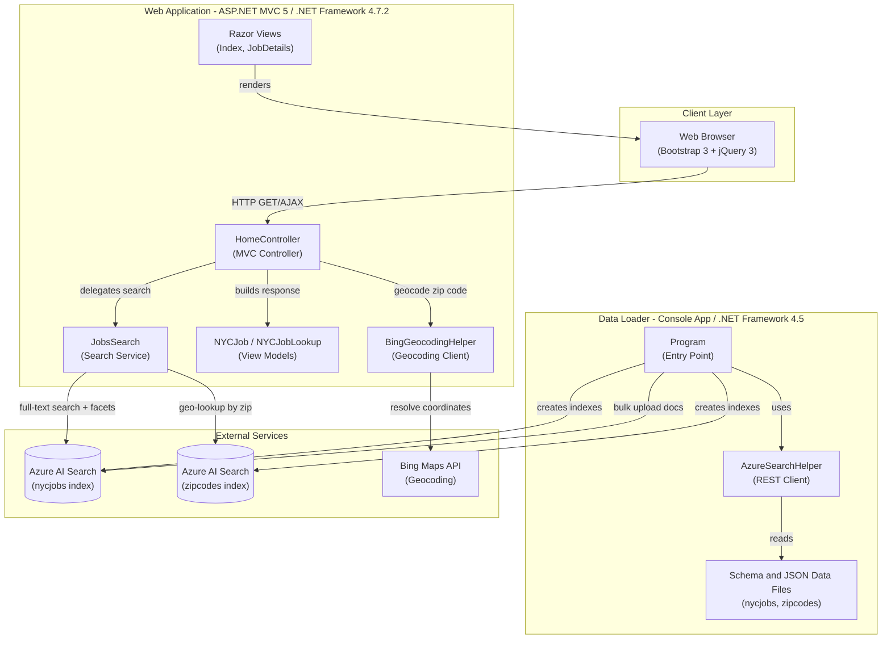
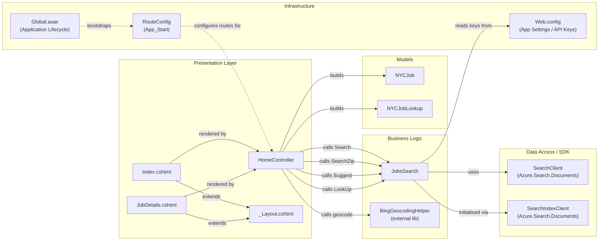

# Architecture Diagram

The NYC Jobs application is a two-component .NET solution consisting of an ASP.NET MVC 5 web front-end that queries Azure AI Search and a console-based data loader utility that seeds the search indexes from JSON files.

## Application Architecture

### Technology Stack Summary

| Layer | Technology | Version | Purpose |
|-------|-----------|---------|---------|
| Presentation | ASP.NET MVC 5 (Razor Views) | 5.2.2 | Server-side web framework with Razor templating |
| Presentation | Bootstrap | 3.4.1 | Responsive CSS framework |
| Presentation | jQuery | 3.1.1 | AJAX calls and DOM manipulation |
| Business Logic | HomeController | — | Handles search, suggest, lookup, and job details actions |
| Business Logic | JobsSearch | — | Wraps Azure AI Search SDK calls (search, suggest, lookup, geo-filter) |
| External Integration | Azure.Search.Documents | 11.1.1 | Azure AI Search client SDK |
| External Integration | BingGeocodingHelper | 1.1 | Bing Maps geocoding (zip-to-coordinates) |
| Serialization | Newtonsoft.Json | 10.0.3 | JSON serialization for MVC responses |
| Data Loader | Console App (AzureSearchBackupRestore) | — | Seeds Azure AI Search indexes from local JSON/schema files |
| Data Loader | Newtonsoft.Json | 9.0.1 | JSON serialization in loader |
| Runtime | .NET Framework | 4.7.2 (web) / 4.5 (loader) | Target runtime |

### Data Storage & External Services

The application relies entirely on **Azure AI Search** as its primary data store. Two indexes are used: `nycjobs` (job postings with full-text search, faceting, geo-filtering, and scoring profiles) and `zipcodes` (used to resolve a user-supplied zip code to lat/lon coordinates for proximity search). There is no relational database; all query and retrieval operations go through the Azure AI Search REST API via the `Azure.Search.Documents` SDK. **Bing Maps API** is used as a secondary external service to geocode zip codes when distance-based filtering is requested. The DataLoader console application pre-populates these indexes by reading local JSON data files and posting them via the Azure AI Search REST API.

### Key Architectural Decisions

- **Azure AI Search as the sole data store**: All job data is indexed in Azure AI Search, eliminating the need for a relational database; faceting, geo-filtering, scoring profiles, and autocomplete are all delegated to the search service.
- **Static singleton search client**: `JobsSearch` initializes `SearchClient` instances in a static constructor (read from `Web.config`), sharing a single HTTP connection across requests.
- **Thin controller pattern**: `HomeController` acts purely as an HTTP adapter—delegating all search logic to `JobsSearch` and returning raw `JsonResult` responses consumed by client-side JavaScript.

## Component Relationships

### Component Inventory

| Component | Layer | Type | Responsibility |
|-----------|-------|------|----------------|
| HomeController | Presentation | MVC Controller | Handles Index, JobDetails, Search, Suggest, and LookUp HTTP actions; orchestrates JobsSearch calls |
| Index.cshtml | Presentation | Razor View | Job search results page with facet navigation and map integration |
| JobDetails.cshtml | Presentation | Razor View | Detailed view of a single job posting |
| _Layout.cshtml | Presentation | Razor Layout | Shared page chrome (header, Bootstrap, jQuery) |
| JobsSearch | Business Logic | Service Class | Wraps Azure AI Search SDK; implements full-text search, geo-filtered search, autocomplete suggest, and document lookup |
| BingGeocodingHelper | Business Logic | External Library | Converts zip codes to lat/lon coordinates via Bing Maps API |
| NYCJob | Models | DTO / View Model | Holds paginated search results, facet counts, and total count returned to the browser |
| NYCJobLookup | Models | DTO / View Model | Holds a single `SearchDocument` for job detail lookup |
| SearchClient | Data Access | Azure SDK Client | Executes search, suggest, and document-get requests against Azure AI Search indexes |
| SearchIndexClient | Data Access | Azure SDK Client | Factory for per-index `SearchClient` instances; initialized with endpoint URL and API key |
| RouteConfig | Infrastructure | Route Registration | Defines default MVC route (`{controller}/{action}/{id}`) |
| Global.asax | Infrastructure | Application Bootstrap | Wires up routes and application-level event handlers at startup |
| Web.config | Infrastructure | Configuration Store | Holds Azure AI Search endpoint/API key and Bing API key as app settings |
| Program (DataLoader) | Data Loader | Console Entry Point | Orchestrates index deletion, schema creation, and JSON document upload for `nycjobs` and `zipcodes` indexes |
| AzureSearchHelper (DataLoader) | Data Loader | HTTP Utility | Wraps raw `HttpClient` calls to the Azure AI Search REST API (v2015-02-28-Preview) |
