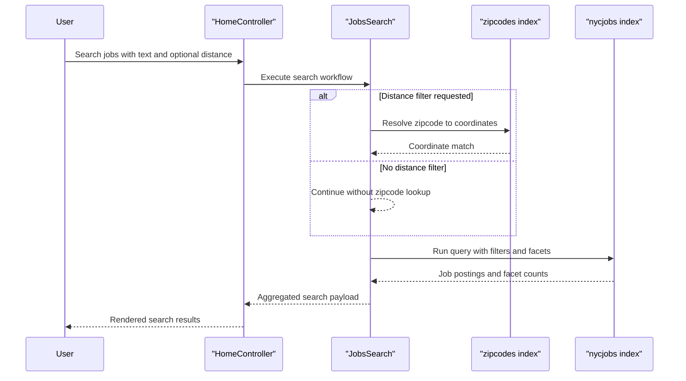

# Core Business Workflows

The application supports job discovery workflows for end users and index management workflows for maintainers using Azure AI Search-backed data.

## Domain Entities

| Entity | Service / Bounded Context | Description | Key Relationships |
|---|---|---|---|
| Job Posting | NYCJobsWeb / Job Discovery | Searchable municipal job listing presented to users | Returned in result sets and detail lookups |
| Zipcode Location | NYCJobsWeb / Geo Search | Location reference used to calculate distance filters | Enriches job search queries with coordinates |
| Search Result Aggregate | NYCJobsWeb / Search Experience | User-facing result envelope with facets and count | Composes jobs plus facet metadata |
| Index Schema and Document Batch | DataLoader / Data Operations | Search index schema and document payloads for ingestion | Feeds `nycjobs` and `zipcodes` indexes |

## Service-to-Domain Mapping

| Service | Domain Context | Owned Entities | External Dependencies |
|---|---|---|---|
| NYCJobsWeb | Job discovery and exploration | Job Posting projections, Zipcode lookup projections, Search Result Aggregate | Azure AI Search, Bing geocoding API |
| DataLoader | Search index administration | Index schema definitions, document import batches | Azure AI Search REST endpoint |

## Primary Workflows

### Workflow 1: Search Jobs with Facets and Distance

Entry point: `GET /Home/Search`.

1. User submits a search term and optional filters from the web UI.
2. Controller normalizes blank queries to wildcard search and passes parameters to `JobsSearch`.
3. If distance filtering is requested, zipcode lookup is executed to resolve coordinates.
4. Search request runs against the jobs index with facets, sorting, and optional geo-distance filtering.
5. Results are returned as a JSON aggregate for rendering in the UI.

### Workflow 2: Rebuild and Import Search Index Data

Entry point: `DataLoader` console execution.

1. Operator provides target search service settings in configuration.
2. Loader deletes and recreates `zipcodes` and `nycjobs` indexes.
3. Loader scans schema/data files and uploads document batches.
4. Imported data becomes available for the web search experience.

## Cross-Service Data Flows

Cross-module flow is asynchronous in execution timing but not message-broker based: `DataLoader` populates shared search indexes ahead of user traffic, and `NYCJobsWeb` later reads those indexes at request time. During search, the web module composes zipcode-derived coordinates with job index queries to provide distance-aware results. If zipcode lookup data is unavailable, distance-constrained query quality degrades while standard text search can still proceed.

## Business Workflow Sequence

## Business Rules & Decision Logic

- Blank search input is converted to wildcard (`*`) to keep discovery results available.
- Geo-distance filtering is only applied when `maxDistance > 0`; otherwise standard query execution is used.
- Sorting behavior branches by requested sort type (`featured`, salary ascending/descending, most recent).
- Index refresh is an explicit operational workflow in the loader, separating content ingestion from interactive query traffic.
- No explicit authorization gates are implemented in controller actions; all search endpoints are publicly callable in current design.
