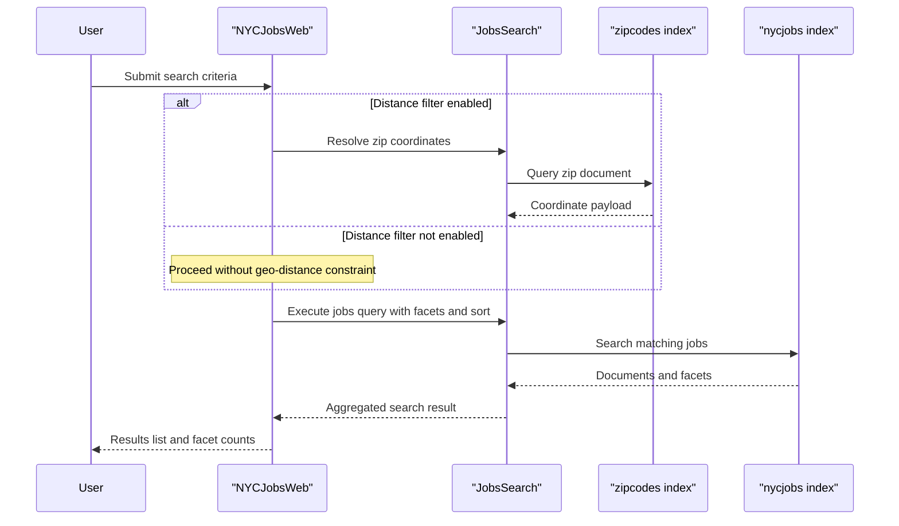

# Core Business Workflows

This application provides a searchable NYC jobs experience backed by Azure Cognitive Search and includes a companion workflow for loading and refreshing search index content.

## Domain Entities

| Entity | Service / Bounded Context | Description | Key Relationships |
|---|---|---|---|
| Job Posting | NYCJobsWeb / Job Discovery | Represents searchable city job content shown to end users | Linked to location/zip data for distance filtering |
| Zip Location | NYCJobsWeb / Geo Filtering | Supports converting zip input into coordinates for search filters | Used by job search workflow when distance is applied |
| Search Result Aggregate (`NYCJob`) | NYCJobsWeb / Presentation | API-facing aggregate carrying results, facets, and count | Composed from search response + facet metadata |
| Index Seed Artifact | DataLoader / Index Management | Source schema and JSON payload used to provision indexes | Drives refresh workflow for `nycjobs` and `zipcodes` indexes |

## Service-to-Domain Mapping

| Service | Domain Context | Owned Entities | External Dependencies |
|---|---|---|---|
| NYCJobsWeb | Job Discovery UI/API | Search result aggregate, query/filter intent | Azure Cognitive Search endpoint, Bing geocoding key |
| DataLoader | Index Management | Index schema/data import lifecycle | Azure Cognitive Search REST API, schema/data files |

## Primary Workflows

### Workflow 1: Search and Filter Jobs

User opens the web page and submits query options (text, facets, sort, optional location radius). The controller normalizes empty queries, optionally resolves zip code coordinates, executes search, and returns aggregated JSON results with facets and total count.

### Workflow 2: Get Typeahead Suggestions and Job Details

Typeahead requests call the suggestion action to return unique terms for UI auto-complete. Detail lookups call lookup action with a document id and return a single job payload for detail rendering.

### Workflow 3: Refresh Search Index Content

An operator runs `DataLoader`, which deletes existing indexes, recreates index schema from local files, and uploads JSON batches to repopulate searchable documents.

## Cross-Service Data Flows

The main runtime flow is Web UI to MVC controller to Azure Search SDK calls. When distance filtering is requested, zip index data is read first and merged into the subsequent job query filter. The data-loader flow is separate and administrative, writing index schema/data that the web app later reads.

## Business Workflow Sequence

## Business Rules & Decision Logic

- Empty query text is converted to wildcard search so users still receive a full result set.
- Optional distance filtering is applied only when `maxDistance > 0`, using resolved coordinates from zip data.
- Sort behavior is controlled by a request parameter (`featured`, salary descending/ascending, most recent).
- Suggestion results are de-duplicated before returning to the UI.
- Lookup workflow returns no payload when identifier input is missing.
