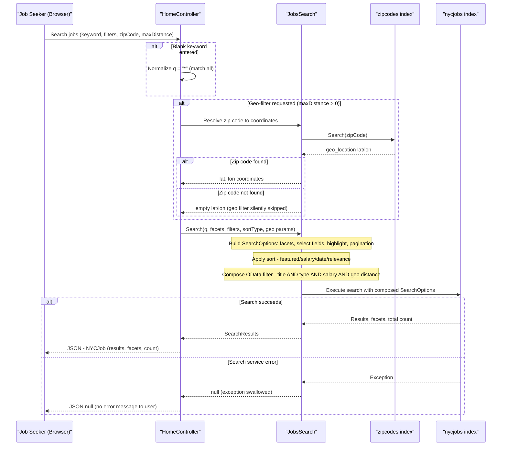

# Core Business Workflows

The NYC Jobs Search application enables job seekers to search, filter, and explore publicly posted NYC government job listings, supporting full-text search, faceted filtering by title/type/salary, geo-proximity filtering by zip code, and autocomplete suggestions.

## Domain Entities

| Entity | Service / Bounded Context | Description | Key Relationships |
|--------|--------------------------|-------------|-------------------|
| NycJob | Job Search (NYCJobsWeb) | A single NYC government job posting with title, agency, salary, work location, description, and posting dates | Belongs to a city Agency; has zero or more Tags; has a geo-location point |
| ZipCode | Geo-Location (NYCJobsWeb) | A US zip code mapped to geographic coordinates (lat/lon), used to resolve user-supplied zip codes into spatial coordinates for proximity filtering | Used as a lookup to derive a geo-point for filtering NycJob by distance |
| SearchQuery (implicit) | Job Search (NYCJobsWeb) | The user's search intent as expressed through the request parameters: keyword, facet selections, sort order, pagination page, and optional geo-filter | Composed at request time from HTTP query parameters; consumed by JobsSearch service |

## Service-to-Domain Mapping

| Service | Domain Context | Owned Entities / Indexes | External Dependencies |
|---------|---------------|--------------------------|----------------------|
| NYCJobsWeb (read path) | Job Search & Discovery | NycJob (read), ZipCode (read) | Azure AI Search (`nycjobs` and `zipcodes` indexes), Bing Geocoding API |
| DataLoader (write path) | Job Data Ingestion | NycJob (write), ZipCode (write) | Azure AI Search Management REST API; local JSON + schema files |

The two services operate in different bounded contexts with no runtime interaction: DataLoader populates indexes offline, and NYCJobsWeb queries them at runtime. All cross-domain data (e.g., geo-location from the `zipcodes` index used to filter `nycjobs`) is resolved within a single request by NYCJobsWeb chaining two index queries internally.

## Primary Workflows

### Workflow 1: Full-Text Job Search with Optional Geo-Filter

**Entry point**: Browser sends `GET /Home/Search` with keyword and optional facet/sort/geo parameters.

1. **Receive search request**: `HomeController.Search` receives query string parameters (`q`, `businessTitleFacet`, `postingTypeFacet`, `salaryRangeFacet`, `sortType`, `lat`, `lon`, `currentPage`, `zipCode`, `maxDistance`).
2. **Normalize empty keyword**: If `q` is blank or whitespace, it is replaced with `"*"` to match all documents (wildcard search).
3. **Resolve zip code to coordinates** (conditional): If `maxDistance > 0`, `JobsSearch.SearchZip(zipCode)` queries the `zipcodes` index for the first matching document and extracts its `geo_location.Latitude` and `geo_location.Longitude`.
4. **Build search options**: `JobsSearch.Search(...)` constructs a `SearchOptions` object:
   - Mode: Any (OR semantics across query terms)
   - Page size: 10 results
   - Pagination: Skip `currentPage - 1` results
   - Highlight: `job_description` field with `<b>` tags
   - Facets: `business_title`, `posting_type`, `level`, `salary_range_from` (with 50,000-unit intervals)
   - Select fields: `id`, `agency`, `posting_type`, `num_of_positions`, `business_title`, `salary_range_from`, `salary_range_to`, `salary_frequency`, `work_location`, `job_description`, `posting_date`, `geo_location`, `tags`
5. **Apply sort order** (conditional): One of — `jobsScoringFeatured` scoring profile (featured + geo-proximity boost), `salary_range_from desc` (highest salary), `salary_range_from asc` (lowest salary), `posting_date desc` (most recent), or default relevance score.
6. **Apply OData filters** (conditional): Filters are composed with `and`:
   - Business title equality filter (`businessTitleFacet`)
   - Posting type equality filter (`postingTypeFacet`)
   - Salary range band filter (`salary_range_from ge X and salary_range_from lt X+50000`)
   - Geo-distance filter (`geo.distance(geo_location, geography'POINT(lon lat)') le maxDistance`)
7. **Execute search**: The composed `SearchOptions` is submitted to Azure AI Search via the `nycjobs` index client.
8. **Return results**: Results, facets, and total count are packaged into an `NYCJob` response object and returned as JSON to the browser.

### Workflow 2: Autocomplete / Suggestions

**Entry point**: Browser sends `GET /Home/Suggest?term={partial}&fuzzy={bool}` (typically triggered on keypress in the search box).

1. `HomeController.Suggest` delegates to `JobsSearch.Suggest(term, fuzzy)`.
2. A `SuggestOptions` is built with `UseFuzzyMatching = fuzzy` and `Size = 8`.
3. Azure AI Search suggester `sg` is queried against the `nycjobs` index, covering fields: `agency`, `posting_type`, `business_title`, `civil_service_title`, `work_location`, `division_work_unit`.
4. Suggestion text values are extracted and de-duplicated (`Distinct()`).
5. The unique suggestion list is returned as a JSON `string[]` to the browser (used to populate a dropdown).

### Workflow 3: Job Detail Lookup

**Entry point**: Browser sends `GET /Home/LookUp?id={jobId}` when a user clicks on a search result to view the full job details.

1. `HomeController.LookUp` validates that `id` is non-null; returns `null` response if missing.
2. `JobsSearch.LookUp(id)` calls `GetDocument<SearchDocument>(id)` to fetch the full document by its primary key from the `nycjobs` index.
3. The complete `SearchDocument` is wrapped in `NYCJobLookup` and returned as JSON.

### Workflow 4: Index Data Load (DataLoader)

**Entry point**: Developer manually runs the `DataLoader` console application.

1. The program reads `TargetSearchServiceName` and `TargetSearchServiceApiKey` from `App.config`.
2. For each index (`zipcodes`, then `nycjobs`), `LaunchImportProcess` is called:
   a. **Delete**: `DELETE /indexes/{indexName}` — removes the existing index if present.
   b. **Create**: `POST /indexes` with schema JSON read from `Schema_and_Data/{indexName}.schema`.
   c. **Import**: For each matching `{indexName}*.json` file in `Schema_and_Data/`, `POST /indexes/{indexName}/docs/index` uploads a batch of documents.
3. On completion, the program prints a note that large indexes may take time to fully index, then waits for a key press before exiting.

## Cross-Service Data Flows

There are no runtime cross-service calls between independently deployed services. All data composition happens within a single NYCJobsWeb request:

**Geo-Proximity Search Composition**: When a user requests a geo-filtered search (`maxDistance > 0`), NYCJobsWeb performs an internal two-step data flow:
1. **Step 1 — Zip code resolution**: Query the `zipcodes` index with the user's zip code string. Extract `geo_location.Latitude` and `geo_location.Longitude` from the first result.
2. **Step 2 — Geo-filtered job search**: Use the resolved coordinates to build an OData `geo.distance(...)` filter and submit the main job search against the `nycjobs` index.

If Step 1 returns no results (unknown zip code) or the `zipcodes` index is unavailable, the `maxDistanceLat`/`maxDistanceLon` values remain empty strings, the geo filter is silently omitted, and the search proceeds without distance filtering. There is no user-facing error or fallback message for this scenario.

**DataLoader → NYCJobsWeb**: This is an offline, pre-runtime flow. DataLoader writes index data before NYCJobsWeb is started or when index refresh is needed. There is no event notification or coordination between the two; NYCJobsWeb always reads whatever is currently in the index.

## Business Workflow Sequence

## Business Rules & Decision Logic

### Validation Rules

- **Blank keyword normalization**: If the search term `q` is blank or whitespace, it is automatically replaced with `"*"` so that the search returns all available jobs rather than no results.
- **Null ID guard (LookUp)**: The `LookUp` action returns `null` JSON (HTTP 200 with null body) if no `id` parameter is supplied, rather than throwing an exception.

### Decision Logic

- **Sort type selection**: Four sort strategies are supported — `featured` (scoring profile with freshness + tag + geo-distance boost), `salaryDesc` (highest salary first), `salaryIncr` (lowest salary first), `mostRecent` (newest postings first), and default (Azure AI Search relevance score).
- **Facet filter composition**: Filters for `businessTitleFacet`, `postingTypeFacet`, and `salaryRangeFacet` are each optional and combined with `and` when present. The salary filter operates in 50,000-unit bands matching the facet interval definition.
- **Geo filter activation**: The geo-distance filter `geo.distance(geo_location, POINT) le maxDistance` is only added when `maxDistance > 0` AND the zip code was successfully resolved to coordinates.
- **Suggestion deduplication**: The `Suggest` workflow deduplicates suggestion text values before returning them to the browser, preventing the same suggestion text from appearing multiple times in the autocomplete dropdown.

### State Transitions

There are no mutable entity lifecycle states in NYCJobsWeb — all entities are read-only from the web app's perspective. The DataLoader manages a simple destructive-recreate lifecycle for each index: `exists → deleted → created → populated`.

### Business Constraints

- **Page size fixed at 10**: The `Search` method hardcodes `Size = 10`. There is no user-controllable page size.
- **Suggestion count fixed at 8**: The `Suggest` method hardcodes `Size = 8`.
- **No write operations from web app**: NYCJobsWeb has no create, update, or delete operations. It is strictly a read-only search interface.

### Cross-Cutting Concerns

- **Transactions**: Not applicable — Azure AI Search has no transactional API. DataLoader operations (delete/create/import) are not atomic; a partial failure leaves the index in an inconsistent state.
- **Error handling**: All exceptions in `JobsSearch` are caught and either stored (`errorMessage` static field at startup) or printed to console, and the method returns `null`. No business exceptions, compensating actions, or user-facing error messages are propagated.
- **Audit/logging**: No structured logging, audit trail, or business event logging is implemented. All error output goes to `Console.WriteLine`.
- **Authorization**: No authentication or authorization is implemented. All endpoints are publicly accessible with no role checks or resource ownership enforcement.
