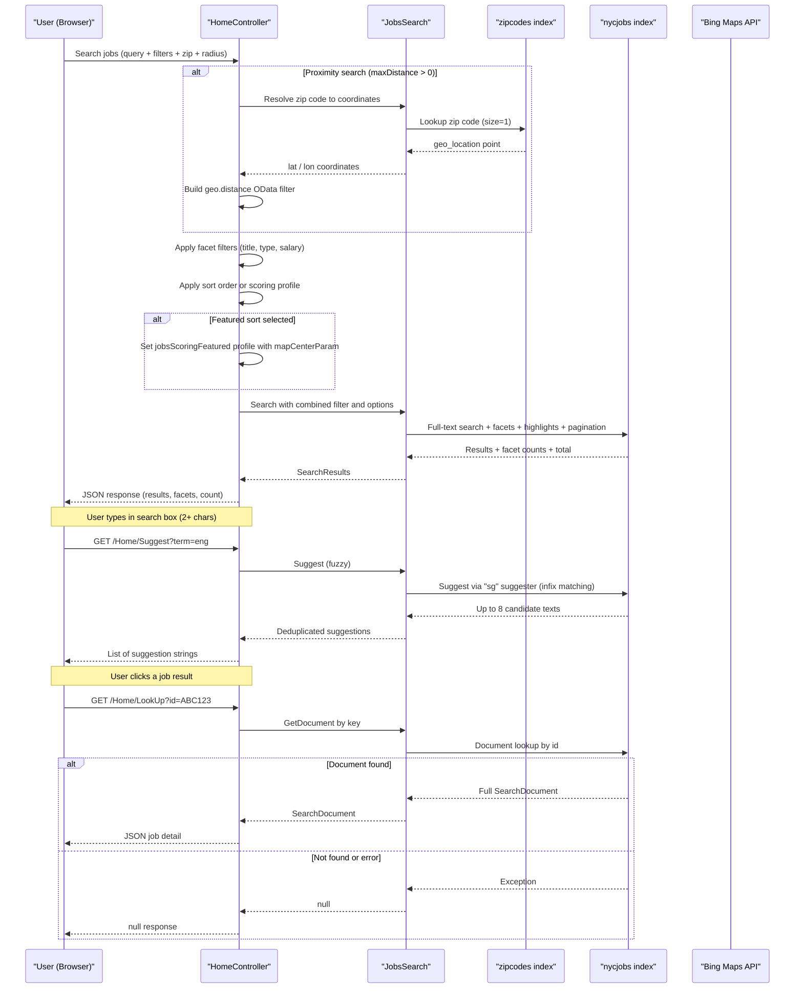

# Core Business Workflows

The NYC Jobs application allows job seekers to search, filter, browse, and view details of New York City government job postings, with support for full-text search, faceted navigation, geo-proximity filtering, and autocomplete suggestions.

## Domain Entities

| Entity | Service / Bounded Context | Description | Key Relationships |
|--------|--------------------------|-------------|-------------------|
| Job Posting (nycjobs index) | NYCJobsWeb — Job Search | Represents a published NYC government job vacancy including title, agency, salary, location, description, and qualifications | Self-contained; no cross-entity foreign keys |
| Zip Code (zipcodes index) | NYCJobsWeb — Geo Lookup | Reference data mapping US zip codes to geographic coordinates for proximity-based search | Used to resolve a user-supplied zip code to lat/lon before querying job postings |
| Search Results (NYCJob DTO) | NYCJobsWeb — Presentation | Aggregated response model combining a paginated list of job documents, facet aggregations, and total count | Composed from Job Posting documents |
| Job Detail (NYCJobLookup DTO) | NYCJobsWeb — Presentation | Single job posting document returned for the detail view | Derived from Job Posting |

## Service-to-Domain Mapping

| Service | Domain Context | Owned Entities | External Dependencies |
|---------|---------------|---------------|----------------------|
| NYCJobsWeb | Job Search & Discovery | Job Posting (read), Zip Code (read), Search Results DTO, Job Detail DTO | Azure AI Search (nycjobs + zipcodes indexes), Bing Maps API (geocoding) |
| DataLoader | Index Administration | Job Posting (write), Zip Code (write) | Azure AI Search REST API (admin key) |

The two services share the same Azure AI Search service but operate in non-overlapping modes: DataLoader owns the write path (schema creation and bulk data load); NYCJobsWeb owns the read path (search queries). There is no direct service-to-service communication between them.

## Primary Workflows

### Workflow 1: Full-Text Job Search with Faceting and Sorting

A user enters a search term in the web UI and browses paginated results. The browser sends a GET request to `/Home/Search` with the query string, facet selections, sort preference, and pagination offset. `HomeController` delegates to `JobsSearch.Search()`, which builds `SearchOptions` (search mode, page size, skip offset, facet fields, highlight fields, sort order) and issues a synchronous call to the Azure AI Search `nycjobs` index. If a sort type of `"featured"` is selected, the `jobsScoringFeatured` scoring profile is applied with the map center point as a scoring parameter. The search results (up to 10 documents per page), facet aggregations, and total count are returned as a JSON response to the browser for client-side rendering.

**Steps:**
1. User types query and/or selects facets/sort in the browser
2. Browser calls `GET /Home/Search?q=...&businessTitleFacet=...&sortType=...&currentPage=...`
3. Controller sets wildcard (`"*"`) if query is blank
4. Builds `SearchOptions`: sets `Size=10`, `Skip=currentPage-1`, facets, highlight fields
5. If `sortType == "featured"`: applies `jobsScoringFeatured` profile with `featuredParam` and `mapCenterParam`
6. If `sortType` is `"salaryDesc"`, `"salaryIncr"`, or `"mostRecent"`: applies `OrderBy` clause
7. Assembles OData `$filter` for any active facet selections (business title, posting type, salary range)
8. Calls `_indexClient.Search<SearchDocument>(searchText, sp)`
9. Returns `JsonResult` with `{ Results, Facets, Count }`

### Workflow 2: Geo-Proximity Job Search

A user selects a maximum distance radius and enters a zip code to find jobs near a location. The controller first resolves the zip code to coordinates, then applies a geo-distance filter to the main search.

**Steps:**
1. User sets `maxDistance > 0` and provides a `zipCode`
2. Browser calls `GET /Home/Search?...&zipCode=10001&maxDistance=5`
3. Controller calls `JobsSearch.SearchZip(zipCode.ToString())`
4. `SearchZip` queries the `zipcodes` index (`SearchMode.All`, `Size=1`) for the zip code string
5. Controller extracts `geo_location.Latitude` and `geo_location.Longitude` from the result
6. OData geo-distance filter is appended: `geo.distance(geo_location, geography'POINT(lon lat)') le {maxDistance}`
7. Main search proceeds with the geo filter applied (combined with any active facet filters via `AND`)
8. Results are returned filtered to jobs within the specified radius

### Workflow 3: Autocomplete Suggestions

As the user types in the search box (minimum 2 characters), the browser calls `/Home/Suggest` to power the jQuery UI autocomplete widget.

**Steps:**
1. User types 2+ characters in the search box
2. jQuery autocomplete calls `GET /Home/Suggest?term=...&fuzzy=true`
3. Controller calls `JobsSearch.Suggest(term, fuzzy)`
4. `Suggest` calls `_indexClient.Suggest<SearchDocument>(text, "sg", SuggestOptions)` using the `sg` suggester (`analyzingInfixMatching` over agency, posting_type, business_title, civil_service_title, work_location, division_work_unit fields)
5. Up to 8 suggestion candidates are returned
6. Controller deduplicates results with `.Distinct().ToList()`
7. Returns `JsonResult` with `List<string>` of unique suggestion texts

### Workflow 4: Job Detail Lookup

When a user clicks a search result, the browser calls `/Home/LookUp` with the document key to retrieve the full job record.

**Steps:**
1. User clicks on a job in the results list
2. Browser calls `GET /Home/LookUp?id={documentId}`
3. Controller calls `JobsSearch.LookUp(id)` if `id != null`
4. `LookUp` calls `_indexClient.GetDocument<SearchDocument>(id)`
5. Returns `JsonResult` with `NYCJobLookup { Result: SearchDocument }`
6. If `id` is null, returns `null` (no error response)

### Workflow 5: Index Seeding (DataLoader)

Run once (or when data needs refreshing) to populate Azure AI Search indexes from local JSON files.

**Steps:**
1. Operator configures `App.config` with target search service name and admin API key
2. `Program.Main()` constructs the service URI and sets the API key header on `HttpClient`
3. For each index (`zipcodes`, then `nycjobs`):
   a. DELETE `/indexes/{name}` — removes existing index (destructive)
   b. POST `/indexes` with schema JSON from `{indexName}.schema` file — recreates the index
   c. For each `{indexName}*.json` data file: POST `/indexes/{name}/docs/index` — bulk-uploads documents
4. Operator is reminded that large indexes may take time to become fully searchable

## Cross-Service Data Flows

The NYC Jobs application is a single-service system with no inter-service communication. The only cross-index data flow is the two-step geo-lookup pattern within `JobsSearch`:

1. **Step 1 — Zip-to-coordinates resolution**: `JobsSearch.SearchZip()` queries the `zipcodes` index to convert a user-provided zip code string into a `geo_location` point. This is a point lookup (size=1) with no ranking.
2. **Step 2 — Geo-filtered job search**: The resolved coordinates are used to construct an OData `geo.distance()` filter, which is combined with any active facet filters before executing the main `nycjobs` search.

**Fallback behavior**: If `SearchZip()` returns no results or throws an exception, the controller proceeds with empty `maxDistanceLat`/`maxDistanceLon` strings and the geo-distance filter is appended as `geo.distance(geo_location, geography'POINT( )') le {distance}`, which will produce malformed OData and return an Azure Search error. There is no fallback to a non-geo search in this case.

## Business Workflow Sequence

## Business Rules & Decision Logic

### Validation Rules

- **Blank search query**: If `q` is null or whitespace, it is replaced with `"*"` (wildcard — return all matching documents). There is no minimum query length enforced server-side.
- **Null document ID**: If `id` is null in the LookUp action, the method returns `null` directly without calling the search service.
- **Distance filtering prerequisite**: Geo-distance filtering is applied only when `maxDistance > 0`. There is no validation that the resolved zip code coordinates are valid before constructing the filter.

### Decision Logic

- **Sort type routing**: The sort behavior branches on the `sortType` parameter:
  - `"featured"` → applies the `jobsScoringFeatured` scoring profile with `featuredParam` (tag boost) and `mapCenterParam` (geo proximity boost)
  - `"salaryDesc"` → `OrderBy salary_range_from desc`
  - `"salaryIncr"` → `OrderBy salary_range_from asc`
  - `"mostRecent"` → `OrderBy posting_date desc`
  - Any other value → default relevance ranking (no explicit sort)

- **Filter combination**: Multiple active facet filters are concatenated with `AND`: business title → posting type → salary range → geo distance. Each filter segment is only appended if its value is non-empty/non-zero.

- **Salary range filter**: Uses a bucket approach — `salary_range_from ge {value} AND salary_range_from lt {value + 50000}` — matching the 50,000-unit interval used when indexing the `salary_range_from` facet.

- **Scoring profile (featured)**: The `jobsScoringFeatured` profile applies three boosts simultaneously: title weight boost (3×), recency freshness boost (3× decaying over 500 days), geo-proximity boost (6× within 5 km), and tag match boost (10× for featured tags).

### State Transitions

There are no entity lifecycle state machines. Job postings are static read-only data; there is no create/update/delete workflow for job records in the web application. DataLoader performs a destructive full-reload cycle (delete → create → bulk upload) with no incremental update mechanism.

### Business Constraints

- **Page size**: Fixed at 10 results per page (`Size=10`); not configurable by the user.
- **Suggestion count**: Fixed at 8 candidates (`Size=8`); not configurable.
- **Geo-distance units**: Distance is specified in kilometers (Azure AI Search default for `geo.distance()`).
- **Zip code resolution**: Only US zip codes are supported (zipcodes index contains US postal data). City or address-based search is noted in a code comment as a future extension.

### Error Handling

- All `JobsSearch` methods wrap their Azure SDK calls in `try/catch (Exception ex)`. On any exception, they log to `Console.WriteLine` and return `null` (for document lookups) or `null` (for searches). The controller does not check for null before constructing the `JsonResult`, which means a failed search will throw a `NullReferenceException` at the `response.GetResults().ToList()` call — resulting in an unhandled 500 error.
- The static constructor of `JobsSearch` catches initialization exceptions and stores the message in `JobsSearch.errorMessage`, but this field is never checked or surfaced to the user.

### Cross-Cutting Concerns

- **Transactions**: None — Azure AI Search is a stateless query service; there are no distributed transactions or rollback mechanisms.
- **Authorization**: None — all workflows are publicly accessible with no authentication or role checks.
- **Audit/Logging**: No structured logging or audit trail. All diagnostic output is `Console.WriteLine` to stdout.
- **Caching**: None — every request results in a live round-trip to Azure AI Search.
