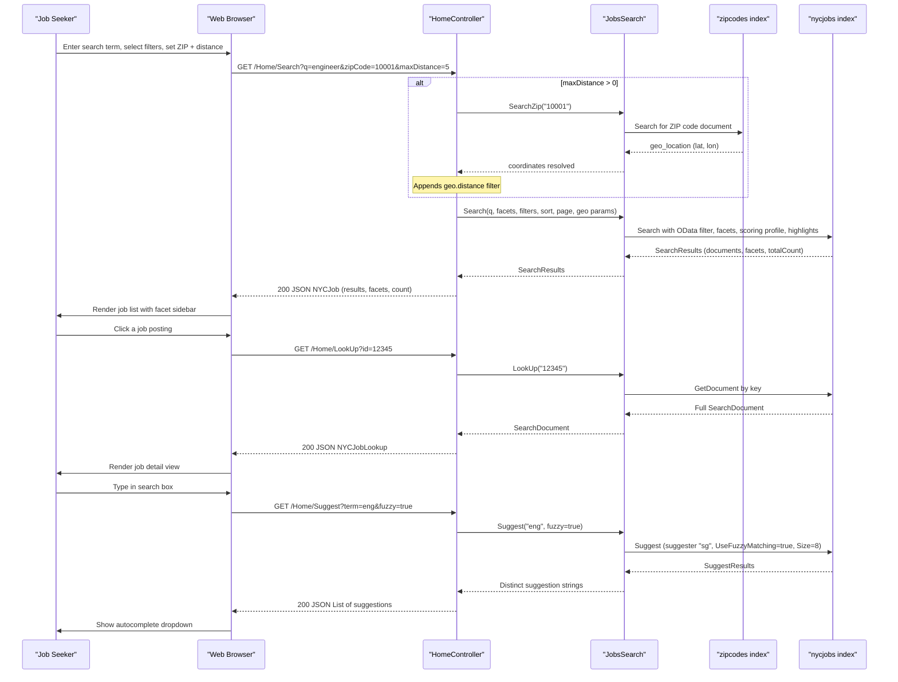

# Core Business Workflows

The NYC Jobs Search application enables job seekers to discover, filter, and explore New York City government job postings using full-text search, faceted filtering, geographic proximity search, and salary-range sorting.

## Domain Entities

| Entity | Service / Bounded Context | Description | Key Relationships |
|---|---|---|---|
| Job Posting | Job Search (NYCJobsWeb) | A NYC government job listing with title, agency, salary range, work location, description, and posting dates | Tagged with a geo-location point; classified by business title, posting type, and level |
| ZIP Code | Geographic Reference (NYCJobsWeb / zipcodes index) | A postal code mapped to a geographic coordinate (latitude/longitude) used to anchor distance-based job searches | Looked up on demand to resolve a user's ZIP code to coordinates for geo-filtering |

## Service-to-Domain Mapping

| Service | Domain Context | Owned Entities | External Dependencies |
|---|---|---|---|
| NYCJobsWeb | Job Search & Discovery | Job Posting (read), ZIP Code (read) | Azure AI Search (nycjobs and zipcodes indexes), Bing Geocoding API |
| DataLoader | Index Administration | Job Posting (write), ZIP Code (write) | Azure AI Search REST API, local JSON data files |

The two components share the same Azure AI Search service but operate independently: DataLoader is responsible for one-time index population, while NYCJobsWeb provides the user-facing read-only search experience.

## Primary Workflows

### Workflow 1: Full-Text Job Search with Faceting and Filtering

A user types a search query (or accepts the default "match all" query) and optionally applies filters for business title, posting type, or salary range, selects a sort order, and receives a paginated list of matching job postings with facet counts.

**Steps:**
1. User enters a search term and optional filter selections in the browser UI.
2. Browser sends an AJAX GET request to `/Home/Search` with query parameters.
3. If the query string is blank or whitespace, it is replaced with `"*"` (match all).
4. `HomeController` delegates to `JobsSearch.Search()` with all parameters.
5. `JobsSearch` builds a `SearchOptions` object:
   - Sets `Size=10` and `Skip=currentPage-1` for pagination.
   - Adds highlight tags (`<b>...</b>`) for `job_description`.
   - Adds facet requests for `business_title`, `posting_type`, `level`, and `salary_range_from` (with 50,000-unit intervals).
   - Selects specific return fields (id, agency, posting_type, business_title, salary range, work_location, job_description, posting_date, geo_location, tags).
6. If `businessTitleFacet`, `postingTypeFacet`, or `salaryRangeFacet` are non-empty, they are combined into an OData `$filter` expression.
7. Based on `sortType`, an ordering clause is applied: `jobsScoringFeatured` scoring profile, `salary_range_from desc`, `salary_range_from`, or `posting_date desc`.
8. Azure AI Search executes the query and returns matching documents, facet counts, and total count.
9. `HomeController` wraps the results in an `NYCJob` DTO and returns it as JSON.
10. Browser renders the results list with highlights and facet sidebar.

### Workflow 2: Proximity-Based Job Search (Geographic Distance Filter)

A user supplies a ZIP code and maximum distance radius, and the application returns only job postings within that radius.

**Steps:**
1. User enters a ZIP code and selects a distance radius (e.g., 5 miles).
2. Browser sends GET `/Home/Search` with `zipCode` and `maxDistance` parameters.
3. `HomeController` detects `maxDistance > 0` and calls `JobsSearch.SearchZip(zipCode)`.
4. `JobsSearch` queries the `zipcodes` Azure AI Search index (`Size=1`) and retrieves the matching document's `geo_location` field.
5. The latitude and longitude from the ZIP code document are extracted and passed back.
6. `JobsSearch.Search()` is called with the resolved coordinates; an additional OData filter `geo.distance(geo_location, geography'POINT(lon lat)') le maxDistance` is appended to the filter string.
7. Azure AI Search performs the geo-distance filtered query against the `nycjobs` index.
8. Results restricted to the specified radius are returned.

### Workflow 3: Autocomplete Suggestions

As a user types in the search box, the application returns up to 8 autocomplete suggestions drawn from job posting fields.

**Steps:**
1. Browser sends GET `/Home/Suggest?term=<partial text>&fuzzy=true` on each keystroke (debounced client-side).
2. `HomeController` calls `JobsSearch.Suggest(term, fuzzy)`.
3. `JobsSearch` calls the Azure AI Search Suggest API using the `sg` suggester against the `nycjobs` index, with `UseFuzzyMatching=fuzzy` and `Size=8`.
4. The suggester covers: `agency`, `posting_type`, `business_title`, `civil_service_title`, `work_location`, `division_work_unit`.
5. Suggestion strings are extracted and de-duplicated (`Distinct()`).
6. Up to 8 unique strings are returned as a JSON array.

### Workflow 4: Job Detail Lookup

A user clicks on a job posting to view its full details.

**Steps:**
1. Browser sends GET `/Home/LookUp?id=<documentKey>`.
2. `HomeController` calls `JobsSearch.LookUp(id)`.
3. `JobsSearch` calls `SearchClient.GetDocument<SearchDocument>(id)` to fetch the full document by key from the `nycjobs` index.
4. The document is wrapped in `NYCJobLookup` and returned as JSON.
5. Browser renders the job detail view.

### Workflow 5: Index Initialization (DataLoader)

A one-time administrative process to create and populate the Azure AI Search indexes.

**Steps:**
1. Operator sets `TargetSearchServiceName` and `TargetSearchServiceApiKey` in `App.config`.
2. DataLoader console app starts; constructs service URI and HTTP client with API key header.
3. For each index (`zipcodes`, then `nycjobs`):
   a. Existing index is deleted via REST DELETE (errors are caught and logged, not fatal).
   b. Index is created via REST POST using the schema from the `.schema` file in `NYCJobsWeb/Schema_and_Data/`.
   c. All matching `<indexName>*.json` batch files are uploaded via REST POST to the index documents endpoint.
4. Application exits. The operator is prompted to press a key.

## Cross-Service Data Flows

The only cross-index data composition in the application is the **geo-distance search flow**: the nycjobs index stores job postings with geographic coordinates, but it does not store ZIP code boundaries. When a user searches by proximity, NYCJobsWeb must first resolve the user's ZIP code to coordinates by querying the separate `zipcodes` index, then use those coordinates in a geo-filter against the `nycjobs` index.

This two-step lookup is performed synchronously within a single HTTP request. There is no fallback behavior: if the ZIP code is not found in the zipcodes index (e.g., invalid ZIP), the geo coordinates remain empty strings, and the distance filter is omitted from the search query (the `maxDistance > 0` branch still adds the empty-string filter, which may produce unexpected results). No circuit breaker, retry, or user-facing error message handles this edge case.

The DataLoader and NYCJobsWeb share the same Azure AI Search indexes but do not communicate with each other at runtime — the data flow is one-directional and sequential (DataLoader populates, NYCJobsWeb reads).

## Business Workflow Sequence

## Business Rules & Decision Logic

**Search Rules:**
- A blank or whitespace-only query string is treated as `"*"` (match all documents) rather than returning an empty result set.
- Pagination uses a 0-based page offset: `Skip = currentPage - 1` (page 1 maps to skip 0, page 2 to skip 1, etc. — this is non-standard; most implementations use skip = (page-1) * pageSize).
- Results are always limited to 10 documents per page (`Size = 10`), with no user-configurable page size.

**Filtering Rules:**
- `businessTitleFacet`, `postingTypeFacet`, and `salaryRangeFacet` filters are combined with `and` when multiple are active.
- Salary range filter uses a 50,000-unit interval: `salary_range_from ge X and salary_range_from lt X+50000`.
- Geographic distance filter is expressed as `geo.distance(geo_location, geography'POINT(lon lat)') le maxDistance` (in kilometers by Azure AI Search default).

**Sorting Rules (mutually exclusive):**
- `"featured"`: Uses the `jobsScoringFeatured` scoring profile with tag boost (`featuredParam--featured`) and map-center distance boost (`mapCenterParam`).
- `"salaryDesc"`: Orders by `salary_range_from desc`.
- `"salaryIncr"`: Orders by `salary_range_from` ascending.
- `"mostRecent"`: Orders by `posting_date desc`.
- Any other value (or empty): Default Azure AI Search relevance scoring.

**Suggestion Rules:**
- Suggestions use the `sg` suggester with `analyzingInfixMatching` mode, sourcing from 6 fields.
- Results are de-duplicated before being returned to the client.

**Index Initialization Rules:**
- DataLoader always deletes and recreates indexes from scratch (no incremental update).
- Schema is loaded from the `.schema` file in `NYCJobsWeb/Schema_and_Data/`; document data from all matching `<indexName>*.json` batch files in the same directory.

**Cross-Cutting Concerns:**
- **Error handling**: All Azure AI Search SDK calls in `JobsSearch` are wrapped in `try/catch`; exceptions are swallowed and `null` is returned. The caller (`HomeController`) does not check for null before accessing results, which can cause `NullReferenceException` if the search service is unreachable.
- **No authentication or authorization**: All search endpoints are publicly accessible; no user authentication, role checks, or rate limiting are implemented.
- **No audit or logging**: No request logging, audit trail, or search analytics are recorded.
- **No transactions**: The application is read-only at runtime; no transactional semantics are needed for the web app. DataLoader performs destructive operations (delete + recreate) with no rollback mechanism.
