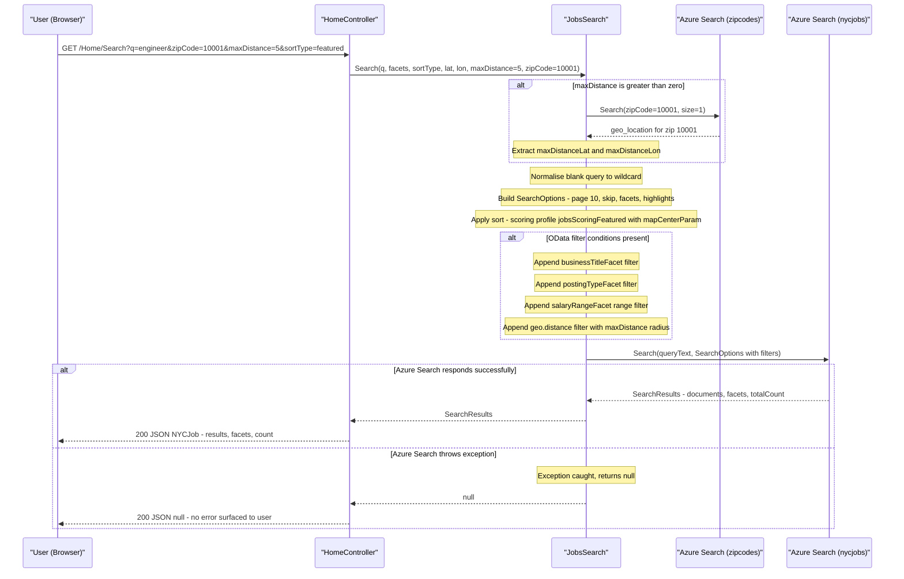

# Core Business Workflows

NYCJobsWeb is a public job search portal that allows citizens to discover, filter, and view New York City government job postings; the companion DataLoader utility initialises the search indexes with official job listing data.

## Domain Entities

| Entity | Service / Bounded Context | Description | Key Relationships |
|---|---|---|---|
| JobPosting (nycjobs document) | NYCJobsWeb — Job Discovery | A single NYC government job opening with title, agency, salary range, location, and description | Tagged with agency and posting type for faceted browsing; carries geo_location for proximity search |
| ZipCode (zipcodes document) | NYCJobsWeb — Geo Resolution | A US zip code with its geographic centre point | Used only to resolve a user-supplied zip code to lat/lon when distance filtering is requested |
| NYCJob (response DTO) | NYCJobsWeb — Search Results | In-memory aggregation of search results, facet counts, and total result count returned to the browser | Wraps a list of JobPosting documents and a facets map |
| NYCJobLookup (response DTO) | NYCJobsWeb — Job Details | In-memory wrapper for a single JobPosting document returned by direct key lookup | Contains one JobPosting document |

## Service-to-Domain Mapping

| Service | Domain Context | Owned Entities | External Dependencies |
|---|---|---|---|
| NYCJobsWeb | Job Discovery and Search | JobPosting (read-only), ZipCode (read-only), NYCJob, NYCJobLookup | Azure AI Search (`nycjobs` and `zipcodes` indexes), Bing Geocoding API |
| DataLoader | Index Initialisation | JobPosting (write), ZipCode (write) | Azure AI Search REST API (Admin key) |

Cross-context exchange: NYCJobsWeb uses a read-only (Query API key) SearchClient; DataLoader uses an Admin API key for index creation and document upload. There is no runtime communication between the two — DataLoader is a one-time setup utility.

## Primary Workflows

### Workflow 1: Job Search with Filters and Geo-Distance

The primary user-facing workflow. A user types a query and optionally applies facet filters, sort order, and proximity constraints. The application translates these inputs into an Azure AI Search query with full-text matching, field-level facets, OData filter expressions, and optional geo-distance filtering.

**Steps:**
1. User submits a GET request with query string parameters: `q`, `businessTitleFacet`, `postingTypeFacet`, `salaryRangeFacet`, `sortType`, `lat`, `lon`, `currentPage`, `zipCode`, `maxDistance`.
2. **Blank query normalisation**: if `q` is empty or whitespace, it is replaced with `"*"` (match-all).
3. **Geo-distance pre-resolution** (conditional): if `maxDistance > 0`, the application calls the `zipcodes` index to look up the geographic centre of the submitted `zipCode` and retrieves `maxDistanceLat` / `maxDistanceLon`.
4. A `SearchOptions` object is built with: page size 10, skip offset (`currentPage - 1`), total-count enabled, highlight tags `<b>…</b>` on `job_description`, field projection (15 fields), four facet fields (`business_title`, `posting_type`, `level`, `salary_range_from` with 50,000-unit intervals).
5. **Sort selection** (decision point): `featured` → applies scoring profile `jobsScoringFeatured` with `featuredParam` and `mapCenterParam` scoring parameters; `salaryDesc` → `salary_range_from desc`; `salaryIncr` → `salary_range_from`; `mostRecent` → `posting_date desc`; default → relevance ranking.
6. **OData filter construction** (incremental AND-composition): `businessTitleFacet`, `postingTypeFacet`, `salaryRangeFacet`, and geo-distance filter are each appended with `" and "` if the corresponding input is non-empty/non-zero.
7. The assembled `SearchOptions` and query text are passed to `SearchClient.Search<SearchDocument>()`.
8. Results are wrapped in `NYCJob` (results list, facets dict, total count) and returned as JSON.

### Workflow 2: Auto-Suggest

As the user types in the search box, the browser makes a GET request to the Suggest action. The application forwards the partial term to Azure AI Search's suggest API on the `nycjobs` index, using suggester `sg` (infix matching on agency, posting type, business title, civil service title, work location, division/work unit). Up to 8 raw suggestions are returned, deduplicated, and sent back as a JSON string array.

### Workflow 3: Job Detail Lookup

The user clicks on a job posting in the results list. The browser sends the job's document key (`id`) to the LookUp action. The application calls `SearchClient.GetDocument<SearchDocument>(id)` for a direct key-based retrieval and returns the full document as `NYCJobLookup` JSON.

### Workflow 4: Index Initialisation (DataLoader — offline)

Before the web application can serve any results, an operator must run the DataLoader console tool once:
1. Creates the `nycjobs` index by POSTing `nycjobs.schema` to the Azure Search REST API.
2. Creates the `zipcodes` index by POSTing `zipcodes.schema`.
3. Uploads job data in six batches (`nycjobs1.json` through `nycjobs6.json`).
4. Uploads zip-code data in 88 batches (`zipcodes1.json` through `zipcodes88.json`).

## Cross-Service Data Flows

This is a single-service application; there are no runtime inter-service calls. The only cross-component data flow is the **geo-distance pre-resolution** step inside Workflow 1: the web application calls the `zipcodes` Azure AI Search index to convert a user-supplied zip code into coordinates, which it then uses to construct a `geo.distance()` OData filter for the main `nycjobs` query. Both calls go to the same Azure AI Search resource but different indexes.

**Fallback behaviour**: if the `zipcodes` lookup returns no results (unknown zip code), `maxDistanceLat` and `maxDistanceLon` remain as empty strings. The geo-distance filter is then constructed using empty-string coordinates, which will cause the Azure Search query to fail silently (exception caught by the `try/catch` in `JobsSearch.Search`). In this case the method returns `null`, and the browser receives an empty JSON response with no user-facing error message.

## Business Workflow Sequence

## Business Rules & Decision Logic

**Blank query normalisation**: A missing or whitespace-only search term is silently replaced with `"*"` (match-all wildcard) so that the default experience shows all available jobs rather than an empty result set.

**Geo-distance opt-in**: Distance filtering is only applied when `maxDistance > 0`. When active, the application first resolves the submitted `zipCode` against the `zipcodes` index to obtain coordinates; the result is then used in an OData `geo.distance()` filter. There is no validation that the zip code exists before the filter is applied.

**OData filter composition**: Each active facet filter (`businessTitleFacet`, `postingTypeFacet`, `salaryRangeFacet`, `geo.distance`) is appended to a growing filter string with `" and "` separators. Filters are only added when their input value is non-empty / non-zero; multiple active filters produce a logical AND.

**Salary facet range construction**: The salary facet uses an interval of 50,000 units. When a salary range facet is selected, the filter expresses a half-open interval: `salary_range_from >= N and salary_range_from < N + 50000`.

**Sort strategy selection**: Four named sort modes are supported — `featured` (Azure Search scoring profile with recency, tag, and proximity boosts), `salaryDesc`, `salaryIncr`, `mostRecent` — and a default of relevance ranking (no `OrderBy`). Sort is selected by string equality; any unrecognised value falls through to default relevance.

**Auto-suggest deduplication**: Raw suggestion strings from Azure Search are deduplicated via `Distinct()` before being returned, ensuring unique autocomplete items.

**Result page size**: Fixed at 10 results per page. Pagination uses a zero-offset skip: `skip = currentPage - 1` (note: this means `currentPage=1` skips 0 and is the first page, but `currentPage=0` also skips 0, making page 0 and page 1 equivalent — a likely off-by-one bug).

**Error handling**: All Azure Search calls are wrapped in a broad `try { … } catch (Exception ex)` that logs to console and returns `null`. There is no exception propagation, no HTTP error status, and no user-facing error message for search failures. This results in silent empty responses rather than actionable error states.

**No authentication or authorisation**: All workflows are publicly accessible with no login requirement, no role check, and no per-user data scope.

**No write workflows in the web application**: All state in the system is read-only from the web application's perspective. Job data is loaded exclusively by the offline DataLoader utility; the web app can never create, update, or delete documents.
