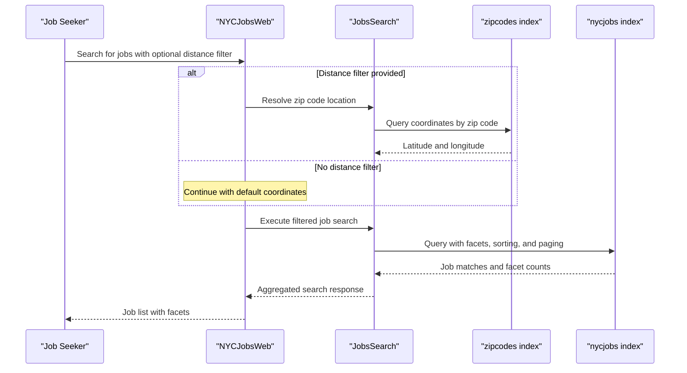

# Core Business Workflows

This application supports job discovery workflows over a public NYC dataset by combining search, filtering, and document detail retrieval from Azure AI Search.

## Domain Entities

| Entity | Service / Bounded Context | Description | Key Relationships |
|---|---|---|---|
| Job Posting | NYCJobsWeb Search Experience | Represents a searchable NYC job listing returned to end users | Aggregated into search result collections and detail responses |
| Zip Location | NYCJobsWeb Search Experience | Represents zip-code geography used for distance filters | Used to derive map coordinates for job filtering |
| Search Result Set | NYCJobsWeb API Contract | Response aggregate containing matched jobs, facet buckets, and total count | Built from Azure Search query response |
| Search Index Definition | DataLoader Ingestion | Defines index schema for `nycjobs`/`zipcodes` data stores | Applied before document uploads during import workflow |

## Service-to-Domain Mapping

| Service | Domain Context | Owned Entities | External Dependencies |
|---|---|---|---|
| NYCJobsWeb | Job Search and Browsing | Job Posting view model, Search Result Set, Zip Location query context | Azure AI Search SDK, Bing geocoding helper |
| DataLoader | Search Data Ingestion | Search Index Definition, bulk JSON document batches | Azure AI Search REST API |

## Primary Workflows

### Workflow 1: Search and Filter NYC Jobs

1. User opens the search interface and submits a query (or empty query for all jobs).
2. `HomeController.Search` normalizes input and optionally resolves zip-based distance coordinates.
3. `JobsSearch.Search` executes faceted query logic (title, posting type, salary band, sort type, distance).
4. The system returns a `NYCJob` response with result list, facets, and count.

Business rules involved:
- Empty query is converted to wildcard (`*`).
- Distance filtering runs only when `maxDistance > 0`.
- Salary facet values are expanded to fixed 50k ranges.

### Workflow 2: Autocomplete Suggestions

1. User types in the search box.
2. Client calls `/Home/Suggest` with term and optional fuzzy flag.
3. `JobsSearch.Suggest` returns suggestion candidates.
4. Controller de-duplicates suggestions and returns a unique list.

### Workflow 3: Data Refresh for Search Indexes

1. Operator runs DataLoader console tool.
2. Tool deletes target index if present, recreates index from schema file, and uploads JSON batches.
3. Updated documents become available to the web search workflow.

## Cross-Service Data Flows

The web application composes user-facing data by querying two Azure Search indexes: `zipcodes` provides geolocation context and `nycjobs` provides the final result set. DataLoader is the producer for both indexes and acts as the ingestion boundary. If external Azure Search dependencies are unavailable, workflows degrade by returning errors/null responses rather than alternate fallback datasets.

## Business Workflow Sequence

## Business Rules & Decision Logic

- Query normalization rule: blank or whitespace search text is treated as wildcard.
- Conditional geospatial rule: zip-code lookup and geo-distance filtering apply only when distance threshold is requested.
- Result shaping rule: suggestions are de-duplicated before response.
- Ingestion integrity rule: DataLoader recreates index schema before document upload to keep search contract alignment.
- Error handling is coarse-grained (exceptions logged to console or swallowed to null responses), with no compensating workflow or retry orchestration.
