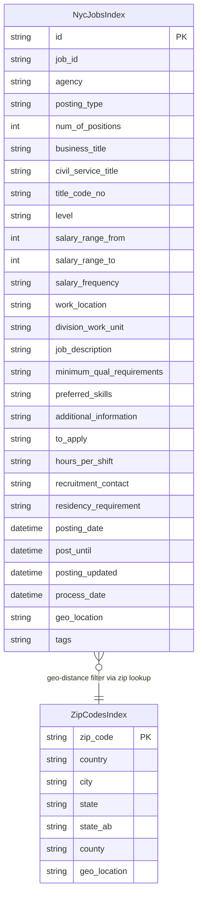

# Data Architecture & Persistence Layer

The application uses Azure AI Search as its sole data store, with two indexes (`nycjobs` and `zipcodes`). There is no relational database, ORM framework, or local cache layer — all persistence and retrieval is handled through the Azure AI Search SDK and REST API.

## Database Configuration

| Service / Module | DB Type | Profile | Driver / Client | Connection | Migration Tool |
|---|---|---|---|---|---|
| NYCJobsWeb | Azure AI Search | All (single environment) | Azure.Search.Documents SDK 11.1.1 | Endpoint URL + API key from `Web.config` (`Searchendpoint`, `SearchServiceApiKey`) | None — index schema defined in `.schema` JSON files; DataLoader utility recreates indexes on demand |
| DataLoader | Azure AI Search | N/A (console, run once) | System.Net.Http.HttpClient (raw REST) | Base URL constructed as `https://<TargetSearchServiceName>.search.windows.net`; API key from `App.config` | None — DataLoader deletes and recreates indexes programmatically using REST API |

No relational database, Flyway, Liquibase, EF Migrations, or seed SQL scripts are used. Schema is authoritative in the `.schema` JSON files in `NYCJobsWeb/Schema_and_Data/`. Data is seeded from the `nycjobs*.json` and `zipcodes*.json` batch files in the same directory.

## Data Ownership per Service

| Service | Indexes Owned | Data Access Framework | Caching | Notes |
|---|---|---|---|---|
| NYCJobsWeb | nycjobs (read), zipcodes (read) | Azure.Search.Documents SDK — `SearchClient` | None | Read-only at runtime; no write operations from the web app |
| DataLoader | nycjobs (write), zipcodes (write) | HttpClient (raw Azure AI Search REST API) | None | Write-only; deletes and recreates indexes, then uploads documents in batches |

## Entity Model

> Note: Azure AI Search does not use a relational schema or ORM entities. The two indexes below map to `SearchDocument` (schema-less dynamic dictionary) in the SDK. Key fields and their types are derived from the `.schema` definition files.

## Key Repository Methods

There is no repository interface in the traditional ORM sense. The `JobsSearch` class in `NYCJobsWeb` serves as the data access layer, directly calling the Azure AI Search SDK.

| Service | Class | Method | Purpose |
|---|---|---|---|
| NYCJobsWeb | `JobsSearch` | `Search(searchText, businessTitleFacet, postingTypeFacet, salaryRangeFacet, sortType, lat, lon, currentPage, maxDistance, maxDistanceLat, maxDistanceLon)` | Full-text search on the nycjobs index with faceting, filtering, sorting, geo-distance filtering, and scoring profiles |
| NYCJobsWeb | `JobsSearch` | `SearchZip(zipCode)` | Looks up a ZIP code in the zipcodes index to resolve it to geographic coordinates (lat/lon) for use in geo-distance filtering |
| NYCJobsWeb | `JobsSearch` | `Suggest(searchText, fuzzy)` | Returns up to 8 autocomplete suggestions from the nycjobs index using the `sg` suggester with optional fuzzy matching |
| NYCJobsWeb | `JobsSearch` | `LookUp(id)` | Retrieves a single document from the nycjobs index by its document key |
| DataLoader | `Program` | `DeleteIndex(indexName)` | Deletes an index via the Azure AI Search REST API |
| DataLoader | `Program` | `CreateTargetIndex(indexName)` | Creates an index by POSTing the contents of the corresponding `.schema` file |
| DataLoader | `Program` | `ImportFromJSON(indexName)` | Uploads documents in batch from all matching `indexName*.json` files in `Schema_and_Data/` |

## Caching Strategy

No caching layer is implemented in either project. Azure AI Search itself provides internal caching of query results at the service level, but this is managed entirely by the Azure platform and not configurable by the application. There are no `MemoryCache`, `IDistributedCache`, Redis, or any other application-level caching patterns in use.

## Data Ownership Boundaries

Both services share the same two Azure AI Search indexes (`nycjobs` and `zipcodes`) but with strict role separation: **DataLoader** has exclusive write access (it creates, populates, and owns the index schemas), while **NYCJobsWeb** has read-only access at runtime. There is no schema-per-service isolation and no database-per-service pattern — the single Azure AI Search service instance is the shared data store for both components.

Cross-component data access does not occur via REST API calls between the two components. The only cross-index access pattern is within `JobsSearch.Search()`: when `maxDistance > 0`, the web app first calls `SearchZip()` to query the zipcodes index for geographic coordinates, then embeds those coordinates as a `geo.distance` OData filter in the nycjobs query.

There are no CQRS patterns, event sourcing, outbox tables, or change-data-capture mechanisms.

### Data Classification & Sensitivity

| Index / Field Group | Sensitive Fields | Classification | Controls in Place |
|---|---|---|---|
| NycJobsIndex | `recruitment_contact` (may contain personal names or contact details) | Potential PII | None — no field-level encryption, masking, or access controls; the field is publicly retrievable |
| NycJobsIndex — all other fields | `agency`, `business_title`, `job_description`, etc. | Non-sensitive (public government job data) | N/A |
| ZipCodesIndex | None | Non-sensitive (public geographic reference data) | N/A |

The `recruitment_contact` field may contain individual recruiter names or contact information sourced from NYC government open data. No encryption-at-rest, data masking, or field-level access controls are configured. All index fields are marked `retrievable: true` and are returned to the browser via the JSON search endpoint without authorization checks.
