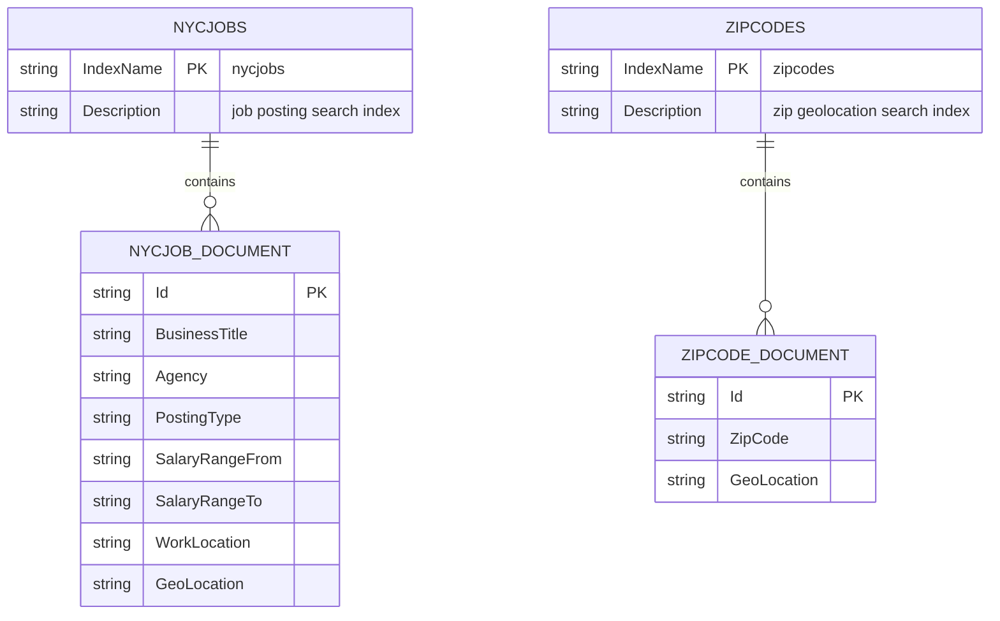

# Data Architecture & Persistence Layer

The solution uses Azure AI Search indexes as its persistence layer, with application data represented as search documents rather than relational ORM entities.

## Database Configuration

| Service/Module | DB Type | Profile | Driver | Connection | Migration Tool |
|---|---|---|---|---|---|
| NYCJobsWeb | Azure AI Search index store | Default web.config settings | Azure.Search.Documents SDK + Azure.Core | Endpoint and API key from appSettings | None |
| DataLoader | Azure AI Search index store | Default app.config settings | HttpClient REST calls | Search service name and API key in appSettings | None (schema files are applied directly) |

## Data Ownership per Service

| Service | Tables Owned | ORM Framework | Caching | Notes |
|---|---|---|---|---|
| NYCJobsWeb | `nycjobs` index documents, `zipcodes` index documents (read access) | None (document search SDK) | None detected | Read/query path only |
| DataLoader | `nycjobs` and `zipcodes` index definitions/documents (write path) | None (manual REST payloads) | None detected | Source of truth for schema/data seed upload |

## Entity Model

## Key Repository Methods

| Service | Repository | Notable Methods | Purpose |
|---|---|---|---|
| NYCJobsWeb | `JobsSearch` (`NYCJobsWeb/JobsSearch.cs`) | `Search(...)` | Executes filtered and faceted search over `nycjobs` |
| NYCJobsWeb | `JobsSearch` | `SearchZip(zipCode)` | Resolves zip-code coordinates from `zipcodes` |
| NYCJobsWeb | `JobsSearch` | `Suggest(searchText, fuzzy)` | Returns autocomplete suggestions |
| NYCJobsWeb | `JobsSearch` | `LookUp(id)` | Retrieves a single job document by key |
| DataLoader | `Program` + `AzureSearchHelper` | `DeleteIndex`, `CreateTargetIndex`, `ImportFromJSON` | Recreates index schema and loads bulk JSON documents |

## Caching Strategy

No explicit application-side caching layer was detected. Each user request calls Azure AI Search directly through the SDK, and ingestion tasks execute immediate REST operations. Any caching behavior is expected to be provided by external service/platform defaults rather than repository-managed cache configuration.

## Data Ownership Boundaries

Data ownership is functionally split: DataLoader owns write operations (index creation and document import), while NYCJobsWeb owns read/query operations for user-facing workflows. Both modules operate on the same Azure AI Search service and index names, so the topology is a shared external data store with role-based ownership by runtime path. Cross-module exchange is indirect through the shared indexes rather than direct service-to-service APIs.

### Data Classification & Sensitivity

| Entity | Sensitive Fields | Classification (PII/PHI/PCI/None) | Controls in Place |
|---|---|---|---|
| NYCJOB_DOCUMENT | Job posting metadata only (no user profile fields found) | None / Public dataset | API key-based access to Azure Search |
| ZIPCODE_DOCUMENT | Zip code and geolocation coordinates | None | API key-based access to Azure Search |

No PHI or PCI data was detected in the documented model.
