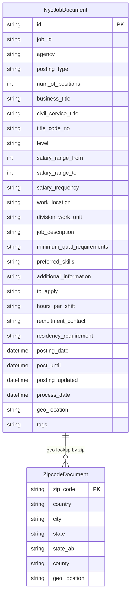

# Data Architecture & Persistence Layer

The NYC Jobs application uses **Azure AI Search** as its sole data backend, with two search indices (`nycjobs` and `zipcodes`) storing all application data — there is no relational database, ORM, or local data store.

## Database Configuration

| Service/Module | DB Type | Profile | Driver | Connection | Migration Tool |
|----------------|---------|---------|--------|-----------|----------------|
| NYCJobsWeb | Azure AI Search | All (single profile) | Azure.Search.Documents SDK v11.1.1 | Endpoint URL and query API key from `Web.config` appSettings | None — indices are created manually via DataLoader console tool |
| DataLoader | Azure AI Search | N/A (one-time setup) | Azure Search REST API (HttpClient) | Service URL and admin API key from `App.config` appSettings | None — schema is applied from `.schema` JSON files; no versioning tool |

No relational database, Flyway/Liquibase, EF Migrations, or seed-data SQL scripts are used. Schema definitions are stored as raw JSON files in `NYCJobsWeb/Schema_and_Data/` and applied via REST API calls from the DataLoader tool. Index recreation is a destructive operation (delete → create → import).

## Data Ownership per Service

| Service | Indices / Documents Owned | Data Access Layer | Caching | Notes |
|---------|--------------------------|-------------------|---------|-------|
| NYCJobsWeb | `nycjobs` (read), `zipcodes` (read) | Azure.Search.Documents SDK — `SearchClient` | None | Query-only; no write operations from the web layer |
| DataLoader | `nycjobs` (write), `zipcodes` (write) | Azure Search REST API (HttpClient) | None | Admin-key write access; used only at index setup time |

## Entity Model

> Note: Azure AI Search uses document-oriented indices rather than relational tables. The ER diagram below represents the two index schemas as logical document types with their fields. There are no foreign key relationships between indices — the application performs a two-step lookup (zipcodes then nycjobs) via separate SDK calls.

## Key Repository Methods

The application does not use a formal repository pattern or ORM. All data access is performed directly through the `JobsSearch` class (`NYCJobsWeb/JobsSearch.cs`).

| Service | Class | Method | Purpose |
|---------|-------|--------|---------|
| NYCJobsWeb | `JobsSearch` | `Search(q, businessTitleFacet, postingTypeFacet, salaryRangeFacet, sortType, lat, lon, currentPage, maxDistance, maxDistanceLat, maxDistanceLon)` | Full-text search on `nycjobs` index with faceting, filtering, geo-distance filter, scoring profiles, and hit highlighting |
| NYCJobsWeb | `JobsSearch` | `SearchZip(zipCode)` | Point lookup against `zipcodes` index to resolve a zip code to lat/lon for distance filtering |
| NYCJobsWeb | `JobsSearch` | `Suggest(searchText, fuzzy)` | Auto-suggest query against `nycjobs` index using the `sg` suggester with optional fuzzy matching |
| NYCJobsWeb | `JobsSearch` | `LookUp(id)` | Document key lookup on `nycjobs` index to retrieve a single full job document by its `id` field |
| DataLoader | `Program` | `LaunchImportProcess(IndexName)` | Orchestrates delete → create → import for a named index |
| DataLoader | `Program` | `CreateTargetIndex(IndexName)` | Posts the schema JSON to Azure Search REST API to create the index |
| DataLoader | `Program` | `ImportFromJSON(IndexName)` | Bulk-uploads all matching JSON data files to the index via the Documents Index REST API |

## Caching Strategy

No caching layer is configured in either project. There are no calls to `MemoryCache`, `IDistributedCache`, Redis, or any other cache provider. Azure AI Search performs its own internal index-level caching (query result caching within the service), but this is managed by the Azure platform and not configurable from the application code.

All search, suggest, and lookup queries are sent to Azure AI Search on every request with no application-side result caching. Given the read-heavy nature of the workload (job postings change infrequently), adding an in-memory cache for common queries would be a low-effort performance improvement.

## Data Ownership Boundaries

The application follows a **single external data store** topology: both projects interact exclusively with the same Azure AI Search service instance. There is no database-per-service isolation because this is a monolith; the web application uses a query-only API key while the DataLoader uses an admin key.

**Cross-service data access:** The web layer never directly queries the DataLoader or vice versa. Data flows unidirectionally: DataLoader writes (create/populate) → Azure AI Search stores → NYCJobsWeb reads. There is no shared relational database, no event bus, and no API call between the two components.

**Read/write pattern:** The web application is strictly read-only against the search indices. All write operations (index creation, document upload) are performed offline by the DataLoader console tool before the web application is started.

### Data Classification & Sensitivity

| Index / Document | Sensitive Fields | Classification | Controls in Place |
|-----------------|-----------------|---------------|-------------------|
| NycJobDocument | `recruitment_contact` (may contain recruiter name/email/phone) | Potential PII (limited) | None — field is stored and retrieved in plaintext; no masking or access control |
| NycJobDocument | `job_description`, `minimum_qual_requirements`, `preferred_skills` | Public (government job postings) | Not sensitive |
| ZipcodeDocument | `zip_code`, `city`, `state`, `geo_location` | Public geographic reference data | Not sensitive |

The data stored is predominantly **public government job posting data** sourced from the NYC Open Data portal. No applicant PII (job-seeker names, contact information, resumes) is stored or processed by the application. The `recruitment_contact` field may contain recruiter contact information but is already publicly available on NYC government job postings. No encryption-at-rest configuration, data masking, or field-level access controls are implemented at the application level; encryption at rest is handled by the Azure AI Search service platform by default.
