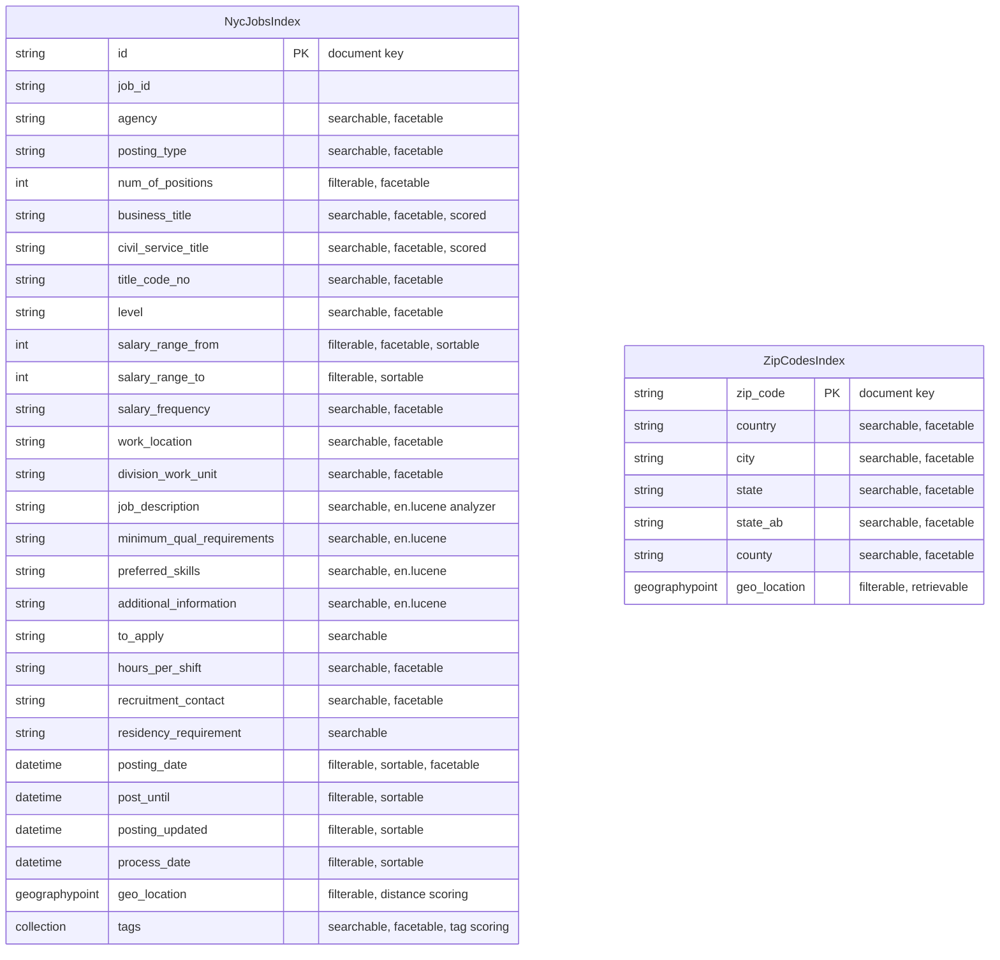

# Data Architecture & Persistence Layer

The NYC Jobs solution uses **Azure AI Search** as its sole data store, with two indexes (`nycjobs` and `zipcodes`). There is no relational database, ORM, or migration framework — index schemas are defined as static JSON files and seeded by the DataLoader console utility.

## Database Configuration

| Service/Module | DB Type | Profile | Driver | Connection | Migration Tool |
|---------------|---------|---------|--------|-----------|---------------|
| NYCJobsWeb | Azure AI Search | All (single config) | Azure.Search.Documents 11.1.1 SDK | Endpoint URL + API key from `Web.config` `<appSettings>` (`Searchendpoint`, `SearchServiceApiKey`) | None — schemas are managed as static `.schema` JSON files |
| DataLoader | Azure AI Search | All (single config) | Raw `HttpClient` (REST, api-version=2015-02-28-Preview) | Endpoint URL + API key from `app.config` (`TargetSearchServiceName`, `TargetSearchServiceApiKey`) | None — index is dropped and recreated on each DataLoader run |

No connection pooling is configured. The Azure SDK manages its own internal HTTP connection pool. There is no Flyway, Liquibase, EF Migrations, or any other schema versioning tool. Schema changes require manually editing the `.schema` file and re-running DataLoader, which performs a destructive delete-then-recreate operation on each target index.

## Data Ownership per Service

| Service | Indexes Owned | Data Access Framework | Caching | Notes |
|---------|--------------|----------------------|---------|-------|
| NYCJobsWeb | `nycjobs` (read), `zipcodes` (read) | Azure.Search.Documents 11.1.1 SDK | None | Read-only; no write operations from the web app |
| DataLoader | `nycjobs` (write), `zipcodes` (write) | Azure AI Search REST API v2015-02-28-Preview (raw HttpClient) | None | Destructive load: deletes and recreates each index on every run |

## Entity Model

> Note: There is no ORM or relational schema. The entities below represent the Azure AI Search index field schemas extracted from `.schema` files.

> Note: These are search indexes, not relational tables. There are no foreign key constraints, JOINs, or ORM-managed relationships. The `zipcodes` index is used exclusively as a geo-lookup table to resolve a zip code string to a `geo_location` point, which is then used to geo-filter the `nycjobs` index.

## Key Repository Methods

| Service | Query / Method | Notable Behavior | Purpose |
|---------|---------------|-----------------|---------|
| JobsSearch.Search() | `SearchClient.Search<SearchDocument>(text, SearchOptions)` | Applies OData `$filter` for facets and geo-distance; uses `jobsScoringFeatured` scoring profile with `featuredParam` tag boost and `mapCenterParam` distance boost; highlights `job_description`; paginates via `Size=10` + `Skip` | Full-text job search with faceting, geo-filtering, sorting, and scoring |
| JobsSearch.SearchZip() | `SearchClient.Search<SearchDocument>(zipCode, SearchOptions)` | Searches `zipcodes` index with `SearchMode.All`, `Size=1`; returns a single document to extract `geo_location` | Resolves a US zip code to lat/lon for proximity search |
| JobsSearch.Suggest() | `SearchClient.Suggest<SearchDocument>(text, "sg", SuggestOptions)` | Uses suggester named `sg` (`analyzingInfixMatching` over agency, posting_type, business_title, civil_service_title, work_location, division_work_unit); supports fuzzy matching | Typeahead autocomplete for the search input |
| JobsSearch.LookUp() | `SearchClient.GetDocument<SearchDocument>(id)` | Retrieves a single document by its `id` key | Job detail view |
| DataLoader.CreateTargetIndex() | HTTP POST `/indexes` | Reads `.schema` file and posts it as JSON to the Azure Search REST API | Creates or replaces index schema |
| DataLoader.ImportFromJSON() | HTTP POST `/indexes/{name}/docs/index` | Reads all `{indexName}*.json` files and bulk-uploads them | Seeds index with document data |
| DataLoader.DeleteIndex() | HTTP DELETE `/indexes/{name}` | Deletes the existing index before re-creation | Destructive pre-load cleanup |

## Caching Strategy

No caching is configured at any layer. There is no Redis, MemoryCache, `IDistributedCache`, `@Cacheable`, response caching middleware, or browser cache headers. Every search request results in a live round-trip to Azure AI Search. The `SearchClient` instance in `JobsSearch` is a static singleton (initialized once in the static constructor), which avoids socket exhaustion from repeated `HttpClient` construction, but this is connection reuse — not result caching.

The `zipcodes` lookup (called on every geo-distance search) is particularly a candidate for in-process caching, as zip-to-coordinate mappings are static reference data that rarely changes.

## Data Ownership Boundaries

There is a single shared Azure AI Search service with two isolated indexes. Both indexes are owned and managed exclusively by the DataLoader during the seeding phase. The web application (`NYCJobsWeb`) has read-only access to both indexes via a query API key; it performs no writes, deletions, or schema modifications.

Cross-index access: the `zipcodes` index is queried directly by the `JobsSearch` service class within the web application to resolve proximity coordinates before executing the main `nycjobs` query. This is a two-step sequential call pattern (not an aggregation gateway); there are no cross-index joins at the Azure AI Search level.

**Read/Write pattern**: The data flow is strictly unidirectional — DataLoader writes, NYCJobsWeb reads. There is no CQRS separation (no explicit command vs query split), but the physical architecture enforces read/write isolation through separate API keys and process boundaries.

### Data Classification & Sensitivity

| Index/Field Group | Sensitive Fields | Classification | Controls in Place |
|------------------|-----------------|---------------|------------------|
| `nycjobs` — job posting fields | `recruitment_contact` (may contain contact person name/email) | Potential PII | None — stored and returned as plain text; no masking or field-level access control |
| `nycjobs` — job description fields | `job_description`, `minimum_qual_requirements`, `preferred_skills` | Public (NYC Open Data) | None needed — publicly published data |
| `nycjobs` — location fields | `work_location`, `geo_location` | Public (office addresses) | None needed — publicly published data |
| `zipcodes` — all fields | None | Public reference data | None needed |
| Web.config / app.config | `SearchServiceApiKey`, `BingApiKey` | Infrastructure credentials | Stored as plain text in config files — no Azure Key Vault, environment variable injection, or secrets management configured |

The most notable sensitivity concern is the Azure AI Search API key stored as plain text in `Web.config`. While this is a read-only query key, it is committed to the repository and should be rotated and replaced with a reference to Azure Key Vault or an environment variable. No user-generated PII (names, addresses, emails of application users) is stored or processed — all data is NYC government open data.
