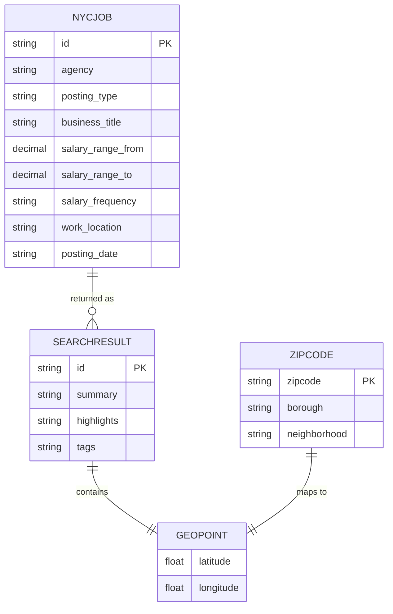

# Data Architecture & Persistence Layer

The solution persists application data in Azure AI Search indexes rather than a relational database, with one web module and one loader module sharing the same search-backed document model.

## Database Configuration

| Service/Module | DB Type | Profile | Driver | Connection | Migration Tool |
|---|---|---|---|---|---|
| NYCJobsWeb | Azure AI Search index store (`nycjobs`, `zipcodes`) | Default | Azure.Search.Documents SDK | Endpoint from `Searchendpoint` app setting and API key credential | None detected |
| DataLoader | Azure AI Search REST index store | Default | HttpClient with Search REST API | Service URI from `TargetSearchServiceName` and API key header | None detected |

## Data Ownership per Service

| Service | Tables Owned | ORM Framework | Caching | Notes |
|---|---|---|---|---|
| NYCJobsWeb | `nycjobs` index documents, `zipcodes` index documents (read path) | None (document search SDK) | None detected | Query-time access for search and suggestion features |
| DataLoader | `nycjobs` and `zipcodes` index definitions/documents (write path) | None (manual REST payloads) | None detected | Recreates indexes and uploads seed batches from JSON files |

## Entity Model

## Key Repository Methods

| Service | Repository | Notable Methods | Purpose |
|---|---|---|---|
| NYCJobsWeb | `JobsSearch` (`NYCJobsWeb/JobsSearch.cs`) | `Search(...)`, `SearchZip(...)`, `Suggest(...)`, `LookUp(...)` | Encapsulates index queries, zipcode lookup, suggestions, and single-document retrieval |
| DataLoader | `Program` + `AzureSearchHelper` (`DataLoader/DataLoader/Program.cs`, `AzureSearchHelper.cs`) | `DeleteIndex`, `CreateTargetIndex`, `ImportFromJSON`, `SendSearchRequest` | Performs index lifecycle operations and bulk import via REST |

## Caching Strategy

No explicit application-level caching framework or cache region configuration is defined in either module. Each request executes direct calls to Azure AI Search endpoints, and neither project declares cache-aside, read-through, or write-through patterns.

## Data Ownership Boundaries

Both modules operate on a shared logical data store in Azure AI Search. `DataLoader` is the primary writer and index schema manager, while `NYCJobsWeb` is primarily a read/query consumer for runtime search features. Cross-service access occurs through shared index ownership rather than service-to-service API composition.

### Data Classification & Sensitivity

| Entity | Sensitive Fields | Classification (PII/PHI/PCI/None) | Controls in Place |
|---|---|---|---|
| NYCJOB | Work location and descriptive text may include location-related personal context | PII (possible) | No field-level masking or encryption settings documented in repository |
| ZIPCODE | Geographic lookup data | None | N/A |
| SEARCHRESULT | Derived projection from indexed data | PII (possible) | No explicit masking controls configured in code |
