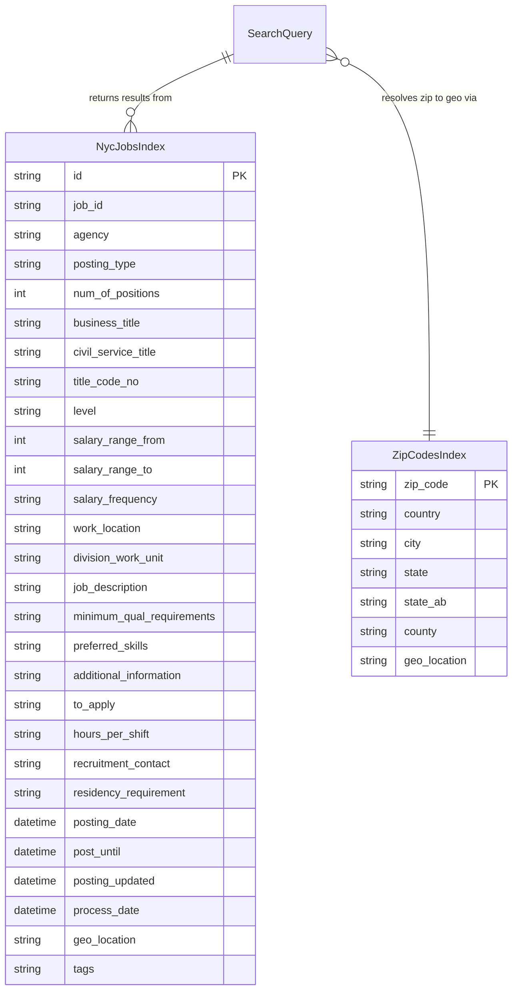

# Data Architecture & Persistence Layer

The application uses **Azure AI Search** as its sole data store — there is no relational database or ORM. All data is accessed through two search indexes (`nycjobs` and `zipcodes`) via the Azure Search REST API.

## Database Configuration

| Service/Module | DB Type | Profile | Driver/SDK | Connection | Migration Tool |
|---------------|---------|---------|-----------|-----------|---------------|
| NYCJobsWeb | Azure AI Search | All (no profiles) | Azure.Search.Documents 11.1.1 | Endpoint URL + API key from `Web.config` `<appSettings>` | None — schema managed via REST API calls in DataLoader |
| DataLoader | Azure AI Search | N/A (console) | System.Net.Http (raw REST) | `https://{TargetSearchServiceName}.search.windows.net` + API key from `App.config` | Destructive recreate on each run (delete → create → import) |

Schema is not version-controlled via a migration tool. The DataLoader console app recreates indexes from scratch each time it runs, using `.schema` JSON files stored in `NYCJobsWeb/Schema_and_Data/`. No connection pooling, Flyway, Liquibase, EF Migrations, or seed-data seeding mechanisms are used. Refer to `configuration-inventory.md` for the raw property keys and values.

## Data Ownership per Service

| Service | Indexes Owned | ORM/Data Framework | Caching | Notes |
|---------|--------------|-------------------|---------|-------|
| NYCJobsWeb | `nycjobs` (read), `zipcodes` (read) | Azure.Search.Documents SDK | None | Read-only consumer; never writes to indexes |
| DataLoader | `nycjobs` (write), `zipcodes` (write) | System.Net.Http (raw REST) | None | Write-only tool; fully recreates both indexes on each execution |

## Entity Model

> Note: There is no ORM or C# entity class hierarchy. Index schemas are defined in JSON schema files and queried via `SearchDocument` (a dynamic property bag). The diagram below represents the logical field structure of each Azure AI Search index.

**Notes on field types:**
- `geo_location` in both indexes is `Edm.GeographyPoint` (lat/lon pair), used for geo-distance filtering
- `tags` in `nycjobs` is `Collection(Edm.String)`, used for tag-boosting in the scoring profile
- `job_description`, `minimum_qual_requirements`, `preferred_skills`, `additional_information` use the `en.lucene` analyzer for English full-text search
- `nycjobs` has one scoring profile (`jobsScoringFeatured`) with freshness boosting (posting_date), tag-match boosting, and geo-distance boosting (within 5 km)
- `nycjobs` has one suggester (`sg`) covering: `agency`, `posting_type`, `business_title`, `civil_service_title`, `work_location`, `division_work_unit`
- `zipcodes` has one suggester (`sg`) covering: `zip_code`, `country`, `state`, `state_ab`, `county`

## Key Repository Methods

There is no repository pattern or ORM in this project. The `JobsSearch` class in NYCJobsWeb acts as the data access layer and calls the Azure AI Search SDK directly:

| Service | Class | Method | SDK Call | Purpose |
|---------|-------|--------|---------|---------|
| NYCJobsWeb | JobsSearch | `Search(q, businessTitleFacet, postingTypeFacet, salaryRangeFacet, sortType, lat, lon, currentPage, maxDistance, ...)` | `_indexClient.Search<SearchDocument>(searchText, SearchOptions)` | Full-text search against `nycjobs` with facets, filters, geo filter, scoring profiles, and pagination |
| NYCJobsWeb | JobsSearch | `SearchZip(zipCode)` | `_indexZipClient.Search<SearchDocument>(zipCode, SearchOptions)` | Resolves a zip code string to a `geo_location` (lat/lon) from the `zipcodes` index |
| NYCJobsWeb | JobsSearch | `Suggest(searchText, fuzzy)` | `_indexClient.Suggest<SearchDocument>(searchText, "sg", SuggestOptions)` | Returns up to 8 autocomplete suggestions from suggester `sg` on the `nycjobs` index |
| NYCJobsWeb | JobsSearch | `LookUp(id)` | `_indexClient.GetDocument<SearchDocument>(id)` | Retrieves a single job document by its `id` key field |
| DataLoader | Program | `LaunchImportProcess(indexName)` | `DeleteIndex` → `CreateTargetIndex` → `ImportFromJSON` | Recreates an index by deleting it, POSTing the schema, and bulk-uploading JSON data files |

All methods are synchronous (blocking). No `async`/`await` is used in either project.

## Caching Strategy

No caching layer is configured in any part of the solution. There is no in-memory cache, distributed cache (Redis), HTTP response caching, or output caching. Every search request results in a direct network call to Azure AI Search. This means:

- Repeated identical searches always round-trip to the Azure Search service
- The `zipcodes` lookup that resolves a zip code to lat/lon is performed on every search request when `maxDistance > 0`, even though zip-to-coordinate mappings are static data that rarely changes
- No session-level caching of search results is in place

For a cloud-ready deployment, adding an in-memory or distributed cache (e.g., `IMemoryCache` or Azure Cache for Redis) for the zip-code lookup results would reduce latency and unnecessary index queries.

## Data Ownership Boundaries

**Isolated data store**: Both projects share the same Azure AI Search service instance, but access is separated by index name (`nycjobs` vs `zipcodes`). There is no relational cross-index join capability in Azure AI Search; the application manually chains two index queries (first resolve zip → then search jobs with geo filter).

**Read/Write separation**: NYCJobsWeb is strictly read-only (search queries, suggest, lookup). DataLoader is strictly write-only (index management). There is no CQRS framework — this separation is by application design and deployment pattern, not enforced by any framework or access control.

**Cross-service data access**: The `zipcodes` index functions as a supporting lookup table for NYCJobsWeb. When a geo-filtered search is requested, the application calls `SearchZip` to resolve the user's zip code to lat/lon coordinates, then uses those coordinates to build an OData `geo.distance(...)` filter for the main `nycjobs` query. This two-step pattern is a manual workaround for the lack of cross-index joins in Azure AI Search.

**Data loading boundary**: The DataLoader tool must be run separately (manually) to populate or refresh index data. There is no automated data pipeline, event-driven ingestion, or change-data-capture mechanism. Index data is loaded from static JSON files stored in the repository under `NYCJobsWeb/Schema_and_Data/`.

### Data Classification & Sensitivity

| Index/Entity | Sensitive Fields | Classification | Controls in Place |
|-------------|-----------------|---------------|-------------------|
| NycJobsIndex | `recruitment_contact` (may contain contact names/emails) | Potential PII | None — field is stored and retrievable as plain text; no masking, encryption-at-rest, or access control |
| ZipCodesIndex | None | No sensitive data | N/A |

The `recruitment_contact` field may contain personally identifiable contact information (recruiter name, phone number, or email address). No field-level encryption, data masking, or access control (RBAC) is configured on the Azure AI Search indexes. The CORS configuration on the `nycjobs` index allows all origins (`"*"`), meaning index queries could be made from any domain without any browser-side origin restriction enforcement.
