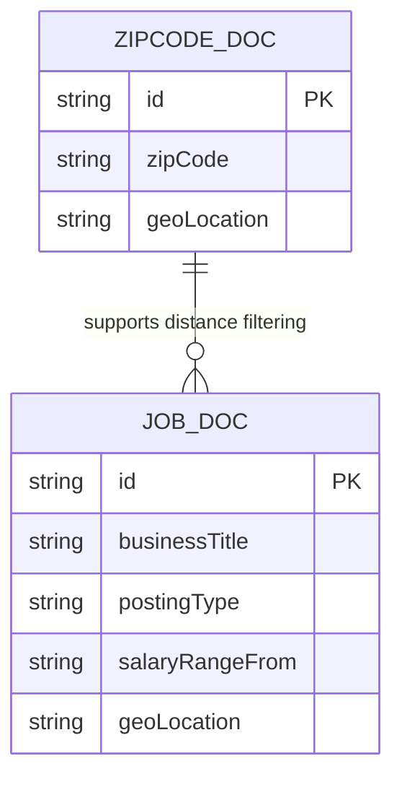

# Data Architecture & Persistence Layer

This application uses Azure Cognitive Search indexes as its primary persistence mechanism rather than a traditional relational database, with a lightweight model layer for API payload transport.

## Database Configuration

| Service/Module | DB Type | Profile | Driver | Connection | Migration Tool |
|---|---|---|---|---|---|
| NYCJobsWeb | Azure Cognitive Search (document index) | Default | Azure.Search.Documents SDK | Endpoint from `Web.config` appSettings | None detected |
| DataLoader | Azure Cognitive Search (REST) | Default | HttpClient REST calls | Service URI from `App.config` appSettings | None detected |

## Data Ownership per Service

| Service | Tables Owned | ORM Framework | Caching | Notes |
|---|---|---|---|---|
| NYCJobsWeb | `nycjobs` index documents, `zipcodes` index documents (consumed) | None (document search SDK) | None detected | Read/query-centric access pattern |
| DataLoader | `nycjobs` and `zipcodes` index schemas and seed documents (managed) | None | None detected | Recreates index schema and uploads JSON batches |

## Entity Model

## Key Repository Methods

| Service | Repository | Notable Methods | Purpose |
|---|---|---|---|
| NYCJobsWeb | `JobsSearch` (`NYCJobsWeb/JobsSearch.cs`) | `Search(...)`, `SearchZip(...)`, `Suggest(...)`, `LookUp(...)` | Encapsulates Azure Search query operations and filtering |
| DataLoader | `Program` + `AzureSearchHelper` (`DataLoader/...`) | `DeleteIndex(...)`, `CreateTargetIndex(...)`, `ImportFromJSON(...)` | Applies schema and loads seed data into indexes |

## Caching Strategy

No explicit application-level cache provider or cache annotations were detected. The current design relies on direct calls to Azure Search for query and lookup operations.

## Data Ownership Boundaries

Data is centralized in Azure Cognitive Search indexes used by both projects. `DataLoader` owns schema lifecycle and seed loading, while `NYCJobsWeb` is the read/query consumer at runtime. Cross-service access is direct via shared search service credentials rather than isolated per-service data stores.

### Data Classification & Sensitivity

| Entity | Sensitive Fields | Classification (PII/PHI/PCI/None) | Controls in Place |
|---|---|---|---|
| JOB_DOC | Work location text, job metadata | None/Low sensitivity | No field-level masking in code |
| ZIPCODE_DOC | Zip and geolocation pairs | None/Low sensitivity | No field-level masking in code |

No PHI or PCI handling was detected in the data access model. Sensitive credential values are externalized in config but should remain secret-managed at deployment time.
