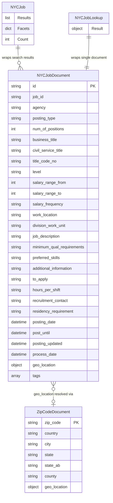

# Data Architecture & Persistence Layer

The application uses **Azure AI Search** as its sole persistence layer, with two managed search indexes (`nycjobs` and `zipcodes`); there is no relational database, no ORM, and no local data store.

## Database Configuration

| Service/Module | DB Type | Profile | Driver / SDK | Connection | Migration Tool |
|---|---|---|---|---|---|
| NYCJobsWeb | Azure AI Search | All (single config) | Azure.Search.Documents v11.1.1 | Endpoint + Query API Key from `Web.config` | None — schema managed via REST API calls in DataLoader |
| DataLoader | Azure AI Search | N/A (console) | Raw HttpClient + REST API v2015-02-28-Preview | Target service name + Admin API Key from `App.config` | None — index created programmatically via REST at load time |

Schema management: Index definitions (field types, analyzers, scoring profiles, suggesters, CORS settings) are defined as JSON in `Schema_and_Data/nycjobs.schema` and `Schema_and_Data/zipcodes.schema`. The DataLoader console tool creates indexes by POSTing these schema files to the Azure Search REST API. There is no incremental migration tooling; schema changes require manual index deletion and recreation.

Seed data: Six `nycjobs*.json` batches and 88 `zipcodes*.json` batches (numbered 1-88) in `Schema_and_Data/` are loaded by DataLoader at setup time.

## Data Ownership per Service

| Service | Indexes Owned | Data Access Method | Caching | Notes |
|---|---|---|---|---|
| NYCJobsWeb | `nycjobs` (read), `zipcodes` (read) | Azure.Search.Documents SDK (`SearchClient`) | None | Read-only; uses Query API key (limited permissions) |
| DataLoader | `nycjobs` (write), `zipcodes` (write) | Raw HttpClient REST calls | None | Write-only at setup time; uses Admin API key |

## Entity Model

> Note: `NYCJobDocument` and `ZipCodeDocument` are Azure AI Search document schemas (not relational tables). `NYCJob` and `NYCJobLookup` are in-memory C# response DTOs. There are no foreign-key constraints; the relationship between job documents and zip codes is resolved at query time by the application calling both indexes.

## Key Repository Methods

| Service | Class | Notable Methods | Purpose |
|---|---|---|---|
| NYCJobsWeb | `JobsSearch` | `Search(searchText, businessTitleFacet, postingTypeFacet, salaryRangeFacet, sortType, lat, lon, currentPage, maxDistance, ...)` | Full-text search with facet filters, sort options, geo-distance filter, highlighting, and scoring profile selection |
| NYCJobsWeb | `JobsSearch` | `SearchZip(zipCode)` | Point-lookup against `zipcodes` index to resolve a zip code to lat/lon for distance filtering |
| NYCJobsWeb | `JobsSearch` | `Suggest(searchText, fuzzy)` | Auto-suggest via the `sg` suggester (infix matching on agency, title, location fields) |
| NYCJobsWeb | `JobsSearch` | `LookUp(id)` | Retrieves a single `nycjobs` document by its primary key |
| DataLoader | `AzureSearchHelper` | `SendSearchRequest(client, method, uri, json)` | Generic REST helper used to create indexes, upload document batches |

No ORM, no repository interface hierarchy, no `@Transactional` or `TransactionScope` usage — all persistence is through SDK or HTTP calls.

## Caching Strategy

No caching layer is implemented. There is no Redis, MemoryCache, `IDistributedCache`, `@Cacheable`, or any other caching mechanism at the application level. Every search, suggest, and lookup operation results in a live call to Azure AI Search. Azure AI Search itself has an internal query cache, but this is managed by the service, not the application.

This is a notable gap for production scenarios: repeated identical searches (e.g., the default empty query on page load) will each incur a round-trip to Azure Search. An in-memory response cache (e.g., `IMemoryCache` with a short TTL) or a distributed cache (Azure Cache for Redis) could significantly reduce latency and cost.

## Data Ownership Boundaries

**Isolated data store**: Both services access the same Azure AI Search resource, but the access roles are strictly separated — NYCJobsWeb holds a Query API key (read-only, no index management) and DataLoader holds an Admin API key (full access). There is no shared relational database, no schema-per-service separation, and no event-driven data synchronization.

**Cross-service data access**: Not applicable — there is only one logical application with a single search backend. The DataLoader is an offline utility, not a runtime service.

**Read/write pattern**: NYCJobsWeb is entirely read-only. All writes (index creation and document upload) are handled by DataLoader, which runs offline as a one-time setup step. There is no CQRS split beyond this natural separation.

### Data Classification & Sensitivity

| Index / Entity | Sensitive Fields | Classification | Controls in Place |
|---|---|---|---|
| `nycjobs` | None — all fields are publicly posted government job listings | Public | N/A |
| `zipcodes` | None — US zip codes and geographic coordinates are public data | Public | N/A |
| `Web.config` | `SearchServiceApiKey` (Query API key), `BingApiKey` | Credentials | Stored in plain text; no encryption, no Azure Key Vault, no environment variable abstraction |

No PII, PHI, or PCI data is stored in the search indexes. However, the `SearchServiceApiKey` and `BingApiKey` credentials are stored as plain text in `Web.config`, which is committed to source control. These should be migrated to Azure Key Vault or environment-based configuration secrets before any cloud deployment. The Admin API key used by DataLoader is similarly stored in `App.config` as plain text.
