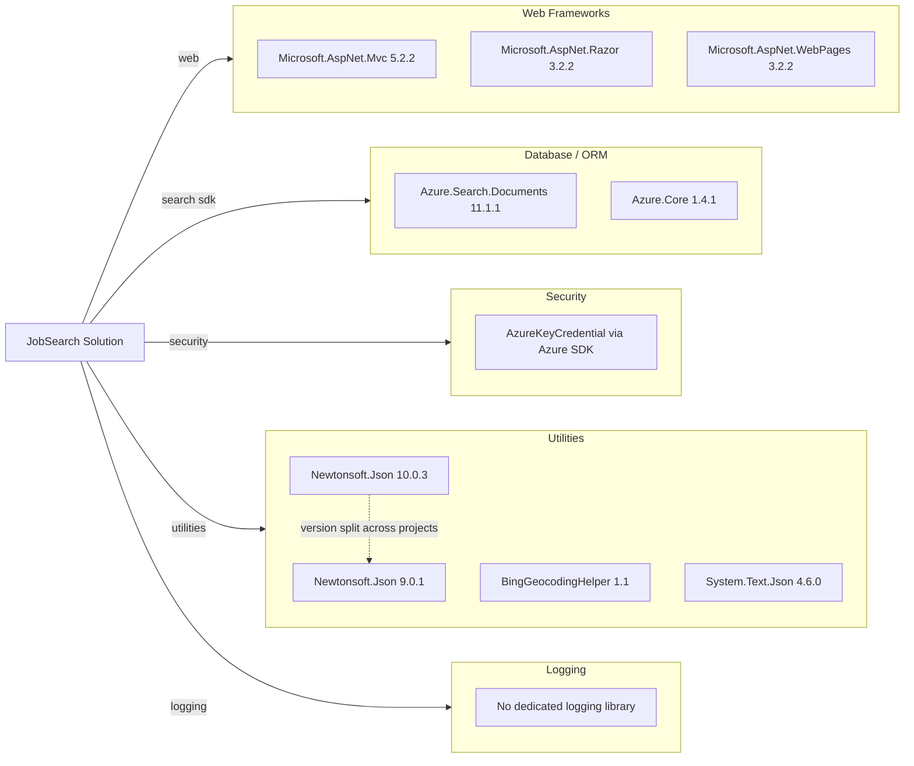

# Dependency Map

This document summarizes declared external dependencies for the solution projects (NYCJobsWeb and DataLoader), with focus on runtime dependencies used by the application.

## Dependencies

### Dependency Summary

| Category | Count | Key Libraries | Notes |
|---|---:|---|---|
| Web Frameworks | 3 | Microsoft.AspNet.Mvc, Razor, WebPages | Legacy ASP.NET MVC 5 stack |
| Database / ORM | 2 | Azure.Search.Documents, Azure.Core | Uses Azure Search service instead of local DB ORM |
| Security | 1 | AzureKeyCredential (Azure SDK) | API-key based service auth |
| Utilities | 4 | Newtonsoft.Json, BingGeocodingHelper, System.Text.Json | Mixed old/new JSON libraries |
| Logging | 0 | None | No explicit logging framework package |

### Version & Compatibility Risks

Core app projects target .NET Framework 4.7.2 and 4.5, and several packages are comparatively old (for example Newtonsoft.Json 9.x/10.x split and legacy ASP.NET MVC packages). This increases upgrade effort for .NET 10 modernization and can require API and compatibility remapping.

### Notable Observations

- Dependency set is NuGet `packages.config` based, not SDK-style package references.
- Two projects use different Newtonsoft.Json major baselines (9.0.1 and 10.0.3).
- No resilience/observability packages (Polly, OpenTelemetry, Serilog, etc.) are declared.
- Front-end libraries (Bootstrap/jQuery) are pinned to older versions suitable for legacy MVC views.

## Test Dependencies

| Framework | Version | Notes |
|---|---|---|
| None detected | N/A | No test framework packages found in project package manifests |

Total test-scope dependencies: 0
No dedicated test dependency declarations were detected in the repository build manifests.
