# Dependency Map

The NYC Jobs solution consists of two .NET Framework projects — **NYCJobsWeb** (ASP.NET MVC 5 web application) and **DataLoader** (console utility) — with a combined total of 26 declared external dependencies across both projects.

## Dependencies

```mermaid
flowchart LR
    NYCJobsWeb["NYCJobsWeb\n(ASP.NET MVC / .NET 4.7.2)"]
    DataLoader["DataLoader\n(Console / .NET 4.5)"]

    subgraph Web["Web Frameworks"]
        MVC["Microsoft.AspNet.Mvc v5.2.2"]
        Razor["Microsoft.AspNet.Razor v3.2.2"]
        WebPages["Microsoft.AspNet.WebPages v3.2.2"]
        WebInfra["Microsoft.Web.Infrastructure v1.0.0"]
        Modernizr["Modernizr v2.8.3"]
        Bootstrap["bootstrap v3.4.1"]
        jQuery["jQuery v3.1.1"]
    end

    subgraph Search["Search / Azure AI"]
        AzureSearch["Azure.Search.Documents v11.1.1"]
        AzureCore["Azure.Core v1.4.1"]
        MSSpatial["Microsoft.Spatial v7.5.3"]
    end

    subgraph Geo["Geocoding"]
        BingGeo["BingGeocodingHelper v1.1"]
        RestClientRuntime["Microsoft.Rest.ClientRuntime v2.3.20"]
        RestAzureRuntime["Microsoft.Rest.ClientRuntime.Azure v3.3.18"]
    end

    subgraph Serialization["Serialization"]
        NewtonsoftWeb["Newtonsoft.Json v10.0.3\n(NYCJobsWeb)"]
        NewtonsoftLoader["Newtonsoft.Json v9.0.1\n(DataLoader)"]
    end

    subgraph Runtime["Runtime Polyfills"]
        BclAsync["Microsoft.Bcl.AsyncInterfaces v1.0.0"]
        SysBuffers["System.Buffers v4.5.0"]
        SysDiag["System.Diagnostics.DiagnosticSource v4.6.0"]
        SysMemory["System.Memory v4.5.3"]
        SysVectors["System.Numerics.Vectors v4.5.0"]
        SysUnsafe["System.Runtime.CompilerServices.Unsafe v4.6.0"]
        SysTextEnc["System.Text.Encodings.Web v4.6.0"]
        SysTextJson["System.Text.Json v4.6.0"]
        SysTasksExt["System.Threading.Tasks.Extensions v4.5.2"]
        SysValueTuple["System.ValueTuple v4.5.0"]
    end

    NYCJobsWeb -->|"web framework"| Web
    NYCJobsWeb -->|"search"| Search
    NYCJobsWeb -->|"geocoding"| Geo
    NYCJobsWeb -->|"serialization"| Serialization
    NYCJobsWeb -->|"runtime polyfills"| Runtime
    DataLoader -->|"serialization"| Serialization
    AzureSearch -.->|"depends on"| AzureCore
    AzureCore -.->|"depends on"| Runtime
```

### Dependency Summary

| Category | Count | Key Libraries | Notes |
|----------|-------|--------------|-------|
| Web Frameworks | 7 | Microsoft.AspNet.Mvc 5.2.2, Bootstrap 3.4.1, jQuery 3.1.1 | Legacy ASP.NET MVC 5 stack on .NET Framework 4.7.2; Bootstrap 3 is EOL |
| Search / Azure AI | 3 | Azure.Search.Documents 11.1.1, Azure.Core 1.4.1, Microsoft.Spatial 7.5.3 | Azure Search SDK version 11.1.1 is several major versions behind current (11.6+) |
| Geocoding | 3 | BingGeocodingHelper 1.1, Microsoft.Rest.ClientRuntime 2.3.20 | BingGeocodingHelper is an unofficial/community helper library |
| Serialization | 2 | Newtonsoft.Json 10.0.3 (web), Newtonsoft.Json 9.0.1 (loader) | Different versions used across projects; both behind current v13 |
| Runtime Polyfills | 10 | System.Buffers, System.Memory, System.Text.Json, etc. | Back-ported BCL packages required for Azure SDK on .NET Framework |

### Version & Compatibility Risks

Both projects target legacy .NET Framework versions (4.7.2 and 4.5) that are in long-term maintenance mode with no new feature development. **ASP.NET MVC 5.2.2** is the last version of classic MVC and will not receive feature updates; migration to ASP.NET Core is required to target modern runtimes. **Azure.Search.Documents 11.1.1** (released 2021) is significantly behind the current release (11.6+) and may lack support for newer Azure AI Search features. **Newtonsoft.Json** is used at version 9.0.1 in the DataLoader and 10.0.3 in the web project — the current release is v13, and both versions have known deserialization vulnerabilities in older configurations. **Bootstrap 3.4.1** reached end-of-life in 2019. The 10 runtime polyfill packages (System.Buffers, System.Memory, etc.) are only required because the Azure SDK is being used on .NET Framework; they would be eliminated by migrating to .NET 8+.

### Notable Observations

- **Dual Newtonsoft.Json versions**: DataLoader pins `9.0.1` while NYCJobsWeb uses `10.0.3`; this inconsistency could cause serialization behaviour differences if the projects ever share code.
- **Heavy runtime polyfill dependency tree**: Ten `System.*` back-port packages are required solely to support `Azure.Core` on .NET Framework. Migrating to .NET 8+ would eliminate all of these.
- **No logging framework declared**: Neither project declares a structured logging library (Serilog, NLog, or Microsoft.Extensions.Logging). All diagnostics rely on `Console.WriteLine` and bare `Exception.Message` strings.
- **No caching, messaging, or security libraries**: The application has no server-side caching layer, no authentication/authorization middleware, and no message broker dependency — all search queries go directly to Azure AI Search on every request.

## Test Dependencies

| Framework | Version | Notes |
|-----------|---------|-------|
| — | — | No test projects detected |

Total test-scope dependencies: 0

No test projects were found in either the NYCJobsWeb solution or the DataLoader solution. There is no unit test, integration test, or end-to-end test infrastructure present in this codebase.
