# Dependency Map

This repository contains two .NET Framework projects with 22 declared NuGet dependencies, centered on ASP.NET MVC and Azure AI Search integration.

## Dependencies

```mermaid
flowchart LR
    App["JobSearch Solution"]

    subgraph Web["Web Frameworks"]
        AspMvc["Microsoft.AspNet.Mvc v5.2.2"]
        Razor["Microsoft.AspNet.Razor v3.2.2"]
        WebPages["Microsoft.AspNet.WebPages v3.2.2"]
        Bootstrap["bootstrap v3.4.1"]
        JQuery["jQuery v3.1.1"]
    end

    subgraph DB["Database / ORM"]
        SearchSdk["Azure.Search.Documents v11.1.1"]
    end

    subgraph Security["Security"]
        AzureCore["Azure.Core v1.4.1"]
    end

    subgraph Logging["Logging"]
        DiagSource["System.Diagnostics.DiagnosticSource v4.6.0"]
    end

    subgraph Utilities["Utilities"]
        BingGeo["BingGeocodingHelper v1.1"]
        NewtonsoftWeb["Newtonsoft.Json v10.0.3"]
        NewtonsoftLoader["Newtonsoft.Json v9.0.1"]
        TextJson["System.Text.Json v4.6.0"]
        Buffers["System.Buffers v4.5.0"]
        Memory["System.Memory v4.5.3"]
        Unsafe["System.Runtime.CompilerServices.Unsafe v4.6.0"]
        ValueTuple["System.ValueTuple v4.5.0"]
        TasksExt["System.Threading.Tasks.Extensions v4.5.2"]
        Numerics["System.Numerics.Vectors v4.5.0"]
        Encodings["System.Text.Encodings.Web v4.6.0"]
        Spatial["Microsoft.Spatial v7.5.3"]
        RestClient["Microsoft.Rest.ClientRuntime v2.3.20"]
        RestAzure["Microsoft.Rest.ClientRuntime.Azure v3.3.18"]
        WebInfra["Microsoft.Web.Infrastructure v1.0.0"]
        AsyncInterfaces["Microsoft.Bcl.AsyncInterfaces v1.0.0"]
        Modernizr["Modernizr v2.8.3"]
    end

    App -->|"web"| Web
    App -->|"search data access"| DB
    App -->|"credentials and pipeline"| Security
    App -->|"diagnostics"| Logging
    App -->|"utilities"| Utilities
    SearchSdk -.->|"depends on"| AzureCore
```

### Dependency Summary

| Category | Count | Key Libraries | Notes |
|---|---:|---|---|
| Web Frameworks | 5 | Microsoft.AspNet.Mvc 5.2.2, Razor 3.2.2, jQuery 3.1.1 | Legacy ASP.NET MVC stack on .NET Framework |
| Database / ORM | 1 | Azure.Search.Documents 11.1.1 | Search index used as primary data store |
| Security | 1 | Azure.Core 1.4.1 | Credential and pipeline primitives for Azure SDK |
| Logging | 1 | System.Diagnostics.DiagnosticSource 4.6.0 | Basic diagnostics dependency |
| Utilities | 14 | Newtonsoft.Json, System.Text.Json, Microsoft.Rest.ClientRuntime | Mixed runtime support libraries and helper packages |

### Version & Compatibility Risks

Both projects target .NET Framework (v4.5 and v4.7.2), which limits modernization agility compared with current .NET LTS versions. The MVC 5 and WebPages package line is legacy, and the coexistence of Newtonsoft.Json 9.x and 10.x across projects may increase maintenance and consistency risk.

### Notable Observations

- The solution relies on Azure AI Search SDK rather than relational ORM dependencies.
- Client-side dependencies (bootstrap, jQuery, Modernizr) are older and tightly coupled to MVC-era frontend patterns.
- Loader and web projects use different Newtonsoft.Json major versions.
- No messaging, caching, or observability framework dependencies are declared in build files.

## Test Dependencies

| Framework | Version | Notes |
|---|---|---|
| None detected | N/A | No test-scoped package declarations found in packages.config files |

Total test-scope dependencies: 0
No test dependencies detected.
