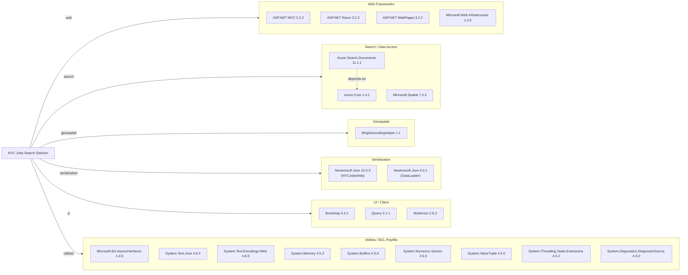

# Dependency Map

This document maps all external dependencies declared in the NYC Jobs Search solution across its two projects (NYCJobsWeb and DataLoader), totaling approximately 22 unique packages.

## Dependencies

### Dependency Summary

| Category | Count | Key Libraries | Notes |
|---|---|---|---|
| Web Frameworks | 4 | ASP.NET MVC 5.2.2, ASP.NET Razor 3.2.2 | Legacy ASP.NET MVC stack targeting .NET Framework 4.7.2 |
| Search / Data Access | 3 | Azure.Search.Documents 11.1.1, Azure.Core 1.4.1 | Azure AI Search SDK v11 (pinned to an older 1.x release) |
| Geospatial | 1 | BingGeocodingHelper 1.1 | Thin wrapper around Bing Maps geocoding REST API |
| Serialization | 2 | Newtonsoft.Json 10.0.3 / 9.0.1 | Two projects pin different major-compatible versions |
| UI / Client | 3 | Bootstrap 3.4.1, jQuery 3.1.1, Modernizr 2.8.3 | All client-side libraries served as static NuGet content packages |
| Utilities / BCL Polyfills | 9 | System.Memory, System.Buffers, Microsoft.Bcl.AsyncInterfaces | Backport packages required to support Azure.Core on .NET Framework 4.7.2 |

### Version & Compatibility Risks

The solution targets **.NET Framework 4.7.2**, which is in long-term maintenance mode with no new feature development. **ASP.NET MVC 5.2.2** is a .NET Framework-only framework with no upgrade path to ASP.NET Core MVC without a full rewrite. **Azure.Search.Documents 11.1.1** and **Azure.Core 1.4.1** are significantly behind their current releases (11.7.x and 1.12.x respectively), and newer Azure AI Search features (semantic search, vector search) require newer SDK versions. **Bootstrap 3.4.1** and **jQuery 3.1.1** are outdated client-side libraries with known security advisories. The nine BCL polyfill packages (`System.Memory`, `System.Buffers`, etc.) are only required because the solution runs on .NET Framework; migrating to .NET 8+ would eliminate all of them. **Newtonsoft.Json** is pinned to two different minor versions across the two projects (10.0.3 vs 9.0.1), and the web project already has a binding redirect that caps it at 10.0.0.0.

### Notable Observations

- **No ORM or database driver**: The application has no relational database dependency — all data access goes through the Azure AI Search SDK, which is unusual and means there is no Entity Framework or ADO.NET migration concern.
- **Nine BCL polyfill packages**: The large group of `System.*` backport packages exists solely to make `Azure.Core` work on .NET Framework 4.7.2. Migrating to .NET 8+ would remove all of them.
- **Outdated Azure SDK pinning**: `Azure.Search.Documents 11.1.1` (released 2021) is more than two major minor-version increments behind the current stable release. Migration to .NET would also benefit from upgrading to the latest SDK.
- **Inconsistent Newtonsoft.Json versions**: DataLoader uses 9.0.1 while NYCJobsWeb uses 10.0.3. Although they are separate executables, this inconsistency is a maintenance smell.

## Test Dependencies

No test projects or test-scoped dependencies were detected in the solution.

Total test-scope dependencies: 0

Neither `NYCJobsWeb` nor `DataLoader` includes any test project or test NuGet packages (e.g., xUnit, MSTest, NUnit, Moq). The solution has no automated test coverage.
