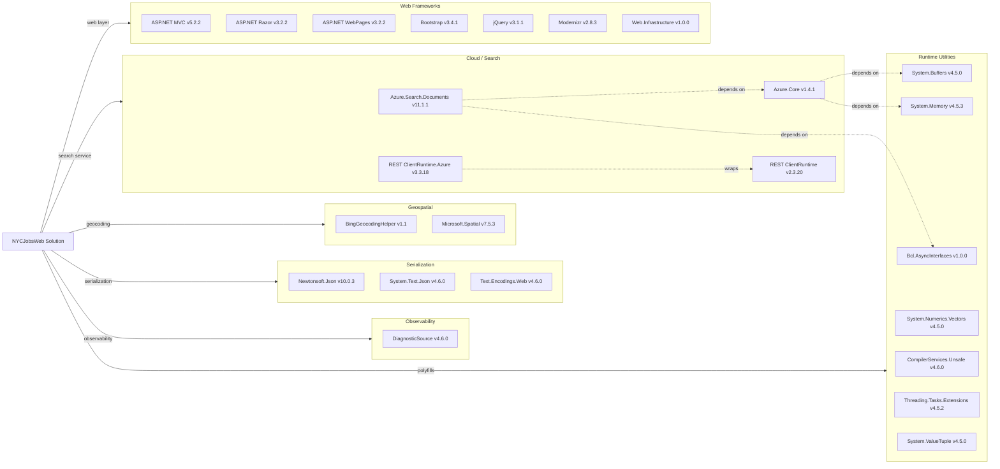

# Dependency Map

NYCJobsWeb is a .NET Framework 4.7.2 ASP.NET MVC solution with 24 declared external package dependencies across two projects (NYCJobsWeb and DataLoader), all managed via `packages.config`.

## Dependencies

### Dependency Summary

| Category | Count | Key Libraries | Notes |
|---|---|---|---|
| Web Frameworks | 7 | ASP.NET MVC 5.2.2, Razor 3.2.2, Bootstrap 3.4.1, jQuery 3.1.1 | Classic .NET Framework MVC stack; no modern Blazor or ASP.NET Core |
| Cloud / Search | 4 | Azure.Search.Documents 11.1.1, Azure.Core 1.4.1 | Azure AI Search SDK v11 — current SDK but pinned to 11.1.1 (11.6+ available) |
| Geospatial | 2 | BingGeocodingHelper 1.1, Microsoft.Spatial 7.5.3 | Bing geocoding for zip-distance filtering |
| Serialization | 3 | Newtonsoft.Json 10.0.3, System.Text.Json 4.6.0 | Two JSON libraries present simultaneously |
| Observability | 1 | System.Diagnostics.DiagnosticSource 4.6.0 | Included as transitive dependency; no active instrumentation code |
| Runtime Utilities | 7 | System.Buffers, System.Memory, System.ValueTuple, System.Threading.Tasks.Extensions | .NET Framework back-port polyfills needed for Azure SDK on net472 |

### Version & Compatibility Risks

**.NET Framework 4.7.2** is in long-term maintenance mode with no new feature development; Microsoft recommends migrating to .NET 8/10. **ASP.NET MVC 5.2.2** is a .NET Framework-only framework with no upgrade path to ASP.NET Core MVC without a rewrite. **Newtonsoft.Json 10.0.3** is significantly behind the current 13.x release and has known CVEs in older versions; the project ships both Newtonsoft.Json and System.Text.Json, which is redundant. **BingGeocodingHelper 1.1** targets net45 and was last published circa 2014 — it is effectively abandonware and should be replaced. **Azure.Search.Documents 11.1.1** (released 2020) is behind the current 11.6.x line, which includes semantic search and vector search features. The seven runtime polyfill packages (System.Buffers, System.Memory, etc.) are only needed because the project targets .NET Framework; they would be eliminated by upgrading to .NET 8+.

### Notable Observations

- **Dual JSON serializers**: Both `Newtonsoft.Json` (v10) and `System.Text.Json` (v4.6.0) are declared. `System.Text.Json` appears only as a transitive pull-in from `Azure.Core`; however, the code uses only Newtonsoft.Json directly. On .NET 8+, `System.Text.Json` is the built-in default and `Newtonsoft.Json` can be removed.
- **Seven runtime polyfill packages**: `System.Buffers`, `System.Memory`, `System.Numerics.Vectors`, `System.Runtime.CompilerServices.Unsafe`, `System.Threading.Tasks.Extensions`, `System.ValueTuple`, and `Microsoft.Bcl.AsyncInterfaces` exist solely to back-port .NET Core APIs to .NET Framework 4.7.2. All seven would be eliminated automatically upon upgrading the target framework.
- **No caching, messaging, or security libraries**: The application has no authentication/authorisation middleware, no caching layer, and no message broker client — the search index serves as the only data source.
- **DataLoader uses an older REST API version**: The DataLoader console project targets `api-version=2015-02-28-Preview` via raw `HttpClient` calls, which is a very old Azure Search REST API version and should be replaced with the `Azure.Search.Documents` SDK used in the web project.

## Test Dependencies

| Framework | Version | Notes |
|---|---|---|
| — | — | No test projects or test-scoped packages detected |

Total test-scope dependencies: 0

No test framework is configured in either project. There are no xUnit, NUnit, or MSTest packages declared in any `packages.config` file, and no test project exists in the solution. Adding a test project targeting xUnit or NUnit is recommended before any migration work begins.
