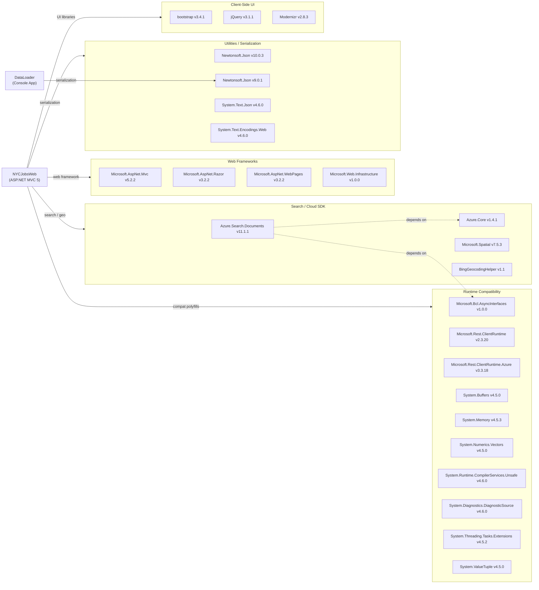

# Dependency Map

This document maps all external dependencies for the NYC Jobs Search solution (NYCJobsWeb ASP.NET MVC 5 web app + DataLoader console app), totalling 22 declared packages across both projects.

## Dependencies

### Dependency Summary

| Category | Count | Key Libraries | Notes |
|----------|-------|---------------|-------|
| Web Frameworks | 4 | Microsoft.AspNet.Mvc 5.2.2, Razor 3.2.2, WebPages 3.2.2 | Legacy ASP.NET MVC 5 stack on .NET Framework 4.7.2 |
| Search / Cloud SDK | 4 | Azure.Search.Documents 11.1.1, Azure.Core 1.4.1, Microsoft.Spatial 7.5.3, BingGeocodingHelper 1.1 | Azure AI Search SDK with geo support; Bing geocoding helper |
| Utilities / Serialization | 4 | Newtonsoft.Json 10.0.3 (web), 9.0.1 (loader), System.Text.Json 4.6.0 | Two different versions of Newtonsoft.Json across projects |
| Client-Side UI | 3 | Bootstrap 3.4.1, jQuery 3.1.1, Modernizr 2.8.3 | Older but stable Bootstrap 3 / jQuery 3 combination |
| Runtime Compatibility | 10 | System.Buffers, System.Memory, System.Threading.Tasks.Extensions, etc. | .NET Framework back-compat polyfills required by Azure SDK |

### Version & Compatibility Risks

The solution targets **ASP.NET MVC 5 on .NET Framework 4.7.2**, which is in long-term servicing/maintenance mode with no new feature development. **Azure.Core 1.4.1** and **Azure.Search.Documents 11.1.1** are significantly outdated; the current stable releases are Azure.Core 1.44+ and Azure.Search.Documents 11.6+, with additional breaking changes around API keys in favour of token-based authentication in newer versions. **Bootstrap 3.4.1** reached end-of-life in 2022 and has known accessibility and security gaps. **Microsoft.Spatial 7.5.3** is a legacy OData spatial library that is not needed with newer Azure Search SDK versions. The DataLoader project still targets **.NET Framework 4.5** (older than the web project's 4.7.2) and uses **Newtonsoft.Json 9.0.1** while the web project uses 10.0.3, creating version drift. Several runtime compatibility shims (`System.Buffers`, `System.Memory`, etc.) are only required to bridge the Azure SDK with .NET Framework and would be unnecessary after migrating to .NET 8+.

### Notable Observations

- **Two different Newtonsoft.Json versions**: NYCJobsWeb references v10.0.3 while DataLoader uses v9.0.1, which could cause issues if the projects ever share a common output folder or are linked together.
- **Heavy polyfill burden**: 10 out of 22 packages are .NET Framework back-compat shims (`System.Buffers`, `System.Memory`, `System.Runtime.CompilerServices.Unsafe`, etc.) purely to support the modern Azure Search SDK on the legacy runtime. Migrating to .NET 8 would eliminate all of these.
- **Bing Geocoding dependency**: `BingGeocodingHelper 1.1` is a low-version, third-party NuGet wrapper around the Bing Maps REST API. Bing Maps for Enterprise is being retired (June 2025); this dependency will need replacement with Azure Maps or another geocoding provider.
- **No logging, security, or observability packages**: The solution has no structured logging library (Serilog, NLog), no authentication/authorization middleware, and no telemetry/APM package, which are all important gaps for a production cloud deployment.

## Test Dependencies

No test-scoped packages were detected in any `packages.config` file across the solution.

Total test-scope dependencies: 0

Neither project includes a unit test project or any test framework (xUnit, MSTest, NUnit). Adding a test layer would be advisable before any migration effort to establish a behavioural baseline.
