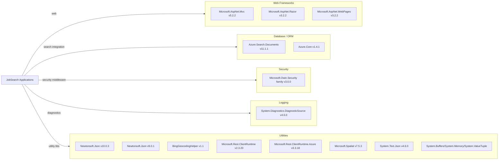

# Dependency Map

This repository contains two .NET Framework applications with 27 declared package dependencies across web, search integration, and utility concerns.

## Dependencies

### Dependency Summary

| Category | Count | Key Libraries | Notes |
|---|---:|---|---|
| Web Frameworks | 3 | ASP.NET MVC 5.2.2, Razor 3.2.2, WebPages 3.2.2 | Legacy ASP.NET MVC on .NET Framework |
| Database / ORM | 2 | Azure.Search.Documents 11.1.1, Azure.Core 1.4.1 | Uses Azure AI Search SDK instead of ORM |
| Security | 1 | Microsoft.Owin.Security (binding redirects) | Auth middleware dependencies present in config |
| Logging | 1 | DiagnosticSource 4.6.0 | Basic diagnostics support |
| Utilities | 20 | Newtonsoft.Json, BingGeocodingHelper, Microsoft.Rest.* | Includes compatibility and runtime helper packages |

### Version & Compatibility Risks

Both projects target .NET Framework (4.7.2 web app and 4.5 loader), which increases modernization effort for future platform upgrades. The repository also uses older ASP.NET MVC and Newtonsoft.Json versions, and mixed JSON library generations (Newtonsoft 9/10 plus System.Text.Json 4.6.0), which may require consolidation during migration.

### Notable Observations

- Dependency management uses legacy `packages.config` instead of centralized PackageReference.
- Utility dependencies dominate the footprint, while business/data logic dependencies are comparatively small.
- The loader app and web app use different Newtonsoft.Json major versions.
- No explicit observability/telemetry packages such as OpenTelemetry or Application Insights are declared.

## Test Dependencies

No test dependency manifest was found (`packages.config` entries are production-only and no test project files were detected).

| Framework | Version | Notes |
|---|---|---|
| None detected | N/A | No xUnit, MSTest, NUnit, or equivalent package references found |

Total test-scope dependencies: 0
No dedicated test infrastructure was detected in this repository.
