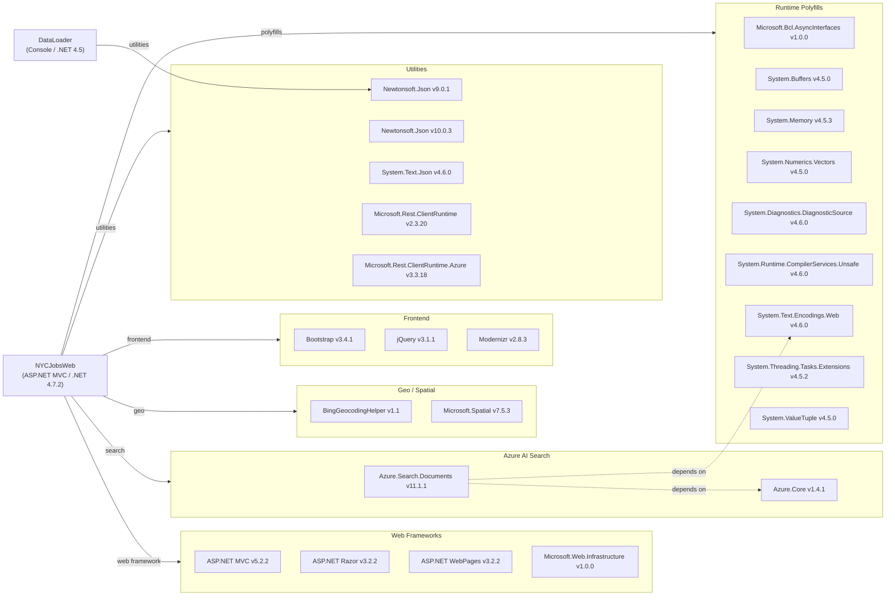

# Dependency Map

The NYC Jobs application comprises two .NET projects — **NYCJobsWeb** (ASP.NET MVC 5 web app, .NET 4.7.2) and **DataLoader** (console app, .NET 4.5) — with a combined total of 26 declared external dependencies.

## Dependencies

### Dependency Summary

| Category | Count | Key Libraries | Notes |
|----------|-------|---------------|-------|
| Web Frameworks | 4 | ASP.NET MVC 5.2.2, Razor 3.2.2, WebPages 3.2.2 | Legacy MVC stack targeting .NET Framework 4.7.2 |
| Azure AI Search | 2 | Azure.Search.Documents 11.1.1, Azure.Core 1.4.1 | Older SDK; latest stable is 11.x (current series is fine but pre-11.4) |
| Geo / Spatial | 2 | BingGeocodingHelper 1.1, Microsoft.Spatial 7.5.3 | BingGeocodingHelper is an unofficial community wrapper |
| Frontend | 3 | Bootstrap 3.4.1, jQuery 3.1.1, Modernizr 2.8.3 | Bootstrap 3 is EOL; jQuery 3.1.1 is significantly behind 3.7+ |
| Utilities | 5 | Newtonsoft.Json 10.0.3 (web), 9.0.1 (loader), System.Text.Json 4.6.0 | Two different Newtonsoft.Json versions across projects |
| Runtime Polyfills | 9 | System.Buffers, System.Memory, System.Threading.Tasks.Extensions, etc. | Required to backport modern BCL APIs to .NET 4.7.2 |

### Version & Compatibility Risks

Both projects target **legacy .NET Framework** versions (.NET 4.7.2 and 4.5), which are in long-term servicing mode and will not receive new feature development. The **ASP.NET MVC 5.2.2** stack is not portable to .NET (Core) without a rewrite to ASP.NET Core MVC. **Azure.Search.Documents 11.1.1** (released 2020) is multiple minor versions behind the current 11.x release, missing improvements in retry policies, serialization, and semantic search. **Bootstrap 3.4.1** reached end-of-life and lacks support for modern accessibility standards and responsive utilities. **jQuery 3.1.1** is well behind the current 3.x release and may contain unfixed CVEs. The nine runtime polyfill packages (`System.Buffers`, `System.Memory`, etc.) are only needed because the project targets .NET 4.7.2; upgrading to .NET 8+ would eliminate all of them. The DataLoader project still uses **Newtonsoft.Json 9.0.1** against the REST API, while the web project uses 10.0.3 — creating an inconsistency in the dependency graph.

### Notable Observations

- **Dual Newtonsoft.Json versions**: NYCJobsWeb uses 10.0.3 while DataLoader uses 9.0.1, creating risk of serialization inconsistencies when data written by one project is read by the other (e.g., date/time handling changes between versions).
- **No logging framework declared**: Neither project declares Serilog, NLog, log4net, or Microsoft.Extensions.Logging; all error handling uses `Console.WriteLine`, making production diagnostics difficult.
- **No authentication/authorization library**: The web application has no authentication middleware — requests are entirely anonymous, which is appropriate for a public job search portal but should be documented as an explicit architectural decision.
- **Nine polyfill packages will be eliminated on upgrade**: All `System.*` backport packages (`System.Buffers`, `System.Memory`, `System.Threading.Tasks.Extensions`, etc.) exist solely to support older .NET Framework targets and can be removed upon migration to .NET 8+.

## Test Dependencies

No test-scoped dependencies were detected in either project's `packages.config` or `.csproj` files. Neither **NYCJobsWeb** nor **DataLoader** includes a test project or declares a test framework such as xUnit, NUnit, or MSTest.

Total test-scope dependencies: **0**

No unit or integration test infrastructure exists in this solution. Adding a test project with xUnit or NUnit is recommended before undertaking modernization to establish a regression baseline.
