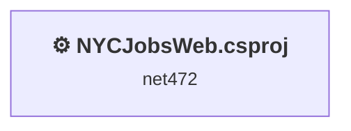
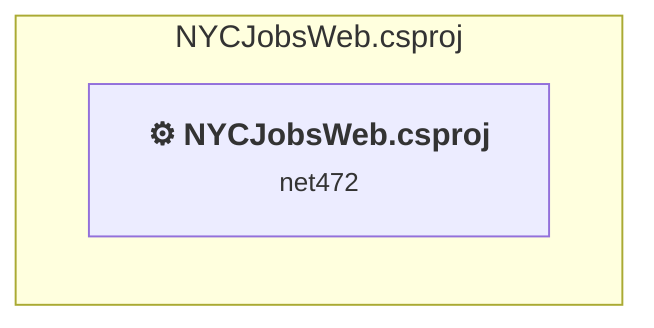

# Projects and dependencies analysis

This document provides a comprehensive overview of the projects and their dependencies in the context of upgrading to .NETCoreApp,Version=v10.0.

## Table of Contents

- [Executive Summary](#executive-Summary)
  - [Highlevel Metrics](#highlevel-metrics)
  - [Projects Compatibility](#projects-compatibility)
  - [Package Compatibility](#package-compatibility)
  - [API Compatibility](#api-compatibility)
  - [Binding Redirect Configuration](#binding-redirect-configuration)
- [Aggregate NuGet packages details](#aggregate-nuget-packages-details)
- [Top API Migration Challenges](#top-api-migration-challenges)
  - [Technologies and Features](#technologies-and-features)
  - [Most Frequent API Issues](#most-frequent-api-issues)
- [Projects Relationship Graph](#projects-relationship-graph)
- [Project Details](#project-details)

  - [NYCJobsWeb\NYCJobsWeb.csproj](#nycjobswebnycjobswebcsproj)

## Executive Summary

### Highlevel Metrics

| Metric | Count | Status |
| :--- | :---: | :--- |
| Total Projects | 1 | All require upgrade |
| Total NuGet Packages | 24 | 9 need upgrade |
| Total Code Files | 10 |  |
| Total Code Files with Incidents | 4 |  |
| Total Lines of Code | 1190 |  |
| Total Number of Issues | 49 |  |
| Estimated LOC to modify | 22+ | at least 1.8% of codebase |

### Projects Compatibility

| Project | Target Framework | Difficulty | Package Issues | API Issues | Binding Issues | Est. LOC Impact | Description |
| :--- | :---: | :---: | :---: | :---: | :---: | :---: | :--- |
| [NYCJobsWeb\NYCJobsWeb.csproj](#nycjobswebnycjobswebcsproj) | net472 | 🔴 High | 22 | 22 | 0 | 22+ | Wap, Sdk Style = False |

### Package Compatibility

| Status | Count | Percentage |
| :--- | :---: | :---: |
| ✅ Compatible | 15 | 62.5% |
| ⚠️ Incompatible | 1 | 4.2% |
| 🔄 Upgrade Recommended | 8 | 33.3% |
| ***Total NuGet Packages*** | ***24*** | ***100%*** |

### API Compatibility

| Category | Count | Impact |
| :--- | :---: | :--- |
| 🔴 Binary Incompatible | 4 | High - Require code changes |
| 🟡 Source Incompatible | 10 | Medium - Needs re-compilation and potential conflicting API error fixing |
| 🔵 Behavioral change | 8 | Low - Behavioral changes that may require testing at runtime |
| ✅ Compatible | 183 |  |
| ***Total APIs Analyzed*** | ***205*** |  |

## Aggregate NuGet packages details

| Package | Current Version | Suggested Version | Projects | Description |
| :--- | :---: | :---: | :--- | :--- |
| Azure.Core | 1.4.1 |  | [NYCJobsWeb.csproj](#nycjobswebnycjobswebcsproj) | ✅Compatible |
| Azure.Search.Documents | 11.1.1 |  | [NYCJobsWeb.csproj](#nycjobswebnycjobswebcsproj) | ✅Compatible |
| BingGeocodingHelper | 1.1 |  | [NYCJobsWeb.csproj](#nycjobswebnycjobswebcsproj) | ✅Compatible |
| bootstrap | 3.4.1 |  | [NYCJobsWeb.csproj](#nycjobswebnycjobswebcsproj) | ✅Compatible |
| jQuery | 3.1.1 | 3.7.1 | [NYCJobsWeb.csproj](#nycjobswebnycjobswebcsproj) | NuGet package contains security vulnerability |
| Microsoft.AspNet.Mvc | 5.2.2 |  | [NYCJobsWeb.csproj](#nycjobswebnycjobswebcsproj) | NuGet package functionality is included with framework reference |
| Microsoft.AspNet.Razor | 3.2.2 |  | [NYCJobsWeb.csproj](#nycjobswebnycjobswebcsproj) | NuGet package functionality is included with framework reference |
| Microsoft.AspNet.WebPages | 3.2.2 |  | [NYCJobsWeb.csproj](#nycjobswebnycjobswebcsproj) | NuGet package functionality is included with framework reference |
| Microsoft.Bcl.AsyncInterfaces | 1.0.0 | 10.0.8 | [NYCJobsWeb.csproj](#nycjobswebnycjobswebcsproj) | NuGet package upgrade is recommended |
| Microsoft.Rest.ClientRuntime | 2.3.20 | 2.3.24 | [NYCJobsWeb.csproj](#nycjobswebnycjobswebcsproj) | NuGet package contains security vulnerability |
| Microsoft.Rest.ClientRuntime.Azure | 3.3.18 |  | [NYCJobsWeb.csproj](#nycjobswebnycjobswebcsproj) | ⚠️NuGet package is deprecated |
| Microsoft.Spatial | 7.5.3 |  | [NYCJobsWeb.csproj](#nycjobswebnycjobswebcsproj) | ✅Compatible |
| Microsoft.Web.Infrastructure | 1.0.0.0 |  | [NYCJobsWeb.csproj](#nycjobswebnycjobswebcsproj) | NuGet package functionality is included with framework reference |
| Modernizr | 2.8.3 |  | [NYCJobsWeb.csproj](#nycjobswebnycjobswebcsproj) | ✅Compatible |
| Newtonsoft.Json | 10.0.3 | 13.0.4 | [NYCJobsWeb.csproj](#nycjobswebnycjobswebcsproj) | NuGet package upgrade is recommended |
| System.Buffers | 4.5.0 |  | [NYCJobsWeb.csproj](#nycjobswebnycjobswebcsproj) | NuGet package functionality is included with framework reference |
| System.Diagnostics.DiagnosticSource | 4.6.0 | 10.0.8 | [NYCJobsWeb.csproj](#nycjobswebnycjobswebcsproj) | NuGet package upgrade is recommended |
| System.Memory | 4.5.3 |  | [NYCJobsWeb.csproj](#nycjobswebnycjobswebcsproj) | NuGet package functionality is included with framework reference |
| System.Numerics.Vectors | 4.5.0 |  | [NYCJobsWeb.csproj](#nycjobswebnycjobswebcsproj) | NuGet package functionality is included with framework reference |
| System.Runtime.CompilerServices.Unsafe | 4.6.0 | 6.1.2 | [NYCJobsWeb.csproj](#nycjobswebnycjobswebcsproj) | NuGet package upgrade is recommended |
| System.Text.Encodings.Web | 4.6.0 | 10.0.8 | [NYCJobsWeb.csproj](#nycjobswebnycjobswebcsproj) | NuGet package upgrade is recommended |
| System.Text.Json | 4.6.0 | 10.0.8 | [NYCJobsWeb.csproj](#nycjobswebnycjobswebcsproj) | NuGet package upgrade is recommended |
| System.Threading.Tasks.Extensions | 4.5.2 |  | [NYCJobsWeb.csproj](#nycjobswebnycjobswebcsproj) | NuGet package functionality is included with framework reference |
| System.ValueTuple | 4.5.0 |  | [NYCJobsWeb.csproj](#nycjobswebnycjobswebcsproj) | NuGet package functionality is included with framework reference |

## Top API Migration Challenges

### Technologies and Features

| Technology | Issues | Percentage | Migration Path |
| :--- | :---: | :---: | :--- |
| Legacy Configuration System | 8 | 36.4% | Legacy XML-based configuration system (app.config/web.config) that has been replaced by a more flexible configuration model in .NET Core. The old system was rigid and XML-based. Migrate to Microsoft.Extensions.Configuration with JSON/environment variables; use System.Configuration.ConfigurationManager NuGet package as interim bridge if needed. |
| ASP.NET Framework (System.Web) | 6 | 27.3% | Legacy ASP.NET Framework APIs for web applications (System.Web.*) that don't exist in ASP.NET Core due to architectural differences. ASP.NET Core represents a complete redesign of the web framework. Migrate to ASP.NET Core equivalents or consider System.Web.Adapters package for compatibility. |

### Most Frequent API Issues

| API | Count | Percentage | Category |
| :--- | :---: | :---: | :--- |
| T:System.Uri | 4 | 18.2% | Behavioral Change |
| M:System.Uri.#ctor(System.String) | 4 | 18.2% | Behavioral Change |
| T:System.Configuration.ConfigurationManager | 4 | 18.2% | Source Incompatible |
| P:System.Configuration.ConfigurationManager.AppSettings | 4 | 18.2% | Source Incompatible |
| T:System.Web.Routing.RouteCollection | 2 | 9.1% | Binary Incompatible |
| T:System.Web.Routing.RouteTable | 1 | 4.5% | Binary Incompatible |
| P:System.Web.Routing.RouteTable.Routes | 1 | 4.5% | Binary Incompatible |
| M:System.Web.HttpApplication.#ctor | 1 | 4.5% | Source Incompatible |
| T:System.Web.HttpApplication | 1 | 4.5% | Source Incompatible |

## Projects Relationship Graph

Legend:
📦 SDK-style project
⚙️ Classic project

## Project Details

### NYCJobsWeb\NYCJobsWeb.csproj

#### Project Info

- **Current Target Framework:** net472
- **Proposed Target Framework:** net10.0
- **SDK-style**: False
- **Project Kind:** Wap
- **Dependencies**: 0
- **Dependants**: 0
- **Number of Files**: 75
- **Number of Files with Incidents**: 4
- **Lines of Code**: 1190
- **Estimated LOC to modify**: 22+ (at least 1.8% of the project)

#### Dependency Graph

Legend:
📦 SDK-style project
⚙️ Classic project

### API Compatibility

| Category | Count | Impact |
| :--- | :---: | :--- |
| 🔴 Binary Incompatible | 4 | High - Require code changes |
| 🟡 Source Incompatible | 10 | Medium - Needs re-compilation and potential conflicting API error fixing |
| 🔵 Behavioral change | 8 | Low - Behavioral changes that may require testing at runtime |
| ✅ Compatible | 183 |  |
| ***Total APIs Analyzed*** | ***205*** |  |

#### Project Technologies and Features

| Technology | Issues | Percentage | Migration Path |
| :--- | :---: | :---: | :--- |
| Legacy Configuration System | 8 | 36.4% | Legacy XML-based configuration system (app.config/web.config) that has been replaced by a more flexible configuration model in .NET Core. The old system was rigid and XML-based. Migrate to Microsoft.Extensions.Configuration with JSON/environment variables; use System.Configuration.ConfigurationManager NuGet package as interim bridge if needed. |
| ASP.NET Framework (System.Web) | 6 | 27.3% | Legacy ASP.NET Framework APIs for web applications (System.Web.*) that don't exist in ASP.NET Core due to architectural differences. ASP.NET Core represents a complete redesign of the web framework. Migrate to ASP.NET Core equivalents or consider System.Web.Adapters package for compatibility. |

