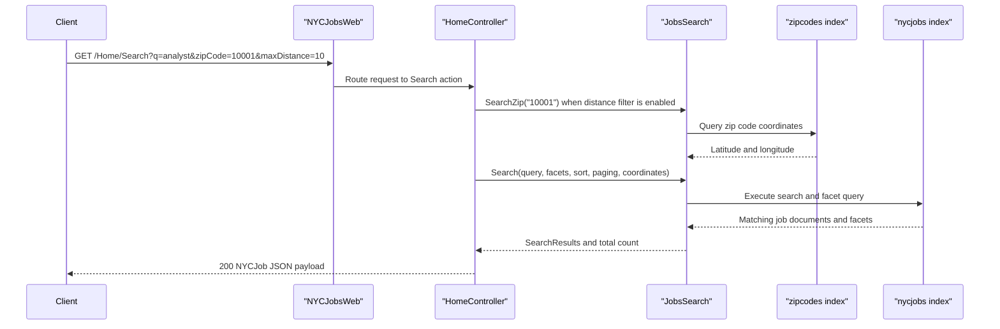

# API & Service Communication Contracts

The repository exposes a small HTTP surface from a single MVC controller and relies on synchronous request-response communication with Azure Cognitive Search. A secondary console utility provisions the backing indexes but is not exposed as a hosted API.

## Service Catalog

| Service | Port | Category | Purpose |
|---|---|---|---|
| NYCJobsWeb | 51269 during local development | API Layer | Serves the job-search website, JSON search endpoints, suggestions, and job detail lookups |
| DataLoader | N/A | Business | Recreates the Azure Search indexes and uploads sample schema and document batches |

## API Endpoints Inventory

| Service | Method | Path | Request Type | Response Type |
|---|---|---|---|---|
| NYCJobsWeb | GET | `/Home/Index` and default `/` route | No body; optional route parameters resolved by MVC routing | Razor view response |
| NYCJobsWeb | GET | `/Home/JobDetails` | No body | Razor view response |
| NYCJobsWeb | GET | `/Home/Search` | Query string parameters for `q`, facets, sort, coordinates, page, zip code, and max distance | `NYCJob` JSON envelope with `Results`, `Facets`, and `Count` |
| NYCJobsWeb | GET | `/Home/Suggest` | Query string `term` and optional `fuzzy` flag | JSON array of unique suggestion strings |
| NYCJobsWeb | GET | `/Home/LookUp` | Query string `id` | `NYCJobLookup` JSON envelope containing one `SearchDocument` |

## Management & Observability Endpoints

| Service | Endpoint | Custom Metrics (if any) |
|---|---|---|
| NYCJobsWeb | None detected | None |
| DataLoader | None detected | None |

## DTOs & Contracts

The API contract is intentionally lightweight. `NYCJob` is the primary response envelope for search results and carries the Azure Search result list, facet payload, and total count. `NYCJobLookup` wraps a single `SearchDocument` for detail lookups. Query-string primitives such as `q`, `businessTitleFacet`, `postingTypeFacet`, `salaryRangeFacet`, `zipCode`, and `maxDistance` act as the request contract for the search endpoint. No immutable record types, OpenAPI documents, protobuf schemas, or GraphQL schemas were found. Serialization is handled through ASP.NET MVC JSON responses and the Azure Search SDK document model.

## Communication Patterns

All communication in the hosted application is synchronous. A browser issues HTTP requests to the MVC site, `HomeController` delegates to `JobsSearch`, and `JobsSearch` calls Azure Cognitive Search through `SearchClient` instances created from configuration. When distance filtering is requested, the application first queries the `zipcodes` index to translate the submitted zip code into coordinates and then applies a geographic distance filter to the `nycjobs` index. The `DataLoader` utility uses raw `HttpClient` calls against the Azure Search REST API to delete, create, and populate indexes from local files. No asynchronous messaging, retry policy, circuit breaker, service discovery, or API gateway logic was detected. Transport security is implied for outbound Azure Search calls because the loader constructs `https://...search.windows.net` URIs, but the MVC app itself exposes no application-level authentication or authorization checks and appears to serve all endpoints publicly.

## Service Technology Matrix

| Service | Web | Data Access | Discovery | Gateway | Actuator | Cache | Metrics |
|---|---|---|---|---|---|---|---|
| NYCJobsWeb | ASP.NET MVC views and controller actions | Azure Cognitive Search SDK | None | None | None | None | None |
| DataLoader | None | HttpClient plus Azure Search REST API | None | None | None | None | None |

## Service Communication Sequence

