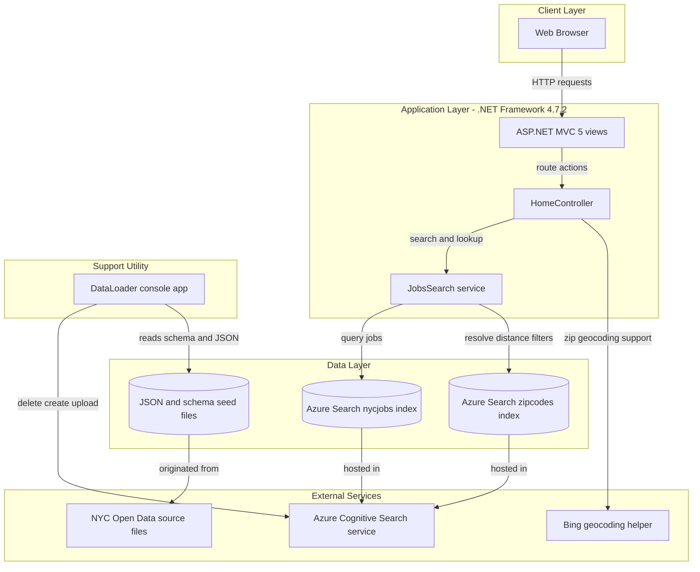
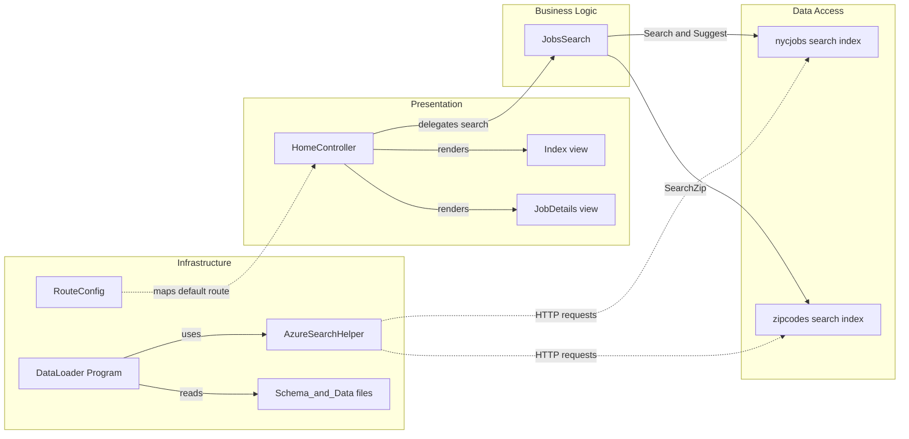

# Architecture Diagram

This repository contains a legacy ASP.NET MVC jobs-search web application plus a companion console loader that provisions and seeds Azure Cognitive Search indexes. The diagrams below summarize the runtime architecture and the main component interactions used to browse, suggest, and look up job postings.

## Application Architecture

### Technology Stack Summary

| Layer | Technology | Version | Purpose |
|---|---|---|---|
| Presentation | ASP.NET MVC | 5.2.2 | Serves the home page, suggestions, search results, and job detail responses |
| Views | Razor and System.Web.WebPages | 3.2.2 | Renders the server-hosted pages for the web experience |
| Search Integration | Azure.Search.Documents and Azure.Core | 11.1.1 / 1.4.1 | Executes search, suggest, and document lookup operations against Azure Cognitive Search |
| Auxiliary Integration | BingGeocodingHelper | 1.1 | Supports location-related behavior exposed by the UI |
| Support Utility | DataLoader console app on .NET Framework | 4.5 | Recreates the search indexes and uploads sample JSON payloads |
| Data | Azure Cognitive Search indexes plus local schema and JSON files | N/A | Stores searchable job and zip code documents and the seed assets used to load them |

### Data Storage & External Services

The application does not use a relational database in this repository. Instead, the MVC site reads from two Azure Cognitive Search indexes named `nycjobs` and `zipcodes`, while the `DataLoader` utility writes index schema and document batches to the same hosted search service. Local JSON and schema files under `NYCJobsWeb/Schema_and_Data` act as the seed source, and a Bing geocoding helper package is referenced for location-related UI behavior.

### Key Architectural Decisions

- The web application talks directly to Azure Cognitive Search from controller-invoked service code instead of introducing a repository or separate API tier.
- Search and geographic filtering are split across two indexes: one for job postings and one for zip-code coordinate lookups.
- Index lifecycle management is intentionally separated into the `DataLoader` console application so the website remains read-only at runtime.

## Component Relationships

### Component Inventory

| Component | Layer | Type | Responsibility |
|---|---|---|---|
| HomeController | Presentation | MVC Controller | Handles page rendering plus JSON search, suggest, and lookup responses |
| Index.cshtml | Presentation | Razor View | Hosts the main job-search user interface |
| JobDetails.cshtml | Presentation | Razor View | Displays the job detail experience |
| JobsSearch | Business Logic | Service class | Builds Azure Search queries, facets, sorting, and distance filters |
| RouteConfig | Infrastructure | MVC Routing configuration | Registers the default `{controller}/{action}/{id}` route |
| DataLoader Program | Infrastructure | Console application entry point | Deletes, recreates, and loads the search indexes |
| AzureSearchHelper | Infrastructure | HTTP helper | Sends authenticated Azure Search REST requests for loader operations |
| Schema_and_Data files | Data Access | Seed asset set | Supplies the JSON documents and index schema definitions imported by the loader |
| nycjobs index | Data Access | Hosted search index | Stores searchable NYC job postings |
| zipcodes index | Data Access | Hosted search index | Stores zip-code coordinate documents used for distance filtering |
