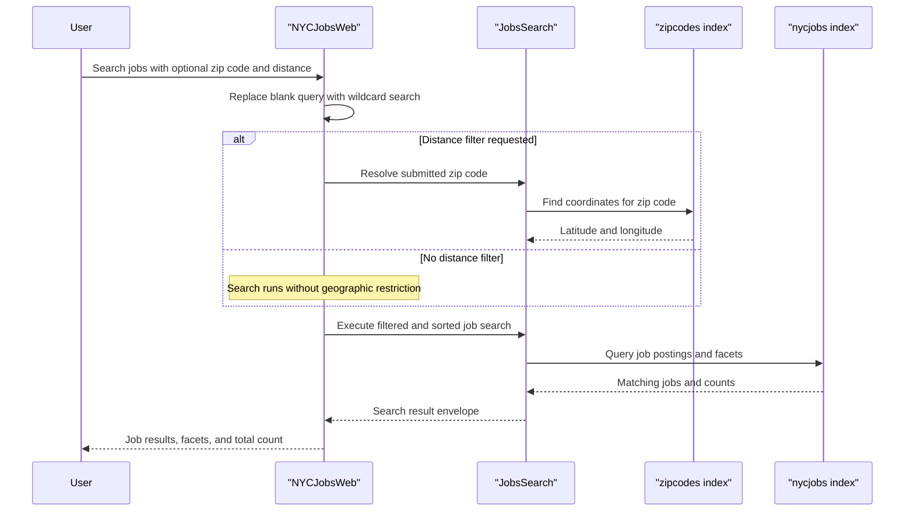

# Core Business Workflows

The application helps users browse New York City job postings, refine the results with facets and distance filters, and inspect individual job details. A separate operational workflow provisions the searchable job and zip-code data that powers the user experience.

## Domain Entities

| Entity | Service / Bounded Context | Description | Key Relationships |
|---|---|---|---|
| Job Posting | NYCJobsWeb search experience | Public job listing returned from the `nycjobs` search index | Appears in search results and individual lookup responses |
| Zip Code Location | NYCJobsWeb search experience | Coordinate lookup used to translate a submitted zip code into a geographic search center | Supports distance-based filtering of job postings |
| Search Result Set | NYCJobsWeb search experience | Aggregated response containing matching jobs, facets, and total count | Combines many job postings into one browse experience |
| Search Index Seed | DataLoader operations | Local schema and JSON data used to create and populate the hosted search indexes | Drives the initial load for both job and zip-code data |

## Service-to-Domain Mapping

| Service | Domain Context | Owned Entities | External Dependencies |
|---|---|---|---|
| NYCJobsWeb | Job discovery and browsing | Job Posting, Zip Code Location, Search Result Set | Azure Cognitive Search indexes, Bing geocoding helper |
| DataLoader | Search index provisioning | Search Index Seed | Azure Cognitive Search REST API, schema and JSON seed files |

## Primary Workflows

### Workflow 1: Search for jobs

1. A user opens the home page and submits a search query with optional facets, sort type, zip code, and max distance.
2. `HomeController.Search` normalizes the query by replacing blanks with `*`, ensuring the workflow returns all jobs when the user does not enter a search phrase.
3. If `maxDistance` is greater than zero, the controller looks up the selected zip code to obtain latitude and longitude before running the job search.
4. `JobsSearch.Search` applies facet filters, optional geographic filtering, and one of four sort behaviors: featured, salary descending, salary ascending, or most recent.
5. The controller returns an `NYCJob` JSON envelope containing result rows, facets, and the total count for the browser UI.

### Workflow 2: Suggest search terms

1. The browser calls `/Home/Suggest` with a partial term.
2. `JobsSearch.Suggest` executes an Azure Search suggest query with optional fuzzy matching.
3. `HomeController` removes duplicates from the returned suggestion texts and returns the unique list as JSON.

### Workflow 3: View job details

1. The browser requests `/Home/LookUp?id={jobId}` for a selected posting.
2. `JobsSearch.LookUp` fetches a single search document by key.
3. The controller wraps the document in `NYCJobLookup` and returns it to the caller.

### Workflow 4: Provision search data

1. An operator runs the `DataLoader` console application after setting the target search service credentials.
2. The loader deletes the `zipcodes` and `nycjobs` indexes if they already exist.
3. The loader recreates each index from the checked-in schema files and uploads every matching JSON batch from `Schema_and_Data`.

## Cross-Service Data Flows

The main business flow is a composition of user input, zip-code lookup data, and job documents sourced from Azure Cognitive Search. The MVC app first gathers coordinate data from the `zipcodes` index when distance filtering is requested, then merges that information into a second query against the `nycjobs` index. The result is a single user-facing response that combines search hits, facet counts, and the total result size. There is no fallback path other than returning whatever Azure Search supplies; no alternate data source or degraded business response was detected.

## Business Workflow Sequence

## Business Rules & Decision Logic

- Blank or whitespace-only search terms are converted to `*`, making the default user experience a browse-all workflow.
- Distance filtering only executes when `maxDistance` is greater than zero, and it depends on a successful zip-code lookup to obtain geographic coordinates.
- Search ordering follows explicit business choices: featured ranking, salary descending, salary ascending, or most recent posting date.
- Suggestion results are deduplicated before being returned to the browser, preventing repeated terms in the UI.
- Job detail lookup returns no response when the `id` parameter is missing, which acts as a simple guard condition for the detail workflow.
- Data provisioning is destructive by design: the loader deletes and recreates indexes before uploading the current sample dataset.
