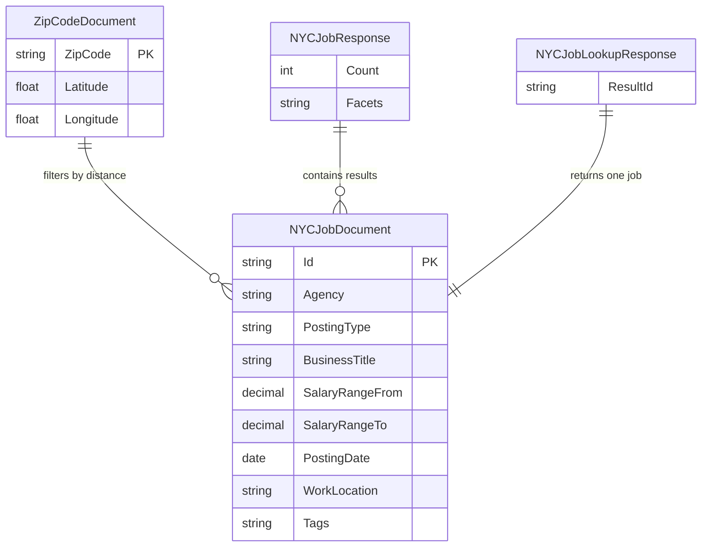

# Data Architecture & Persistence Layer

The repository uses Azure Cognitive Search indexes instead of a traditional relational database or ORM-backed persistence layer. Data access centers on reading hosted search documents at runtime and writing schema plus seed data through the companion loader utility.

## Database Configuration

| Service/Module | DB Type | Profile | Driver | Connection | Migration Tool |
|---|---|---|---|---|---|
| NYCJobsWeb | Azure Cognitive Search indexes | Default | Azure.Search.Documents 11.1.1 | Search endpoint and API key loaded from `Web.config` app settings | None |
| DataLoader | Azure Cognitive Search indexes | Default | `HttpClient` against Azure Search REST API | `https://{TargetSearchServiceName}.search.windows.net` with API key from `App.config` | None |

## Data Ownership per Service

| Service | Tables Owned | ORM Framework | Caching | Notes |
|---|---|---|---|---|
| NYCJobsWeb | None directly; reads `nycjobs` and `zipcodes` indexes | None | None | Treats Azure Search as a read-oriented document store for jobs and location lookups |
| DataLoader | Index schema files and uploaded document batches for `nycjobs` and `zipcodes` | None | None | Acts as the writer and index-provisioning utility for the hosted search data |

## Entity Model

> Note: No ORM entities were found. The diagram below is a best-effort representation of the indexed document shapes and response envelopes used by the application.

## Key Repository Methods

| Service | Repository | Notable Methods | Purpose |
|---|---|---|---|
| NYCJobsWeb | `JobsSearch` | `Search(...)`, `SearchZip(string zipCode)`, `Suggest(string searchText, bool fuzzy)`, `LookUp(string id)` | Encapsulates all search, zip lookup, suggestion, and single-document retrieval behavior |
| DataLoader | `Program` plus `AzureSearchHelper` | `DeleteIndex(string indexName)`, `CreateTargetIndex(string indexName)`, `ImportFromJSON(string indexName)`, `SendSearchRequest(...)` | Manages the lifecycle and population of the hosted search indexes |

## Caching Strategy

No explicit application cache provider, in-memory cache, or distributed cache configuration was detected. Each request appears to query Azure Cognitive Search directly, and the loader writes data straight to the service without an intermediate cache.

## Data Ownership Boundaries

The repository uses a shared hosted search service rather than separate stores per module. `DataLoader` is the source of truth for index schema creation and sample data upload, while `NYCJobsWeb` is a read-only consumer of the same `nycjobs` and `zipcodes` indexes. Cross-module interaction happens indirectly through the shared search indexes and seed files rather than through REST calls or direct relational joins.

### Data Classification & Sensitivity

| Entity | Sensitive Fields | Classification (PII/PHI/PCI/None) | Controls in Place |
|---|---|---|---|
| NYCJobDocument | None clearly sensitive; fields describe public job postings and work locations | None | No data-specific controls detected in the repository |
| ZipCodeDocument | None | None | No data-specific controls detected in the repository |

No PII, PHI, or PCI data was clearly modeled in the application entity layer. The configuration files do contain service API keys, but those are configuration secrets rather than persisted business data.
