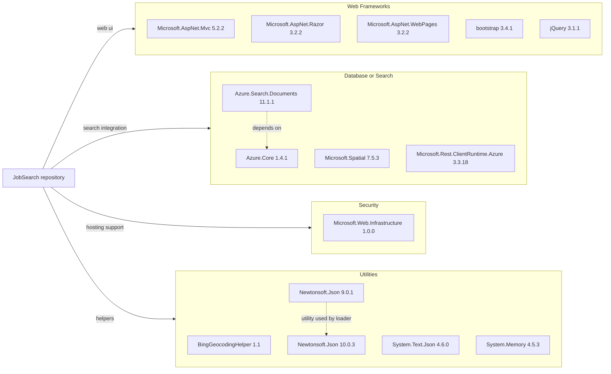

# Dependency Map

This repository declares dependencies for two .NET Framework projects: the `NYCJobsWeb` MVC site and the `DataLoader` console utility. Most dependencies support the legacy ASP.NET MVC presentation stack and Azure Cognitive Search integration rather than database or messaging infrastructure.

## Dependencies

### Dependency Summary

| Category | Count | Key Libraries | Notes |
|---|---:|---|---|
| Web Frameworks | 5 | ASP.NET MVC 5.2.2, Razor 3.2.2, WebPages 3.2.2, bootstrap 3.4.1, jQuery 3.1.1 | Legacy ASP.NET MVC front end hosted on .NET Framework |
| Database / ORM | 0 | None | No ORM or relational database libraries are declared |
| Database / Search | 4 | Azure.Search.Documents 11.1.1, Azure.Core 1.4.1, Microsoft.Spatial 7.5.3 | Azure Cognitive Search is the primary data access technology |
| Messaging | 0 | None | No queueing or event-bus packages are declared |
| Caching | 0 | None | No cache provider packages are declared |
| Logging | 0 | None | No dedicated logging framework packages are declared |
| Security | 1 | Microsoft.Web.Infrastructure 1.0.0 | Supports classic ASP.NET hosting behavior |
| Utilities | 5 | BingGeocodingHelper 1.1, Newtonsoft.Json 10.0.3 and 9.0.1, System.Text.Json 4.6.0 | Utility and serialization packages are shared across the two projects |

### Version & Compatibility Risks

The dependency set is anchored to .NET Framework 4.7.2 for the web app and .NET Framework 4.5 for the loader, with ASP.NET MVC 5-era packages that are stable but firmly in maintenance mode. The presence of older helper libraries such as `Microsoft.Web.Infrastructure`, `Newtonsoft.Json 9.0.1` in the loader, and browser assets like jQuery 3.1.1 indicates likely compatibility and modernization work when targeting a current .NET runtime.

### Notable Observations

- The repository uses Azure Cognitive Search SDK packages but no relational data-access packages, which reinforces that search indexes are the primary persisted store.
- `Newtonsoft.Json` appears in two different versions because the console loader and web application manage dependencies independently.
- There are no declared observability, caching, or resilience libraries, so those concerns are likely handled minimally or not at all.
- Test dependencies are absent, which matches the lack of test projects in the repository.

## Test Dependencies

| Framework | Version | Notes |
|---|---|---|
| None detected | N/A | No test-scoped packages or dedicated test projects were found |

Total test-scope dependencies: 0

No test dependencies were detected in the project files or package manifests.
